# DEVELOPER GUIDE
## 1. Introduction

### 1.1 Purpose

This document provides a detailed design description for the CulicidaeLab library. The library is a Python-based system designed to facilitate the management of datasets, configuration, and machine learning models (predictors) for tasks related to mosquito image analysis, including detection, segmentation, and classification.

### 1.2 Scope

The library provides:

- A type-safe, validated configuration system for model parameters, application settings, and species metadata.
- Cross-platform resource management for datasets, model weights, cache, and temporary files.
- A suite of predictors for classification, detection, and segmentation, built on a common base class.
- A provider-based architecture for integration with external data sources like Hugging Face.
- Utilities for dataset handling, file operations, and result visualization.

### 1.3 Definitions, Acronyms, and Abbreviations (DAA)

- **YOLO**: You Only Look Once (an object detection model architecture)
- **SAM**: Segment Anything Model (a segmentation model architecture)
- **IoU**: Intersection over Union (a metric for segmentation and detection)
- **AP**: Average Precision (a metric for detection)
- **mAP**: Mean Average Precision (detection metric)
- **Pydantic**: A data validation and settings management library for Python.

### 1.4 References

* IEEE Std 1016-1998, IEEE Recommended Practice for Software Design Descriptions.
* Python 3.x Language Reference.
* Pydantic Documentation.
* OmegaConf Documentation.
* FastAI Library Documentation.
* HuggingFace Hub and Datasets Documentation.
* YOLO (Ultralytics) Model Documentation.
* Segment Anything Model (SAM) Documentation.
* timm (PyTorch Image Models) Documentation.

### 1.5 Overview of the Document

This document is organized into four main sections:

* **Section 1 (Introduction)**: Provides the purpose, scope, definitions, references, and an overview of this document.
* **Section 2 (System Overview)**: Describes the system's context, objectives, and overall functions.
* **Section 3 (System Architectural Design)**: Outlines the high-level architecture, including component decomposition, their interfaces, and data design.
* **Section 4 (System Detailed Design)**: Provides a detailed description of each module and its constituent classes, including their purpose, functions, interfaces, and data.
* **Section 5 (Traceability)**: Briefly discusses how the design addresses the implicit requirements of the library.

---

## 2. System Overview

### 2.1 System Context

The CulicidaeLab library is intended to be used by researchers, developers, and data scientists working on projects involving mosquito image analysis. It can serve as a backend for more extensive applications or be used directly in scripts for batch processing, model evaluation, and dataset management. It operates within a Python environment and relies on several external libraries for its core functionalities (e.g., Pydantic, FastAI, Hugging Face libraries, PyTorch, Ultralytics).

### 2.2 System Objectives

The primary objectives of this library are:

1. To provide a centralized, type-safe, and validated way to manage configurations for datasets, models, and application settings using Pydantic.
2. To offer a flexible, provider-based system for managing and accessing diverse datasets and model weights from various sources (e.g., Hugging Face).
3. To define a common, predictable interface (`BasePredictor`) for different types of predictors (detector, segmenter, classifier) and provide concrete implementations.
4. To facilitate efficient model inference, clear result visualization, and standardized evaluation.
5. To ensure robust, cross-platform resource management for models, datasets, cache, and temporary files.

### 2.3 System Functions

The library provides the following key functions:

* **Configuration Management**: Loads, merges, and validates hierarchical configurations from YAML files into Pydantic models.
* **Resource Management**: Manages file system paths for models, datasets, cache, and temporary files in a cross-platform manner.
* **Provider Abstraction**: Downloads datasets and model weights from external providers (e.g., Hugging Face) through a standardized interface.
* **Dataset Management**: Lists and loads datasets as defined in the configuration, using the provider abstraction.
* **Model Prediction**: Performs inference using detector, segmenter, and classifier models on single images or batches.
* **Result Visualization**: Generates visual outputs of model predictions overlaid on input images.
* **Model Evaluation**: Evaluates model performance against ground truth data using standard metrics for each task.
* **Model Weight Management**: Ensures model weights are available locally, downloading them via providers when necessary.

---

## 3. System Architectural Design

### 3.1 Architectural Overview and Design Principles

The architecture of the `culicidaelab` library is built on the principles of Clean Code and SOLID to provide users with a powerful and flexible tool that remains simple to use. The architecture is clearly divided into logical layers, each with its own area of responsibility. This separation simplifies understanding, testing, and extending the code.

The library features a revolutionary **pluggable backend architecture** that enables support for multiple ML frameworks (PyTorch, ONNX) and optimized deployment modes. This allows for flexible installation profiles ranging from lightweight serving-only deployments to full development environments.

#### 3.1.1 Architectural Layers Diagram

```mermaid
graph TD
    %% -- Layers Definition --
    classDef userLayer fill:#eaf4ff,stroke:#004085,stroke-width:2px,color:#004085
    classDef productLayer fill:#e8f5e9,stroke:#155724,stroke-width:2px,color:#155724
    classDef facadeLayer fill:#fff8e1,stroke:#856404,stroke-width:2px,color:#856404
    classDef coreLayer fill:#fbe9e7,stroke:#721c24,stroke-width:2px,color:#721c24
    classDef infraLayer fill:#eceff1,stroke:#383d41,stroke-width:2px,color:#383d41
    classDef backendLayer fill:#e3f2fd,stroke:#0277bd,stroke-width:2px,color:#0277bd
    classDef externalLayer fill:#f5f5f5,stroke:#6c757d,stroke-width:4px,stroke-dasharray: 5 5

    %% -- User Layer --
    subgraph "User"
         LibraryUser[/"👤 Library User"/]
         ServeAPI[/"⚡ Serve API<br/>(Production)"/]
    end

    %% -- Products Layer --
    subgraph "Main Library Functionality"
        direction TB
        Predictors["🔬 Predictors"]
        style Predictors fill:#fff,stroke:none
        MosquitoClassifier("🦟 MosquitoClassifier")
        MosquitoDetector("🎯 MosquitoDetector")
        MosquitoSegmenter("✂️ MosquitoSegmenter")
        UtilityFunctions("🔧 Utility Functions<br/>list_models()<br/>list_datasets()")
    end

    %% -- Facade Layer --
    subgraph "Facade (Configuration Center)"
        facade_spacer["<br>"]; style facade_spacer fill:none,stroke:none
        facade_spacer ~~~ Settings
        Settings["🎛️ Settings<br/><b>(Facade)</b><br/>Provides unified access<br/>to services and parameters"]
    end

    %% -- Core Abstraction & Logic Layer --
    subgraph "Core (Abstractions & Contracts)"
        core_spacer["<br>"]; style core_spacer fill:none,stroke:none
        core_spacer ~~~ BasePredictor
        BasePredictor["🧩 BasePredictor<br/>Abstract class for<br/>all predictors"]
        BaseProvider["🔌 BaseProvider<br/>Abstract class for<br/>external providers"]
        BaseInferenceBackend["🎯 BaseInferenceBackend<br/>Abstract backend interface<br/>for ML frameworks"]
        PredictionModels["📊 Prediction Models<br/>Pydantic-based structured<br/>prediction outputs"]
        ProviderService["🔧 ProviderService<br/>Factory for creating<br/>provider objects"]
        ConfigManager["⚙️ ConfigManager<br/>Manages configurations<br/>from YAML files"]
    end

    %% -- Backend Layer --
    subgraph "Pluggable Backend System"
        BackendFactory["🏭 Backend Factory<br/>Intelligent backend selection<br/>based on environment"]
        PyTorchBackends["🔥 PyTorch Backends<br/>FastAI, YOLO, SAM<br/>(Development)"]
        ONNXBackends["⚡ ONNX Backends<br/>Optimized inference<br/>(Production)"]
    end

    %% -- Infrastructure & Adapters Layer --
    subgraph "Infrastructure & Adapters"
        infra_spacer["<br>"]; style infra_spacer fill:none,stroke:none
        infra_spacer ~~~ DatasetsManager
        ResourceManager["📁 ResourceManager<br/>Manages files<br/>and directories"]
        HuggingFaceProvider["🤗 HuggingFaceProvider<br/><b>(Adapter)</b><br/>Implementation for<br/>Hugging Face Hub"]
        DatasetsManager["📊 DatasetsManager<br/>Manages the lifecycle<br/>of datasets"]
    end

    %% -- External Systems --
    subgraph "External Systems"
        direction LR
        HuggingFaceHub[("🌐<br/>Hugging Face Hub")]
        FileSystem[("💾<br/>Local<br/>File System")]
    end

    %% -- Relationships --
    LibraryUser -- "Uses" --> MosquitoClassifier
    LibraryUser -- "Uses" --> MosquitoDetector
    LibraryUser -- "Uses" --> MosquitoSegmenter
    LibraryUser -- "Uses" --> UtilityFunctions
    LibraryUser -- "High-performance API" --> ServeAPI
    LibraryUser -- "Or manages data via" --> DatasetsManager

    ServeAPI -- "Optimized inference" --> ONNXBackends
    ServeAPI -- "Caches predictors" --> MosquitoClassifier
    ServeAPI -- "Caches predictors" --> MosquitoDetector
    ServeAPI -- "Caches predictors" --> MosquitoSegmenter

    MosquitoClassifier -- "Receives on creation" --> Settings
    MosquitoDetector -- "Receives on creation" --> Settings
    MosquitoSegmenter -- "Receives on creation" --> Settings
    UtilityFunctions -- "Uses" --> Settings

    Settings -- "Manages" --> ProviderService
    Settings -- "Manages" --> ConfigManager
    Settings -- "Manages" --> ResourceManager

    MosquitoClassifier -. "Implements" .-> BasePredictor
    MosquitoDetector -. "Implements" .-> BasePredictor
    MosquitoSegmenter -. "Implements" .-> BasePredictor
    Predictors --- MosquitoClassifier
    Predictors --- MosquitoDetector
    Predictors --- MosquitoSegmenter

    BasePredictor -- "Delegates to" --> BaseInferenceBackend
    BasePredictor -- "Outputs" --> PredictionModels
    BackendFactory -- "Creates" --> BaseInferenceBackend
    BackendFactory -. "Selects" .-> PyTorchBackends
    BackendFactory -. "Selects" .-> ONNXBackends
    PyTorchBackends -. "Implements" .-> BaseInferenceBackend
    ONNXBackends -. "Implements" .-> BaseInferenceBackend

    DatasetsManager -- "Uses" --> ProviderService
    ProviderService -- "Creates" --> HuggingFaceProvider
    HuggingFaceProvider -. "Implements" .-> BaseProvider

    HuggingFaceProvider -- "Downloads from" --> HuggingFaceHub
    ResourceManager -- "Works with" --> FileSystem
    HuggingFaceProvider -- "Saves to" --> ResourceManager
    ConfigManager -- "Reads from" --> ResourceManager

    %% -- Styling --
    class LibraryUser,ServeAPI userLayer
    class MosquitoClassifier,MosquitoDetector,MosquitoSegmenter,Predictors,UtilityFunctions productLayer
    class Settings facadeLayer
    class BasePredictor,BaseProvider,BaseInferenceBackend,PredictionModels,ProviderService,ConfigManager coreLayer
    class BackendFactory,PyTorchBackends,ONNXBackends backendLayer
    class ResourceManager,HuggingFaceProvider,DatasetsManager infraLayer
    class HuggingFaceHub,FileSystem externalLayer
```



#### 3.1.2 Layer Descriptions

1. **Main Library Functionality**: This is the highest level, representing the concrete, usable products of the library: `MosquitoClassifier`, `MosquitoDetector`, `MosquitoSegmenter`, and utility functions. Also includes the high-performance `serve()` API for production deployments.

2. **Facade (Configuration Center)**: The `Settings` class implements the **Facade** design pattern. It serves as a single, simplified entry point for configuring the entire library, hiding the internal complexity of managing configurations, resources, and services.

3. **Core (Abstractions and Contracts)**: This is the architectural core, defining the main abstract classes and interfaces (`BasePredictor`, `BaseProvider`, `BaseInferenceBackend`). This layer is completely decoupled from concrete implementations and includes structured prediction models built with Pydantic.

4. **Pluggable Backend System**: A revolutionary layer that enables support for multiple ML frameworks. The `BackendFactory` intelligently selects between PyTorch backends (for development) and ONNX backends (for production) based on environment, configuration, and user preferences.

5. **Infrastructure and Adapters**: This layer contains concrete implementations of the core abstractions. It acts as a bridge between the library's logic and the outside world.
   * `DatasetsManager` manages high-level dataset resources.
   * `HuggingFaceProvider` implements the **Adapter** pattern, adapting the Hugging Face API to the internal `BaseProvider` interface.
   * `ResourceManager` works directly with the file system.

6. **External Systems**: Resources outside the library's direct control, such as the `Hugging Face Hub` and the local `File System`.

#### 3.1.3 Guiding Design Principles

* **Extensibility**: To add a new data source (e.g., AWS S3), a developer only needs to create a new `S3Provider` that implements the `BaseProvider` interface and register it in the configuration. To add a new ML framework backend, implement `BaseInferenceBackend` and register it with the `BackendFactory`. No changes are needed in the high-level predictor modules.

* **Pluggable Architecture**: The backend system enables seamless switching between ML frameworks (PyTorch, ONNX) and deployment modes (development, production) without changing user-facing APIs.

* **Installation Flexibility**: The architecture supports multiple installation profiles:
  * **Lightweight serving** (`[serve]`): ONNX-only for production deployments (~200MB)
  * **Full development** (`[full]`): PyTorch + ONNX for complete functionality (~2GB+)

* **Maintainability & Testability**: The single responsibility of each component simplifies debugging. The use of dependency inversion allows infrastructure components to be replaced with mocks during testing.

* **SOLID Principles**:
  * **Dependency Inversion Principle (DIP)**: High-level modules (`MosquitoClassifier`) do not depend on low-level modules (`HuggingFaceProvider`, specific backends). Both depend on abstractions (`BaseProvider`, `BaseInferenceBackend`).
  * **Factory Pattern (`ProviderService`, `BackendFactory`)**: Allows the system to dynamically decide which provider or backend object to create based on configuration and environment.
  * **Facade Pattern (`Settings`)**: Simplifies the user's interaction with the library by hiding the complexity of creating and wiring internal components.
  * **Strategy Pattern (Backends)**: Different inference strategies (PyTorch vs ONNX) can be swapped without changing the predictor interface.

### 3.2 Component Decomposition

The library is decomposed into five main high-level modules:

1. **`core` Module**:
   * **Description**: Forms the backbone of the library, providing essential services, base classes, protocols, and data models.
   * **Sub-components**: `Settings`, `ConfigManager`, `ResourceManager`, `BasePredictor`, `BaseProvider`, `BaseInferenceBackend`, `ProviderService`, `prediction_models`, `config_models`, `species_config`, `utils`.

2. **`datasets` Module**:
   * **Description**: Handles the high-level logic for managing and accessing datasets.
   * **Sub-components**: `DatasetsManager`.

3. **`providers` Module**:
   * **Description**: Contains concrete implementations of `core.BaseProvider` for fetching data from various external sources.
   * **Sub-components**: `HuggingFaceProvider`.

4. **`predictors` Module**:
   * **Description**: Contains concrete implementations of `BasePredictor` for specific machine learning tasks, the backend factory system, and concrete backend implementations.
   * **Sub-components**: `MosquitoClassifier`, `MosquitoDetector`, `MosquitoSegmenter`, `BackendFactory`, `backends/` (PyTorch and ONNX implementations).

5. **`serve` Module**:
   * **Description**: High-performance production API for optimized inference with automatic backend selection and in-memory caching.
   * **Sub-components**: `serve()` function, `clear_serve_cache()` function.

### 3.3 Component Interfaces

* **`core.Settings`**: The primary user-facing class, accessed via `get_settings()`. It acts as a singleton facade, providing simple access to configuration values, resource paths (`.model_dir`), helper objects, and utility functions like `list_models()` and `list_datasets()`. It initializes and holds instances of `ConfigManager` and `ResourceManager`.

* **`core.ConfigManager`**: An internal component managed by `Settings`. It loads default and user YAML files, merges them, and validates the result against Pydantic models defined in `core.config_models`.

* **`core.ResourceManager`**: Provides standardized paths for data storage (models, datasets, cache) used by `Settings`, `DatasetsManager`, and backend implementations.

* **`core.BaseProvider`**: An abstract base class defining the contract for any component that provides data (datasets or model files), with methods like `download_dataset` and `download_model_weights`.

* **`core.ProviderService`**: A factory and cache for provider instances. It uses `Settings` to look up a provider's configuration and instantiates the correct `BaseProvider` implementation (e.g., `providers.HuggingFaceProvider`).

* **`datasets.DatasetsManager`**: Manages access to datasets. It uses `Settings` to get dataset configurations and the `ProviderService` to acquire the correct provider instance to download and load data.

* **`core.BaseInferenceBackend`**: An abstract base class defining the contract for ML framework backends. It provides methods for model loading (`load_model`), inference (`predict`, `predict_batch`), and resource management (`unload_model`, `is_loaded`).

* **`predictors.BackendFactory`**: Intelligent factory for creating backend instances. It automatically selects between PyTorch and ONNX backends based on user preferences, configuration, and environment capabilities.

* **`core.BasePredictor`**: The abstract base class for all predictors. It defines the standard interface (`predict`, `evaluate`, `visualize`) and delegates model operations to a `BaseInferenceBackend` instance. It outputs structured Pydantic prediction models.

* **`core.prediction_models`**: Pydantic models for structured, type-safe prediction outputs: `ClassificationPrediction`, `DetectionPrediction`, `SegmentationPrediction`. These replace the previous tuple-based outputs.

* **`predictors.*` (e.g., `MosquitoClassifier`, `MosquitoDetector`)**: Concrete implementations of `BasePredictor`. They are initialized with `Settings` and automatically create appropriate backends via the `BackendFactory`.

* **`serve`**: High-performance production API that automatically uses ONNX backends and implements in-memory caching for minimal latency on subsequent calls.

### 3.4 Conceptual interaction flow


To illustrate how the components interact, consider the common scenario of classifying a mosquito image with the new backend architecture.

1. **Initialization**: The user's application calls `get_settings()` to retrieve the `Settings` facade instance. The `Settings` object loads all necessary configurations from YAML files. The user then creates an instance of `MosquitoClassifier`, passing it the `settings` object.

   ```python
   from culicidaelab import MosquitoClassifier, get_settings

   settings = get_settings()
   classifier = MosquitoClassifier(settings=settings, load_model=True)
   ```

2. **Backend Selection**: Upon initialization, the `MosquitoClassifier` uses the `BackendFactory` to intelligently select an appropriate backend. The factory examines the environment, configuration, and user preferences to choose between PyTorch (development) or ONNX (production) backends.

3. **Backend Initialization**: The selected backend (e.g., `ClassifierFastAIBackend`) is instantiated and becomes responsible for all model operations.

4. **Model Weight Management**: When `load_model=True`, the backend handles weight downloading through the provider system. It uses the `ProviderService` to get a `HuggingFaceProvider` instance, which downloads the model weights from the Hugging Face Hub and saves them locally via the `ResourceManager`.

5. **Model Loading**: The backend loads the model into memory using the appropriate ML framework (PyTorch, ONNX, etc.).

6. **Prediction with Structured Output**: When the user calls `predict()`, the predictor delegates to the backend for raw inference, then converts the raw output to a structured Pydantic model (`ClassificationPrediction`) that provides type safety and JSON serialization.

This new architecture provides several advantages:
- **Pluggable backends** enable different ML frameworks and optimization levels
- **Automatic backend selection** based on environment and preferences  
- **Structured outputs** with Pydantic models for type safety
- **Installation flexibility** with lightweight serving vs full development profiles

The entire complex process remains hidden from the end-user, who only needs to perform the initial creation step, but benefits from enhanced performance and flexibility.

### 3.5 Data Design

* **Configuration Data**: Managed by `ConfigManager` and validated into a tree of **Pydantic models**, with `core.config_models.CulicidaeLabConfig` as the root. The original source is YAML files.

* **Image Data**: Represented as `np.ndarray` (NumPy arrays) or other formats supported by the backend system.

* **Dataset Metadata**: Formally defined by the **`core.config_models.DatasetConfig`** Pydantic model.

* **Model Predictions**: Used structured Pydantic models instead of tuples for type safety, validation, and JSON serialization:
  * **Classifier**: `ClassificationPrediction` containing a list of `Classification` objects with species names and confidence scores. Provides `top_prediction()` method for easy access.
  * **Detector**: `DetectionPrediction` containing a list of `Detection` objects with `BoundingBox` coordinates and confidence scores.
  * **Segmenter**: `SegmentationPrediction` containing binary masks and metadata.

* **Legacy Prediction Formats** (deprecated but supported for backward compatibility):
  * **Detector**: `list[tuple[float, float, float, float, float]]` (center_x, center_y, width, height, confidence).
  * **Segmenter**: `np.ndarray` (binary mask of shape HxW).
  * **Classifier**: `list[tuple[str, float]]` (species_name, confidence_score).

* **Ground Truth Data**: Similarly represented by a `typing.TypeAlias` (e.g., `DetectionGroundTruthType`) with formats matching the prediction types.

* **Evaluation Metrics**: Dictionaries mapping metric names to float values (`dict[str, float]`).

* **Filesystem Paths**: Managed as `pathlib.Path` objects by `ResourceManager` and `Settings`.

* **Backend Data**: Raw predictions from ML frameworks are converted to structured models via the `_convert_raw_to_prediction()` method in each predictor.

## 4. System Detailed Design

This section details each module and its components.

### 4.1 `core` Module Detailed Design

The `core` module provides foundational classes, protocols, and utilities essential for the functioning of the entire library. It handles configuration, resource management, and defines the basic contracts for predictors and data providers.

**Project Structure:**

```
core
├── __init__.py
├── base_inference_backend.py
├── base_predictor.py
├── base_provider.py
├── config_manager.py
├── config_models.py
├── provider_service.py
├── resource_manager.py
├── settings.py
├── species_config.py
├── utils.py
└── weights_manager_protocol.py
```

#### 4.1.1 `core.base_predictor.BasePredictor`

* **Identification**: `core.base_predictor.BasePredictor`
* **Purpose**: An abstract base class that defines a common interface for all predictors (e.g., detector, segmenter, classifier). **Major architectural overhaul** - now delegates model operations to pluggable `BaseInferenceBackend` implementations.
* **Inherits**: `Generic[InputDataType, PredictionType, GroundTruthType]`, `ABC`
* **Function**: Enforces a standard structure for model loading, prediction, evaluation, and visualization. It delegates all model operations to a `BaseInferenceBackend` instance, enabling support for multiple ML frameworks (PyTorch, ONNX). Outputs structured Pydantic prediction models for type safety and JSON serialization.
* **Interfaces (Provided)**:
  * `__init__(self, settings: Settings, predictor_type: str, backend: BaseInferenceBackend, load_model: bool = False)`: **Breaking Change** - Initializes the predictor with a backend instance instead of weights manager.
  * `load_model(self) -> None`: Delegates to `backend.load_model()` with enhanced error handling.
  * `unload_model(self) -> None`: Delegates to `backend.unload_model()`.
  * `predict(self, input_data: InputDataType, **kwargs: Any) -> PredictionType`: Enhanced with automatic model loading and structured output conversion via `_convert_raw_to_prediction()`.
  * `predict_batch(self, input_data_batch: Sequence[InputDataType], show_progress: bool = False, **kwargs: Any) -> list[PredictionType]`: Enhanced batch processing with progress tracking.
  * `evaluate(self, ground_truth: GroundTruthType, prediction: PredictionType | None = None, input_data: InputDataType | None = None, **predict_kwargs: Any) -> dict[str, float]`: Evaluates a single prediction against a ground truth.
  * `evaluate_batch(self, ground_truth_batch: list[GroundTruthType], predictions_batch: list[PredictionType] | None = None, input_data_batch: list[InputDataType] | None = None, num_workers: int = 4, show_progress: bool = True, **predict_kwargs) -> dict[str, float]`: Evaluates on a batch of items using parallel processing.
  * `visualize(self, input_data: InputDataType, predictions: PredictionType, save_path: str | Path | None = None) -> np.ndarray` (abstract): Visualizes predictions on the input data.
  * `get_model_info(self) -> dict[str, Any]`: Gets information about the loaded model from the backend.
  * `model_context(self)` (context manager): Temporarily loads the model for a block of code.
  * `config` (property) `-> PredictorConfig`: Gets the predictor's Pydantic configuration model.
  * `model_loaded` (property) `-> bool`: **Changed** - Returns `self.backend.is_loaded` instead of internal state.
  * `__call__(self, input_data: InputDataType, **kwargs: Any) -> PredictionType`: Convenience method for `predict()`.
  * `_convert_raw_to_prediction(self, raw_prediction: Any) -> PredictionType` (abstract): **New Required Method** - Converts raw backend output to structured Pydantic prediction models.
  * `_evaluate_from_prediction(self, prediction: PredictionType, ground_truth: GroundTruthType) -> dict[str, float]` (abstract): Core metric calculation logic.
* **Interfaces (Used)**:
  * `core.settings.Settings`
  * `core.base_inference_backend.BaseInferenceBackend`
  * `core.config_models.PredictorConfig`
  * `core.prediction_models.*` (Pydantic prediction models)
* **Data**: `settings`, `predictor_type`, `backend`.
* **Migration Notes**: 
  * **Breaking Change**: Constructor signature changed - requires `backend` parameter instead of `weights_manager`
  * **New Abstract Method**: Subclasses must implement `_convert_raw_to_prediction()` method
  * **Removed Methods**: `_load_model()` and `model_path` property removed - now handled by backends

#### 4.1.2 `core.base_inference_backend.BaseInferenceBackend`

* **Identification**: `core.base_inference_backend.BaseInferenceBackend`
* **Purpose**: **New Architecture Component** - Abstract base class for all ML framework backends, enabling pluggable support for PyTorch, ONNX, and other inference engines.
* **Inherits**: `Generic[InputDataType, PredictionType]`, `ABC`
* **Function**: Defines the contract for model loading, inference, and resource management across different ML frameworks. Enables the library's flexible installation profiles and deployment modes.
* **Interfaces (Provided)**:
  * `__init__(self, predictor_type: str)`: Initializes the backend with predictor type information.
  * `load_model(self, **kwargs: Any) -> None` (abstract): Loads the model into memory using the specific ML framework.
  * `predict(self, input_data: InputDataType, **kwargs: Any) -> PredictionType` (abstract): Performs inference on a single input.
  * `predict_batch(self, input_data_batch: list[InputDataType], show_progress: bool = False, **kwargs: Any) -> list[PredictionType]`: Performs batch inference with optional progress tracking.
  * `unload_model(self) -> None` (abstract): Unloads the model to free memory.
  * `is_loaded(self) -> bool` (abstract): Checks if the model is currently loaded.
* **Interfaces (Used)**:
  * Framework-specific libraries (PyTorch, ONNX Runtime, etc.)
  * `core.settings.Settings` (via concrete implementations)
* **Data**: `predictor_type`, framework-specific model objects.
* **Concrete Implementations**:
  * `predictors.backends.classifier._fastai.ClassifierFastAIBackend`: PyTorch/FastAI-based classification
  * `predictors.backends.classifier._onnx.ClassifierONNXBackend`: ONNX-based classification
  * `predictors.backends.detector._yolo.DetectorYOLOBackend`: YOLO-based detection
  * `predictors.backends.segmenter._sam.SegmenterSAMBackend`: SAM-based segmentation

#### 4.1.3 `core.prediction_models`

* **Identification**: `core.prediction_models`
* **Purpose**: **New Architecture Component** - Pydantic models for structured, type-safe prediction outputs that replace the previous tuple-based formats.
* **Function**: Provides JSON-serializable, validated prediction outputs with convenient access methods. Enables consistent API responses across all predictor types.
* **Key Models**:
  * `BoundingBox`: Represents detection bounding boxes with `to_numpy()` conversion method.
  * `Detection`: Single detection result with bounding box, confidence, and optional class information.
  * `DetectionPrediction`: Container for multiple detections with metadata.
  * `Classification`: Single classification result with species name and confidence score.
  * `ClassificationPrediction`: Container for multiple classifications with `top_prediction()` convenience method.
  * `SegmentationPrediction`: Container for segmentation masks and metadata.
* **Benefits**:
  * **Type Safety**: Full type hints and validation
  * **JSON Serialization**: Direct conversion to/from JSON for API responses
  * **Convenience Methods**: Easy access to common operations like `top_prediction()`
  * **Backward Compatibility**: Can be converted to legacy tuple formats when needed

#### 4.1.4 `core.base_provider.BaseProvider`

* **Identification**: `core.base_provider.BaseProvider`
* **Purpose**: Abstract base class for all data and model providers.
* **Inherits**: `ABC`
* **Function**: Defines a standard contract for downloading datasets and model weights from external or internal sources.
* **Interfaces (Provided)**:
  * `download_dataset(self, dataset_name: str, save_dir: str | None = None, *args: Any, **kwargs: Any) -> Path` (abstract): Downloads a dataset.
  * `download_model_weights(self, model_type: str, *args: Any, **kwargs: Any) -> Path` (abstract): Downloads model weights.
  * `get_provider_name(self) -> str` (abstract): Gets the unique name of the provider.
  * `load_dataset(self, dataset_path: str | Path, **kwargs: Any) -> Any` (abstract): Loads a dataset from a local path.
* **Data**: N/A (abstract class).

#### 4.1.3 `core.config_manager.ConfigManager`

* **Identification**: `core.config_manager.ConfigManager`
* **Purpose**: Handles loading, merging, and validating configurations for the library.
* **Function**: Implements a robust loading strategy: 1. Loads default YAML configurations bundled with the library. 2. Loads user-provided YAML configurations. 3. Merges the user's configuration on top of the defaults. 4. Validates the final merged configuration against the `CulicidaeLabConfig` Pydantic model. It also provides a utility to instantiate objects from their configuration definitions.
* **Interfaces (Provided)**:
  * `__init__(self, user_config_dir: str | Path | None = None)`: Initializes the manager.
  * `get_config(self) -> CulicidaeLabConfig`: Returns the fully validated Pydantic configuration object.
  * `instantiate_from_config(self, config_obj: Any, **kwargs: Any) -> Any`: Instantiates a Python object from its Pydantic config model, which must contain a `target` field.
  * `save_config(self, file_path: str | Path) -> None`: Saves the current configuration state to a YAML file.
* **Interfaces (Used)**:
  * `core.config_models.CulicidaeLabConfig` and other Pydantic models.
  * `PyYAML` library (implicitly).
* **Data**: `user_config_dir`, `default_config_path`, `config` (a `CulicidaeLabConfig` instance).

#### 4.1.4 `core.config_models.py`

* **Identification**: `core.config_models.py`
* **Purpose**: Defines the Pydantic models that represent the entire application's configuration structure.
* **Function**: Provides data validation, type safety, and a clear structure for all configuration sections, ensuring robustness and predictability.
* **Key Models (Provided)**:
  * `CulicidaeLabConfig`: The root model for the entire configuration.
  * `PredictorConfig`: Defines the configuration for a single predictor, including its class (`target`), model path, and other parameters.
  * `ProviderConfig`: Defines the configuration for a data provider (e.g., Hugging Face, Roboflow).
  * `DatasetConfig`: Defines the configuration for a specific dataset.
  * `SpeciesModel`: Defines the configuration for species data, including class mappings and metadata.
  * `AppSettings`: Core application settings (e.g., environment, log level).
  * `ProcessingConfig`: General processing parameters (e.g., batch size, device).
  * `VisualizationConfig`: Settings for visualizing model outputs.

#### 4.1.5 `core.provider_service.ProviderService`

* **Identification**: `core.provider_service.ProviderService`
* **Purpose**: Manages the instantiation and lifecycle of data providers.
* **Function**: Acts as a factory and cache for provider instances. It uses the application `Settings` to find the configuration for a requested provider, instantiates it using `ConfigManager`, and stores it for reuse.
* **Interfaces (Provided)**:
  * `__init__(self, settings: Settings)`: Initializes the service.
  * `get_provider(self, provider_name: str) -> BaseProvider`: Retrieves an instantiated provider by its name.
* **Interfaces (Used)**:
  * `core.settings.Settings`
  * `core.base_provider.BaseProvider`
* **Data**: `_settings`, `_providers` (as a cache).

#### 4.1.6 `core.resource_manager.ResourceManager`

* **Identification**: `core.resource_manager.ResourceManager`
* **Purpose**: Centralized resource management for models, datasets, and temporary files, with cross-platform compatibility.
* **Function**: Manages application resource directories (models, datasets, cache, temp), provides standardized path generation, temporary workspace management (including an auto-cleaning context manager), file cleanup utilities, checksum creation/verification, and disk usage reporting.
* **Interfaces (Provided)**:
  * `__init__(self, app_name: str | None = None, custom_base_dir: str | Path | None = None)`: Initializes resource paths.
  * `get_model_path(self, model_name: str, create_if_missing: bool = True) -> Path`: Gets a standardized path for a specific model.
  * `get_dataset_path(self, dataset_name: str, create_if_missing: bool = True) -> Path`: Gets a standardized path for a specific dataset.
  * `get_cache_path(self, cache_name: str, create_if_missing: bool = True) -> Path`: Gets a path for cache files.
  * `create_temp_workspace(self, prefix: str = "workspace", suffix: str = "") -> Path`: Creates a temporary workspace directory.
  * `temp_workspace(self, prefix: str = "workspace", suffix: str = "")` (context manager): Creates a temporary workspace that is automatically deleted on exit.
  * `clean_temp_workspace(self, workspace_path: Path, force: bool = False) -> None`: Manually cleans a temporary workspace.
  * `clean_old_files(self, days: int = 5, include_cache: bool = True) -> dict[str, int]`: Cleans up old download and temporary files.
  * `get_disk_usage(self) -> dict[str, dict[str, int | str]]`: Gets disk usage statistics for all managed directories.
  * `create_checksum(self, file_path: str | Path, algorithm: str = "md5") -> str`: Creates a checksum for a file.
  * `verify_checksum(self, file_path: str | Path, expected_checksum: str, algorithm: str = "md5") -> bool`: Verifies a file's checksum.
  * `get_all_directories(self) -> dict[str, Path]`: Gets all managed directories.
* **Data**: `app_name`, `user_data_dir`, `user_cache_dir`, `temp_dir`, `model_dir`, `dataset_dir`, `downloads_dir`.

#### 4.1.7 `core.settings.Settings`

* **Identification**: `core.settings.Settings`
* **Purpose**: A user-friendly facade for all configuration management, providing a simple and stable interface to access configuration values, resource directories, and application settings.
* **Function**: This class acts as a high-level interface that delegates complex operations to `ConfigManager` and `ResourceManager`. It is designed as a singleton, accessible via the `get_settings` function, ensuring a single, consistent source of configuration throughout the application.
* **Interfaces (Provided)**:
  * `__init__(self, config_dir: str | Path | None = None)`: Initializes the Settings facade by setting up the underlying managers.
  * `get_config(self, path: str | None = None, default: Any = None) -> Any`: Gets a configuration value using a dot-separated path.
  * `set_config(self, path: str, value: Any) -> None`: Sets a configuration value in memory.
  * `save_config(self, file_path: str | Path | None = None) -> None`: Saves the current in-memory configuration to a YAML file.
  * `instantiate_from_config(self, config_path: str, **kwargs: Any) -> Any`: A convenience method to instantiate an object from its configuration path.
  * `get_dataset_path(self, dataset_type: str) -> Path`: Gets the path for a specific dataset directory.
  * `get_model_weights_path(self, model_type: str) -> Path`: Gets the configured path to a model's weights file.
  * `get_api_key(self, provider: str) -> str | None`: Gets an API key for a specified provider.
  * `temp_workspace(self, prefix: str = "workspace")` (context manager): Provides a temporary workspace via the `ResourceManager`.
  * `model_dir` / `weights_dir` (property) `-> Path`: The directory for model weights.
  * `dataset_dir` (property) `-> Path`: The directory for datasets.
  * `cache_dir` (property) `-> Path`: The cache directory.
  * `config_dir` (property) `-> Path`: The active user configuration directory.
  * `species_config` (property) `-> SpeciesConfig`: Provides lazy-loaded access to the `SpeciesConfig` helper.
* **Interfaces (Used)**:
  * `core.config_manager.ConfigManager`
  * `core.resource_manager.ResourceManager`
  * `core.species_config.SpeciesConfig`
* **Data**: `_instance`, `_lock`, `_initialized`.

#### 4.1.8 `core.settings.get_settings`

* **Identification**: `core.settings.get_settings`
* **Purpose**: Factory function to get the singleton `Settings` instance.
* **Function**: This is the primary entry point for accessing all application settings. It ensures that the `Settings` class is initialized only once.
* **Interfaces (Provided)**:
  * `get_settings(config_dir: str | Path | None = None) -> Settings`: Returns the `Settings` singleton instance.

#### 4.1.9 `core.species_config.SpeciesConfig`

* **Identification**: `core.species_config.SpeciesConfig`
* **Purpose**: A user-friendly facade for accessing species-specific configuration.
* **Function**: This class acts as an adapter, taking the validated `SpeciesModel` Pydantic object from the main configuration and providing simple, direct methods for querying species data, such as mapping between class indices and names or retrieving detailed metadata.
* **Interfaces (Provided)**:
  * `__init__(self, config: SpeciesModel)`: Initializes with a validated `SpeciesModel` Pydantic object.
  * `species_map` (property) `-> dict[int, str]`: Gets the mapping of class indices to full species names.
  * `get_species_metadata(self, species_name: str) -> dict[str, Any] | None`: Gets detailed metadata for a specific species.
  * `get_species_by_index(self, index: int) -> str | None`: Gets the full species name by its class index.
  * `get_index_by_species(self, species_name: str) -> int | None`: Gets the class index for a given species name.
  * `list_species_names(self) -> list[str]`: Returns a list of all configured species names.
* **Interfaces (Used)**:
  * `core.config_models.SpeciesModel`
* **Data**: `_config`, `_species_map`, `_reverse_species_map`, `_metadata_store`.

#### 4.1.10 `core.utils`

* **Identification**: `core.utils`
* **Purpose**: A collection of standalone utility functions used throughout the library.
* **Functions (Provided)**:
  * `download_file(url: str, destination: str | Path | None = None, downloads_dir: str | Path | None = None, progress_callback: Callable | None = None, chunk_size: int = 8192, timeout: int = 30, desc: str | None = None) -> Path`: Downloads a file from a URL with options for progress tracking, chunking, and timeout, returning the path to the downloaded file.
  * `str_to_bgr(str_color: str) -> tuple[int, int, int]`: Converts a hexadecimal color string (e.g., '#RRGGBB') into a BGR integer tuple suitable for use with libraries like OpenCV.

#### 4.1.11 `core.weights_manager_protocol.WeightsManagerProtocol`

* **Identification**: `core.weights_manager_protocol.WeightsManagerProtocol`
* **Purpose**: Defines the protocol (interface) for any class that manages model weights.
* **Type**: `typing.Protocol`
* **Function**: Ensures that core components like `BasePredictor` can work with any weights manager without depending on its concrete implementation. This promotes loose coupling and allows for different weight management strategies (e.g., local file system, cloud storage).
* **Interfaces (Provided)**:
  * `ensure_weights(self, predictor_type: str) -> Path`: Ensures weights for a given predictor type are available locally, potentially downloading them if missing, and returns the local path to the weights file.

### 4.2 `datasets` Module Detailed Design

The `datasets` module is responsible for managing access to and loading of datasets based on the central application configuration. It acts as an intermediary between the user code and the underlying data providers.

**Project Structure:**

```
datasets
├── __init__.py
└── datasets_manager.py
```

#### 4.2.1 `datasets.datasets_manager.DatasetsManager`

* **Identification**: `datasets.datasets_manager.DatasetsManager`
* **Purpose**: Manages access, loading, and caching of configured datasets.
* **Function**: Provides a high-level interface that uses the global `Settings` for configuration and a `ProviderService` for the actual data loading. This decouples the logic of *what* datasets are available (defined in config) from *how* they are loaded and sourced (handled by providers). It maintains a session-local cache of downloaded dataset paths to avoid repeated downloads.
* **Interfaces (Provided)**:
  * `__init__(self, settings: Settings, provider_service: ProviderService)`: Initializes the manager with its dependencies.
  * `get_dataset_info(self, dataset_name: str) -> DatasetConfig`: Retrieves the Pydantic configuration model for a specific dataset.
  * `list_datasets(self) -> list[str]`: Lists all available dataset names from the global configuration.
  * `list_loaded_datasets(self) -> list[str]`: Lists all datasets that have been loaded (downloaded and cached) during the current session.
  * `load_dataset(self, dataset_name: str, split: str | None = None, **kwargs: Any) -> Any`: Loads a specific dataset split. It uses the configured provider to download the dataset if it's not already cached, and then loads it into memory. The return type depends on the provider's implementation.
* **Interfaces (Used)**:
  * `core.settings.Settings`: To access dataset configurations.
  * `core.provider_service.ProviderService`: To get the correct provider instance for downloading and loading data.
  * `core.config_models.DatasetConfig`: As a return type for `get_dataset_info`.
* **Data**: `settings`, `provider_service`, `loaded_datasets` (internal cache).

### 4.3 `providers` Module Detailed Design

The `providers` module contains concrete implementations of the `BaseProvider` interface. Each class in this module is responsible for interacting with a specific external data source (like Hugging Face) to download datasets or model weights.

**Project Structure:**

```
providers
├── __init__.py
└── huggingface_provider.py
```

#### 4.3.1 `providers.huggingface_provider.HuggingFaceProvider`

* **Identification**: `providers.huggingface_provider.HuggingFaceProvider`
* **Inherits**: `core.base_provider.BaseProvider`
* **Purpose**: Provider for downloading and managing HuggingFace datasets and models.
* **Function**: This class implements the `BaseProvider` interface to interact with the Hugging Face Hub. It fetches dataset metadata, downloads full datasets or specific splits, and downloads model weights. It is designed to be instantiated by the `ProviderService`, which injects the main `Settings` object and provider-specific configuration (like `dataset_url` and `api_key`).
* **Interfaces (Provided)**:
  * `__init__(self, settings: Settings, dataset_url: str, **kwargs: Any) -> None`: Initializes the provider with the global settings and its specific configuration.
  * `download_dataset(self, dataset_name: str, save_dir: str | None = None, split: str | None = None, *args: Any, **kwargs: Any) -> Path`: Downloads a dataset from the Hugging Face Hub to a local directory.
  * `download_model_weights(self, model_type: str, *args: Any, **kwargs: Any) -> Path`: Downloads and caches model weights from the Hugging Face Hub based on configuration.
  * `get_dataset_metadata(self, dataset_name: str) -> dict[str, Any]`: Fetches metadata for a specific dataset from the Hub.
  * `get_provider_name(self) -> str`: Returns the provider's name: `"huggingface"`.
  * `load_dataset(self, dataset_path: str | Path, split: str | None = None, **kwargs) -> Any`: Loads a Hugging Face dataset from a local disk path, which is typically the output of `download_dataset`.
* **Interfaces (Used)**:
  * `core.base_provider.BaseProvider` (inheritance).
  * `core.settings.Settings` (for configuration, resource paths, and API keys).
  * `huggingface_hub` library (for downloading models and datasets).
  * `datasets` library (for loading datasets from disk).
  * `requests` library (for fetching metadata).
* **Data**: `provider_name`, `settings`, `dataset_url`, `api_key`.

### 4.4 `predictors` Module Detailed Design

The `predictors` module contains concrete implementations of machine learning models for various mosquito analysis tasks, inheriting from `core.base_predictor.BasePredictor`. **Major architectural overhaul** - now features a pluggable backend system with intelligent backend selection and support for multiple ML frameworks.

**Project Structure:**

```
predictors
├── __init__.py
├── classifier.py
├── detector.py
├── segmenter.py
├── backend_factory.py          # Intelligent backend selection
└── backends/                   # Pluggable backend implementations
    ├── __init__.py
    ├── classifier/
    │   ├── _fastai.py         # PyTorch/FastAI backend
    │   └── _onnx.py           # ONNX backend
    ├── detector/
    │   └── _yolo.py           # YOLO backend
    └── segmenter/
        └── _sam.py            # SAM backend
```

#### 4.4.1 `predictors.backend_factory.BackendFactory`

* **Identification**: `predictors.backend_factory.create_backend`
* **Purpose**: **New Architecture Component** - Intelligent factory function for creating appropriate backend instances based on environment, configuration, and user preferences.
* **Function**: Implements a clear precedence order for backend selection: 1) Code override (mode parameter), 2) Configuration override (YAML), 3) Environment auto-detection. Enables the library's flexible installation profiles and graceful handling of different deployment scenarios.
* **Interfaces (Provided)**:
  * `create_backend(settings: Settings, predictor_type: str, mode: str | None = None) -> BaseInferenceBackend`: Creates and returns an appropriate backend instance.
* **Selection Logic**:
  * **Code Override**: `mode='serve'` forces ONNX backend, `mode='experiments'` forces PyTorch backend
  * **Configuration Override**: Checks predictor config for backend setting
  * **Environment Auto-Detection**: Uses PyTorch if available, falls back to ONNX
* **Interfaces (Used)**:
  * `core.settings.Settings`
  * `core.base_inference_backend.BaseInferenceBackend`
  * Backend implementations in `predictors.backends.*`
* **Data**: N/A (stateless factory function).
* **Error Handling**: Raises `RuntimeError` if PyTorch backend requested but not installed, `ValueError` if backend cannot be resolved.

#### 4.4.2 `predictors.classifier.set_posix_windows` (Context Manager)

* **Identification**: `predictors.classifier.set_posix_windows`
* **Purpose**: A context manager to handle path compatibility issues when loading FastAI models trained on POSIX systems (Linux/macOS) onto a Windows system.
* **Function**: It temporarily patches `pathlib.PosixPath` to behave like `pathlib.WindowsPath` on Windows systems, allowing the model's pickled path objects to be deserialized correctly.
* **Interfaces (Provided)**:
  * `@contextmanager def set_posix_windows()`
* **Data**: N/A (functional).

#### 4.4.3 `predictors.classifier.MosquitoClassifier`

* **Identification**: `predictors.classifier.MosquitoClassifier`
* **Inherits**: `core.base_predictor.BasePredictor[np.ndarray, ClassificationPrediction, ClassificationGroundTruthType]`
* **Purpose**: Classifies mosquito species from an image using pluggable backend implementations (PyTorch/FastAI or ONNX).
* **Function**: **Major architectural update** - Now delegates model operations to backend implementations while providing structured Pydantic prediction outputs. Automatically selects appropriate backend based on environment and configuration.
* **Interfaces (Provided)**:
  * `__init__(self, settings: Settings, backend: BaseInferenceBackend | None = None, mode: str | None = None, load_model: bool = False) -> None`: **Enhanced** - Can accept explicit backend or automatically create one via BackendFactory.
  * `predict(self, input_data: np.ndarray, **kwargs: Any) -> ClassificationPrediction`: **Enhanced** - Returns structured `ClassificationPrediction` Pydantic model instead of tuples.
  * `predict_batch(self, input_data_batch: list[np.ndarray], show_progress: bool = False, **kwargs: Any) -> list[ClassificationPrediction]`: Enhanced batch processing.
  * `visualize(self, input_data: np.ndarray, predictions: ClassificationPrediction, save_path: str | Path | None = None) -> np.ndarray`: Overlays top classification results onto an image.
  * `get_species_names(self) -> list[str]`: Gets a sorted list of all species names known to the classifier.
  * `get_class_index(self, species_name: str) -> int | None`: Retrieves the class index for a given species name.
  * `_convert_raw_to_prediction(self, raw_prediction: Any) -> ClassificationPrediction`: **New Required Method** - Converts raw backend output to structured Pydantic model.
* **Interfaces (Used)**:
  * `core.base_predictor.BasePredictor` (inheritance).
  * `core.settings.Settings` (for configuration).
  * `predictors.backend_factory.create_backend` (for automatic backend selection).
  * `core.prediction_models.ClassificationPrediction` (structured output).
  * Backend implementations via `BaseInferenceBackend` interface.
* **Data**: `settings`, `backend` (BaseInferenceBackend instance).
* **Backend Support**:
  * **PyTorch/FastAI Backend**: Full development capabilities with training support
  * **ONNX Backend**: Optimized inference for production deployments

#### 4.4.3 `predictors.detector.MosquitoDetector`

* **Identification**: `predictors.detector.MosquitoDetector`
* **Inherits**: `core.base_predictor.BasePredictor[DetectionPredictionType, DetectionGroundTruthType]`
* **Purpose**: Detects mosquitos in images using a YOLO model.
* **Function**: Loads a YOLO model and implements the full prediction lifecycle for object detection. It predicts bounding boxes on single or batches of images (leveraging YOLO's native batching), visualizes the results, and evaluates detection performance (precision, recall, AP, mean IoU).
* **Interfaces (Provided)**:
  * `__init__(self, settings: Settings, load_model: bool = False) -> None`: Initializes the detector.
  * `predict(self, input_data: np.ndarray, **kwargs: Any) -> DetectionPredictionType`: Detects mosquitos in a single image, returning a list of bounding boxes `(cx, cy, w, h, conf)`.
  * `predict_batch(self, input_data_batch: list[np.ndarray], show_progress: bool = True, **kwargs: Any) -> list[DetectionPredictionType]`: Detects mosquitos in a batch of images.
  * `visualize(self, input_data: np.ndarray, predictions: DetectionPredictionType, save_path: str | Path | None = None) -> np.ndarray`: Draws predicted bounding boxes on an image.
* **Interfaces (Used)**:
  * `core.base_predictor.BasePredictor` (inheritance).
  * `core.settings.Settings` (for configuration).
  * Ultralytics YOLO library.
  * `numpy`, `cv2` (OpenCV for visualization).
* **Data**: `confidence_threshold`, `iou_threshold`, `max_detections`, `model` (YOLO model instance).

#### 4.4.4 `predictors.model_weights_manager.ModelWeightsManager`

* **Identification**: `predictors.model_weights_manager.ModelWeightsManager`
* **Implements**: `core.weights_manager_protocol.WeightsManagerProtocol`
* **Purpose**: Manages the download and local availability of model weights.
* **Function**: Acts as the bridge between a predictor needing its weights and the `ProviderService` that can download them. When a predictor requests its weights, this manager checks if the file already exists locally. If not, it uses the configured provider to download the weights and returns the final, verified local path.
* **Interfaces (Provided)**:
  * `__init__(self, settings: Settings, provider_service: ProviderService)`: Initializes with dependencies.
  * `ensure_weights(self, model_type: str) -> Path`: Ensures model weights exist locally, downloading them if needed, and returns the path.
* **Interfaces (Used)**:
  * `core.settings.Settings` (to get predictor configurations).
  * `core.provider_service.ProviderService` (to get a provider instance for downloading).
  * `core.base_provider.BaseProvider` (via the provider service).
* **Data**: `settings`, `provider_service`.

#### 4.4.5 `predictors.segmenter.MosquitoSegmenter`

* **Identification**: `predictors.segmenter.MosquitoSegmenter`
* **Inherits**: `core.base_predictor.BasePredictor[SegmentationPredictionType, SegmentationGroundTruthType]`
* **Purpose**: Segments mosquitos in images using the SAM2 model.
* **Function**: Loads a SAM2 model and provides methods to generate segmentation masks. It can perform whole-image segmentation or be guided by bounding boxes from a detector. It also implements visualization of masks and evaluation based on metrics like IoU.
* **Interfaces (Provided)**:
  * `__init__(self, settings: Settings, load_model: bool = False) -> None`: Initializes the segmenter.
  * `predict(self, input_data: np.ndarray, **kwargs: Any) -> np.ndarray`: Generates a binary segmentation mask. Can be guided by `detection_boxes` provided in kwargs.
  * `visualize(self, input_data: np.ndarray, predictions: SegmentationPredictionType, save_path: str | Path | None = None) -> np.ndarray`: Overlays the segmentation mask as a colored layer on the original image.
* **Interfaces (Used)**:
  * `core.base_predictor.BasePredictor` (inheritance).
  * `core.settings.Settings` (for configuration).
  * `segment_anything` (SAM2) library and PyTorch.
  * `numpy`.
* **Data**: `model` (SAM2 model instance/predictor).

### 4.5 `serve` Module Detailed Design

The `serve` module provides a high-performance, production-optimized inference API designed for web services and applications requiring minimal latency. **New architecture component** that automatically uses ONNX backends and implements in-memory caching.

**Project Structure:**

```
serve.py                    # High-performance production API
```

#### 4.5.1 `serve.serve`

* **Identification**: `serve.serve`
* **Purpose**: **New Production API** - High-performance inference function optimized for production environments with automatic backend selection and in-memory caching.
* **Function**: Provides a single, unified interface for all prediction types while automatically selecting ONNX backends for optimal performance. Implements intelligent caching to eliminate model loading overhead on subsequent calls.
* **Interfaces (Provided)**:
  * `serve(image: ImageInput, predictor_type: str = "classifier", **kwargs) -> PredictionResult`: Runs prediction using specified predictor type in high-performance mode.
  * `clear_serve_cache() -> None`: Clears the in-memory predictor cache and unloads models.
* **Type Aliases**:
  * `ImageInput`: Union of acceptable image input formats (np.ndarray, str, Path, PIL.Image, bytes)
  * `PredictionResult`: Union of structured prediction outputs (ClassificationPrediction, DetectionPrediction, SegmentationPrediction)
* **Interfaces (Used)**:
  * All predictor classes (`MosquitoClassifier`, `MosquitoDetector`, `MosquitoSegmenter`)
  * `core.settings.Settings`
  * `core.prediction_models.*` (structured outputs)
* **Data**: Internal cache dictionary for predictor instances.
* **Performance Features**:
  * **Automatic ONNX Backend**: Selects optimized ONNX backends for fastest inference
  * **In-Memory Caching**: First call loads model, subsequent calls are near-instantaneous
  * **Unified Interface**: Single function for all prediction types
  * **Type Safety**: Structured Pydantic outputs with full type hints
* **Use Cases**:
  * **Web APIs**: FastAPI/Flask endpoints with minimal latency
  * **Batch Processing**: Efficient processing of large image sets
  * **Production Deployments**: Optimized for serving environments

#### 4.5.2 Integration Examples

**Web API Integration:**
```python
from fastapi import FastAPI, UploadFile
from culicidaelab.serve import serve
import json

app = FastAPI()

@app.post("/predict/{predictor_type}")
async def predict(predictor_type: str, file: UploadFile):
    image_bytes = await file.read()
    result = serve(image_bytes, predictor_type=predictor_type)
    return json.loads(result.model_dump_json())
```

**Performance Comparison:**
- **Traditional PyTorch**: ~500ms per prediction (including model loading)
- **Serve API (first call)**: ~300ms (ONNX optimization + model loading)
- **Serve API (cached)**: ~50ms (10x faster with cached model)

## 5. Traceability

This section establishes comprehensive traceability between the system's functional requirements, architectural objectives, and their corresponding implementation components. The traceability matrix demonstrates how each design decision directly addresses specific requirements and ensures complete coverage of the system's intended functionality.

### 5.1 Requirements-to-Components Mapping

The following table maps each functional requirement to its implementing components, providing clear visibility into how the architecture fulfills the system's objectives:

| Functional Requirement                         | Primary Component(s)                    | Supporting Components                                                 | Implementation Details                                                                                                                                                 |
| ---------------------------------------------- | --------------------------------------- | --------------------------------------------------------------------- | ---------------------------------------------------------------------------------------------------------------------------------------------------------------------- |
| **Centralized Configuration Management** | `core.ConfigManager`                  | `core.settings.Settings`, Pydantic models in `core.config_models` | ConfigManager provides singleton access to configuration, while Settings handles environment-specific parameters and Pydantic models ensure type safety and validation |
| **Flexible Dataset Access & Management** | `datasets.DatasetsManager`            | `providers` module, `core.BaseProvider`, `core.ProviderService` | DatasetsManager orchestrates dataset operations, BaseProvider defines provider interface, concrete providers handle specific data sources                              |
| **Pluggable Backend Architecture**       | `core.BaseInferenceBackend`           | `predictors.BackendFactory`, concrete backend implementations        | **NEW** - Enables support for multiple ML frameworks (PyTorch, ONNX) with intelligent backend selection based on environment and deployment needs                     |
| **Standardized Predictor Interface**     | `core.BasePredictor`                  | All predictor implementations, `BaseInferenceBackend`                | **Enhanced** - Abstract base class delegates model operations to pluggable backends while maintaining consistent API with structured Pydantic outputs                 |
| **Structured Prediction Outputs**        | `core.prediction_models`              | All predictor implementations                                         | **NEW** - Pydantic models provide type-safe, JSON-serializable prediction outputs replacing previous tuple-based formats                                              |
| **Species Classification**               | `predictors.MosquitoClassifier`       | `core.BasePredictor`, backend implementations                        | **Enhanced** - Implements species-specific classification with pluggable backend support (PyTorch/FastAI, ONNX)                                                      |
| **High-Performance Production API**      | `serve.serve`                         | All predictors, ONNX backends, in-memory caching                     | **NEW** - Production-optimized API with automatic ONNX backend selection and intelligent caching for minimal latency                                                  |
| **Installation Flexibility**             | `predictors.BackendFactory`           | Backend implementations, dependency management                        | **NEW** - Supports lightweight serving installations (ONNX-only) and full development environments (PyTorch+ONNX)                                                    |
| **Object Detection**                     | `predictors.MosquitoDetector`         | `core.BasePredictor`, visualization utilities                       | Provides bounding box detection with batch processing capabilities and integrated visualization                                                                        |
| **Image Segmentation**                   | `predictors.MosquitoSegmenter`        | `core.BasePredictor`, post-processing utilities                     | Implements pixel-level segmentation with support for multiple output formats and mask processing                                                                       |
| **Efficient Batch Processing**           | `predict_batch()` methods             | `core.BasePredictor`, resource management                           | Optimized batch processing with memory management and progress tracking across all predictor types                                                                     |
| **Result Visualization**                 | `visualize()` methods                 | Plotting libraries,`core.BasePredictor`                             | Consistent visualization interface with customizable output formats and annotation overlays                                                                            |
| **Model Performance Evaluation**         | `evaluate()` and `evaluate_batch()` | Metrics calculation, validation utilities                             | Comprehensive evaluation framework with standard metrics and custom evaluation protocols                                                                               |
| **Resource Management**                  | `core.ResourceManager`                | File system utilities, path management                                | Cross-platform resource handling with automatic directory creation and cleanup                                                                                         |
| **Model Weight Management**              | `predictors.ModelWeightsManager`      | `core.WeightsManagerProtocol`, download utilities                   | Automated model weight downloading, caching, and version management with integrity verification                                                                        |
| **External Data Source Integration**     | `core.BaseProvider`                   | `providers.HuggingFaceProvider`, `core.ProviderService`           | Extensible provider system supporting multiple data sources with unified access patterns                                                                               |
| **Species Metadata Handling**            | `core.SpeciesConfig`                  | Configuration system, validation                                      | Structured species information management with taxonomic validation and metadata enrichment                                                                            |
| **Cross-Platform Compatibility**         | All core modules                        | Platform-specific utilities                                           | Consistent behavior across operating systems with platform-aware file handling                                                                                         |

### 5.2 Architectural Objectives Traceability

The architecture addresses several implicit but critical objectives that ensure the system's long-term viability and usability:

#### 5.2.1 Modularity and Extensibility

**Objective**: Enable easy addition of new predictors, data sources, and ML framework backends without modifying existing code.

**Implementation**:

- **Core Abstractions**: `BasePredictor`, `BaseProvider`, `BaseInferenceBackend` define clear contracts
- **Module Separation**: Distinct `core`, `datasets`, `providers`, and `predictors` modules with minimal interdependencies
- **Plugin Architecture**: Provider system allows new data sources, backend system enables new ML frameworks
- **Inheritance Hierarchy**: Well-defined base classes enable new predictor types and backends with minimal boilerplate
- **Factory Pattern**: `BackendFactory` enables dynamic backend selection without code changes

**Verification**: New mosquito species predictors can be added by subclassing `BasePredictor` without modifying existing components.

#### 5.2.2 Configuration-Driven Behavior

**Objective**: Maximize system flexibility through external configuration rather than hard-coded values.

**Implementation**:

- **Centralized Settings**: `core.ConfigManager` provides single source of configuration truth
- **Environment Awareness**: `core.Settings` adapts to different deployment environments
- **Type Safety**: Pydantic models in `core.config_models` ensure configuration validation
- **Hierarchical Configuration**: Support for global, module-specific, and instance-specific settings

**Verification**: Users can modify system behavior through configuration files without code changes.

#### 5.2.3 Deployment Flexibility and Performance Optimization

**Objective**: Support multiple deployment scenarios from lightweight production serving to full development environments with optimal performance for each use case.

**Implementation**:

- **Pluggable Backend Architecture**: `BaseInferenceBackend` enables switching between PyTorch (development) and ONNX (production) backends
- **Intelligent Backend Selection**: `BackendFactory` automatically chooses optimal backend based on environment and configuration
- **Installation Profiles**: Support for lightweight `[serve]` (ONNX-only, ~200MB) and full `[full]` (PyTorch+ONNX, ~2GB+) installations
- **High-Performance Serving API**: `serve.serve` provides production-optimized inference with automatic ONNX backend selection and in-memory caching
- **Structured Outputs**: Pydantic models enable efficient JSON serialization for web APIs while maintaining type safety

**Verification**: Same codebase can be deployed in lightweight serving mode (ONNX-only) or full development mode (PyTorch+ONNX) with 10x+ performance improvements in production scenarios.

#### 5.2.4 Robust Error Handling and Resource Management

**Objective**: Ensure system stability and proper resource cleanup under all conditions.

**Implementation**:

- **Resource Management**: `core.ResourceManager` handles file system operations with proper cleanup
- **Weight Management**: `ModelWeightsManager` manages model files with integrity checking
- **Provider Resilience**: Data source failures are handled gracefully with fallback mechanisms
- **Memory Management**: Batch processing includes memory optimization and cleanup procedures

**Verification**: System continues operating and properly cleans up resources even when individual components fail.

#### 5.2.5 Performance Optimization

**Objective**: Provide efficient processing capabilities for both single predictions and batch operations with framework-specific optimizations.

**Implementation**:

- **Backend-Specific Optimization**: PyTorch backends for development flexibility, ONNX backends for production performance
- **Intelligent Caching**: `serve.serve` implements in-memory predictor caching for near-instantaneous subsequent calls
- **Batch Processing**: All predictors implement optimized batch methods with memory management and progress tracking
- **Lazy Loading**: Models and datasets are loaded only when needed to minimize memory footprint
- **Framework Selection**: Automatic selection of optimal ML framework based on deployment scenario
- **Resource Pooling**: Shared resources are managed efficiently across multiple operations

**Verification**: ONNX backends provide 10x+ performance improvements over PyTorch in production scenarios, while batch operations scale efficiently with dataset size.

#### 5.2.6 Developer Experience and Usability

**Objective**: Provide intuitive APIs and comprehensive functionality for researchers and developers with enhanced type safety and modern development practices.

**Implementation**:

- **Consistent Interface**: All predictors share common method signatures (predict, visualize, evaluate) with enhanced type hints
- **Structured Outputs**: Pydantic models provide type-safe, JSON-serializable results with convenient access methods
- **Rich Visualization**: Built-in visualization capabilities with customizable output formats
- **Comprehensive Evaluation**: Standard metrics and custom evaluation protocols
- **Utility Functions**: `list_models()` and `list_datasets()` for programmatic discovery
- **Production-Ready API**: `serve.serve` provides single-function access to all prediction types
- **Documentation Integration**: Code structure supports comprehensive documentation generation
- **Modern Python Features**: Full type hints, context managers, and async-compatible design

**Verification**: New users can accomplish common tasks with minimal learning curve, while advanced users benefit from type safety and production-ready APIs.

### 5.3 Cross-Cutting Concerns Traceability

Several system-wide concerns are addressed through coordinated implementation across multiple components:

#### 5.3.1 Data Flow Integrity

- **Source**: `providers` module ensures data authenticity
- **Processing**: `predictors` maintain data lineage through processing pipeline
- **Storage**: `ResourceManager` handles data persistence with integrity checks
- **Validation**: Configuration system validates data formats and parameters

#### 5.3.2 Scalability Considerations

- **Horizontal Scaling**: Provider system supports distributed data sources
- **Vertical Scaling**: Batch processing optimizes memory and compute usage
- **Caching Strategy**: Multi-level caching reduces redundant operations
- **Resource Management**: Efficient cleanup prevents resource leaks

#### 5.3.3 Maintainability and Testing

- **Clear Separation**: Modular design enables focused testing of individual components
- **Dependency Injection**: Configuration-driven dependencies support test isolation
- **Protocol Compliance**: Abstract base classes define testable contracts
- **Mock Support**: Provider abstraction enables comprehensive unit testing

### 5.4 Compliance Verification

Each requirement can be verified through specific implementation artifacts:

1. **Interface Compliance**: Abstract base classes define contracts that concrete implementations must fulfill
2. **Configuration Coverage**: All configurable behavior is exposed through the settings system
3. **Error Handling**: Each component includes appropriate exception handling and resource cleanup
4. **Performance Metrics**: Batch processing methods include optimization
5. **Extension Points**: New functionality can be added through well-defined extension mechanisms

This traceability matrix ensures that every aspect of the system design directly addresses identified requirements while maintaining architectural integrity and supporting future enhancements.
