# DEVELOPER GUIDE
## 1. Introduction

### 1.1 Purpose

This document provides a detailed design description for the CulicidaeLab library. The library is a Python-based system designed to facilitate the management of datasets, configuration, and machine learning models (predictors) for tasks related to mosquito image analysis, including detection, segmentation, and classification.

### 1.2 Scope

The library provides:

- A type-safe, validated configuration system for model parameters, application settings, and species metadata.
- Cross-platform resource management for datasets, model weights, cache, and temporary files.
- A suite of predictors for classification, detection, and segmentation, built on a common base class.
- A provider-based architecture for integration with external data sources like Hugging Face.
- Utilities for dataset handling, file operations, and result visualization.

### 1.3 Definitions, Acronyms, and Abbreviations (DAA)

- **YOLO**: You Only Look Once (an object detection model architecture)
- **SAM**: Segment Anything Model (a segmentation model architecture)
- **IoU**: Intersection over Union (a metric for segmentation and detection)
- **AP**: Average Precision (a metric for detection)
- **mAP**: Mean Average Precision (detection metric)
- **Pydantic**: A data validation and settings management library for Python.

### 1.4 References

* IEEE Std 1016-1998, IEEE Recommended Practice for Software Design Descriptions.
* Python 3.x Language Reference.
* Pydantic Documentation.
* OmegaConf Documentation.
* FastAI Library Documentation.
* HuggingFace Hub and Datasets Documentation.
* YOLO (Ultralytics) Model Documentation.
* Segment Anything Model (SAM) Documentation.
* timm (PyTorch Image Models) Documentation.

### 1.5 Overview of the Document

This document is organized into four main sections:

* **Section 1 (Introduction)**: Provides the purpose, scope, definitions, references, and an overview of this document.
* **Section 2 (System Overview)**: Describes the system's context, objectives, and overall functions.
* **Section 3 (System Architectural Design)**: Outlines the high-level architecture, including component decomposition, their interfaces, and data design.
* **Section 4 (System Detailed Design)**: Provides a detailed description of each module and its constituent classes, including their purpose, functions, interfaces, and data.
* **Section 5 (Traceability)**: Briefly discusses how the design addresses the implicit requirements of the library.

---

## 2. System Overview

### 2.1 System Context

The CulicidaeLab library is intended to be used by researchers, developers, and data scientists working on projects involving mosquito image analysis. It can serve as a backend for more extensive applications or be used directly in scripts for batch processing, model evaluation, and dataset management. It operates within a Python environment and relies on several external libraries for its core functionalities (e.g., Pydantic, FastAI, Hugging Face libraries, PyTorch, Ultralytics).

### 2.2 System Objectives

The primary objectives of this library are:

1. To provide a centralized, type-safe, and validated way to manage configurations for datasets, models, and application settings using Pydantic.
2. To offer a flexible, provider-based system for managing and accessing diverse datasets and model weights from various sources (e.g., Hugging Face).
3. To define a common, predictable interface (`BasePredictor`) for different types of predictors (detector, segmenter, classifier) and provide concrete implementations.
4. To facilitate efficient model inference, clear result visualization, and standardized evaluation.
5. To ensure robust, cross-platform resource management for models, datasets, cache, and temporary files.

### 2.3 System Functions

The library provides the following key functions:

* **Configuration Management**: Loads, merges, and validates hierarchical configurations from YAML files into Pydantic models.
* **Resource Management**: Manages file system paths for models, datasets, cache, and temporary files in a cross-platform manner.
* **Provider Abstraction**: Downloads datasets and model weights from external providers (e.g., Hugging Face) through a standardized interface.
* **Dataset Management**: Lists and loads datasets as defined in the configuration, using the provider abstraction.
* **Model Prediction**: Performs inference using detector, segmenter, and classifier models on single images or batches.
* **Result Visualization**: Generates visual outputs of model predictions overlaid on input images.
* **Model Evaluation**: Evaluates model performance against ground truth data using standard metrics for each task.
* **Model Weight Management**: Ensures model weights are available locally, downloading them via providers when necessary.

---

## 3. System Architectural Design

### 3.1 Architectural Overview and Design Principles

The architecture of the `culicidaelab` library is built on the principles of Clean Code and SOLID to provide users with a powerful and flexible tool that remains simple to use. The architecture is clearly divided into logical layers, each with its own area of responsibility. This separation simplifies understanding, testing, and extending the code.

#### 3.1.1 Architectural Layers Diagram

```mermaid
graph TD
    %% -- Layers Definition --
    classDef userLayer fill:#eaf4ff,stroke:#004085,stroke-width:2px,color:#004085
    classDef productLayer fill:#e8f5e9,stroke:#155724,stroke-width:2px,color:#155724
    classDef facadeLayer fill:#fff8e1,stroke:#856404,stroke-width:2px,color:#856404
    classDef coreLayer fill:#fbe9e7,stroke:#721c24,stroke-width:2px,color:#721c24
    classDef infraLayer fill:#eceff1,stroke:#383d41,stroke-width:2px,color:#383d41
    classDef externalLayer fill:#f5f5f5,stroke:#6c757d,stroke-width:4px,stroke-dasharray: 5 5

    %% -- User Layer --
    subgraph "User"
         LibraryUser[/"👤 Library User"/]
    end

    %% -- Products Layer --
    subgraph "Main Library Functionality"
        direction TB
        Predictors["🔬 Predictors"]
        style Predictors fill:#fff,stroke:none
        MosquitoClassifier("🦟 MosquitoClassifier")
        MosquitoDetector("🎯 MosquitoDetector")
        MosquitoSegmenter("✂️ MosquitoSegmenter")
    end

    %% -- Facade Layer --
    subgraph "Facade (Configuration Center)"
        facade_spacer["<br>"]; style facade_spacer fill:none,stroke:none
        facade_spacer ~~~ Settings
        Settings["🎛️ Settings<br/><b>(Facade)</b><br/>Provides unified access<br/>to services and parameters"]
    end

    %% -- Core Abstraction & Logic Layer --
    subgraph "Core (Abstractions & Contracts)"
        core_spacer["<br>"]; style core_spacer fill:none,stroke:none
        core_spacer ~~~ BasePredictor
        BasePredictor["🧩 BasePredictor<br/>Abstract class for<br/>all predictors"]
        BaseProvider["🔌 BaseProvider<br/>Abstract class for<br/>external providers"]
        WeightsManagerProtocol["⚖️ WeightsManagerProtocol<br/>Interface for managing weights"]
        ProviderService["🔧 ProviderService<br/>Factory for creating<br/>provider objects"]
        ConfigManager["⚙️ ConfigManager<br/>Manages configurations<br/>from YAML files"]
    end

    %% -- Infrastructure & Adapters Layer --
    subgraph "Infrastructure & Adapters"
        infra_spacer["<br>"]; style infra_spacer fill:none,stroke:none
        infra_spacer ~~~ DatasetsManager
        ModelWeightsManager["⚖️ ModelWeightsManager<br/>Implementation of the protocol<br/>for managing weights"]
        ResourceManager["📁 ResourceManager<br/>Manages files<br/>and directories"]
        HuggingFaceProvider["🤗 HuggingFaceProvider<br/><b>(Adapter)</b><br/>Implementation for<br/>Hugging Face Hub"]
        DatasetsManager["📊 DatasetsManager<br/>Manages the lifecycle<br/>of datasets"]
    end

    %% -- External Systems --
    subgraph "External Systems"
        direction LR
        HuggingFaceHub[("🌐<br/>Hugging Face Hub")]
        FileSystem[("💾<br/>Local<br/>File System")]
    end

    %% -- Relationships --
    LibraryUser -- "Uses" --> MosquitoClassifier
    LibraryUser -- "Uses" --> MosquitoDetector
    LibraryUser -- "Uses" --> MosquitoSegmenter
    LibraryUser -- "Or manages data via" --> DatasetsManager

    MosquitoClassifier -- "Receives on creation" --> Settings
    MosquitoDetector -- "Receives on creation" --> Settings
    MosquitoSegmenter -- "Receives on creation" --> Settings

    Settings -- "Manages" --> ProviderService
    Settings -- "Manages" --> ConfigManager
    Settings -- "Manages" --> ResourceManager

    MosquitoClassifier -. "Implements" .-> BasePredictor
    MosquitoDetector -. "Implements" .-> BasePredictor
    MosquitoSegmenter -. "Implements" .-> BasePredictor
    Predictors --- MosquitoClassifier
    Predictors --- MosquitoDetector
    Predictors --- MosquitoSegmenter

    BasePredictor -- "Requires" --> WeightsManagerProtocol
    ModelWeightsManager -. "Implements" .-> WeightsManagerProtocol
    ModelWeightsManager -- "Uses" --> ProviderService

    DatasetsManager -- "Uses" --> ProviderService
    ProviderService -- "Creates" --> HuggingFaceProvider
    HuggingFaceProvider -. "Implements" .-> BaseProvider

    HuggingFaceProvider -- "Downloads from" --> HuggingFaceHub
    ResourceManager -- "Works with" --> FileSystem
    HuggingFaceProvider -- "Saves to" --> ResourceManager
    ConfigManager -- "Reads from" --> ResourceManager

    %% -- Styling --
    class LibraryUser userLayer
    class MosquitoClassifier,MosquitoDetector,MosquitoSegmenter,Predictors productLayer
    class Settings facadeLayer
    class BasePredictor,BaseProvider,WeightsManagerProtocol,ProviderService,ConfigManager coreLayer
    class ModelWeightsManager,ResourceManager,HuggingFaceProvider,DatasetsManager infraLayer
    class HuggingFaceHub,FileSystem externalLayer
```



#### 3.1.2 Layer Descriptions

1. **Main Library Functionality**: This is the highest level, representing the concrete, usable products of the library: `MosquitoClassifier`, `MosquitoDetector`, and `MosquitoSegmenter`.
2. **Facade (Configuration Center)**: The `Settings` class implements the **Facade** design pattern. It serves as a single, simplified entry point for configuring the entire library, hiding the internal complexity of managing configurations, resources, and services.
3. **Core (Abstractions and Contracts)**: This is the architectural core, defining the main abstract classes and interfaces (`BasePredictor`, `BaseProvider`, `WeightsManagerProtocol`). This layer is completely decoupled from concrete implementations.
4. **Infrastructure and Adapters**: This layer contains concrete implementations of the core abstractions. It acts as a bridge between the library's logic and the outside world.
   * `ModelWeightsManager` and `DatasetsManager` manage high-level resources.
   * `HuggingFaceProvider` implements the **Adapter** pattern, adapting the Hugging Face API to the internal `BaseProvider` interface.
   * `ResourceManager` works directly with the file system.
5. **External Systems**: Resources outside the library's direct control, such as the `Hugging Face Hub` and the local `File System`.

#### 3.1.3 Guiding Design Principles

* **Extensibility**: To add a new data source (e.g., AWS S3), a developer only needs to create a new `S3Provider` that implements the `BaseProvider` interface and register it in the configuration. No changes are needed in the high-level predictor modules.
* **Maintainability & Testability**: The single responsibility of each component simplifies debugging. The use of dependency inversion allows infrastructure components to be replaced with mocks during testing.
* **SOLID Principles**:
  * **Dependency Inversion Principle (DIP)**: High-level modules (`MosquitoClassifier`) do not depend on low-level modules (`HuggingFaceProvider`). Both depend on abstractions (`BaseProvider`).
  * **Factory Pattern (`ProviderService`)**: Allows the system to dynamically decide which provider object to create based on configuration.
  * **Facade Pattern (`Settings`)**: Simplifies the user's interaction with the library by hiding the complexity of creating and wiring internal components.

### 3.2 Component Decomposition

The library is decomposed into four main high-level modules:

1. **`core` Module**:
   * **Description**: Forms the backbone of the library, providing essential services, base classes, protocols, and data models.
   * **Sub-components**: `Settings`, `ConfigManager`, `ResourceManager`, `BasePredictor`, `BaseProvider`, `ProviderService`, `WeightsManagerProtocol`, `config_models`, `species_config`, `utils`.
2. **`datasets` Module**:
   * **Description**: Handles the high-level logic for managing and accessing datasets.
   * **Sub-components**: `DatasetsManager`.
3. **`providers` Module**:
   * **Description**: Contains concrete implementations of `core.BaseProvider` for fetching data from various external sources.
   * **Sub-components**: `HuggingFaceProvider`.
4. **`predictors` Module**:
   * **Description**: Contains concrete implementations of `BasePredictor` for specific machine learning tasks and concrete implementation of `WeightsManagerProtocol`.
   * **Sub-components**: `MosquitoClassifier`, `MosquitoDetector`, `MosquitoSegmenter`, `ModelWeightsManager`.

### 3.3 Component Interfaces

* **`core.Settings`**: The primary user-facing class, accessed via `get_settings()`. It acts as a singleton facade, providing simple access to configuration values, resource paths (`.model_dir`), and helper objects. It initializes and holds instances of `ConfigManager` and `ResourceManager`.
* **`core.ConfigManager`**: An internal component managed by `Settings`. It loads default and user YAML files, merges them, and validates the result against Pydantic models defined in `core.config_models`.
* **`core.ResourceManager`**: Provides standardized paths for data storage (models, datasets, cache) used by `Settings`, `DatasetsManager`, and `ModelWeightsManager`.
* **`core.BaseProvider`**: An abstract base class defining the contract for any component that provides data (datasets or model files), with methods like `download_dataset` and `download_model_weights`.
* **`core.ProviderService`**: A factory and cache for provider instances. It uses `Settings` to look up a provider's configuration and instantiates the correct `BaseProvider` implementation (e.g., `providers.HuggingFaceProvider`).
* **`datasets.DatasetsManager`**: Manages access to datasets. It uses `Settings` to get dataset configurations and the `ProviderService` to acquire the correct provider instance to download and load data.
* **`core.WeightsManagerProtocol`**: A protocol defining the `ensure_weights` method. This decouples predictors from the specific weights management implementation.
* **`predictors.ModelWeightsManager`**: The concrete implementation of `WeightsManagerProtocol`. It uses `Settings` to find model configurations and the `ProviderService` to download weight files if they are not available locally.
* **`core.BasePredictor`**: The abstract base class for all predictors. It defines the standard interface (`predict`, `evaluate`, `visualize`). It requires a `Settings` object and an object conforming to `WeightsManagerProtocol` for initialization.
* **`predictors.*` (e.g., `MosquitoClassifier`, `MosquitoDetector`)**: Concrete implementations of `BasePredictor`. They are initialized with `Settings` and a `ModelWeightsManager` instance to ensure their model weights are available before use.

### 3.4 Conceptual interaction flow


To illustrate how the components interact, consider the common scenario of classifying a mosquito image.

1. **Initialization**: The user's application calls `get_settings()` to retrieve the `Settings` facade instance. The `Settings` object loads all necessary configurations from YAML files. The user then creates an instance of `MosquitoClassifier`, passing it the `settings` object.

   ```python
   from culicidaelab import MosquitoClassifier, get_settings

   settings = get_settings()
   classifier = MosquitoClassifier(settings=settings, load_model=True)
   ```
2. **Request for Model Weights**: Upon initialization (with `load_model=True`), the `MosquitoClassifier` (via its `BasePredictor` parent) determines it needs its model weights. It invokes the `ensure_weights` method on its `ModelWeightsManager`.
3. **Provider Resolution**: The `ModelWeightsManager` inspects the predictor's configuration (via `Settings`) and finds that the weights are hosted on Hugging Face. It requests a "huggingface" provider from the `ProviderService`.
4. **Provider Instantiation**: The `ProviderService`, acting as a factory, creates and returns an instance of `HuggingFaceProvider`.
5. **Data Download and Storage**: The `ModelWeightsManager` calls `download_model_weights` on the `HuggingFaceProvider` instance. The provider communicates with the `Hugging Face Hub` to download the file. To determine the correct local save location (e.g., `~/.culicidae_lab/models/...`), it uses the `ResourceManager`.
6. **Model Loading**: The verified local path to the weights file is returned up the call stack to the `MosquitoClassifier`. It can now load the model into memory (e.g., a PyTorch model) and becomes ready for inference.

This entire complex process is orchestrated by the architecture and remains hidden from the end-user, who only needs to perform the initial creation step.

### 3.5 Data Design

* **Configuration Data**: Managed by `ConfigManager` and validated into a tree of **Pydantic models**, with `core.config_models.CulicidaeLabConfig` as the root. The original source is YAML files.
* **Image Data**: Represented as `np.ndarray` (NumPy arrays).
* **Dataset Metadata**: Formally defined by the **`core.config_models.DatasetConfig`** Pydantic model.
* **Model Predictions**: Formats are standardized and often represented by a `typing.TypeAlias` for clarity (e.g., `DetectionPredictionType`).
  * **Detector**: `list[tuple[float, float, float, float, float]]` (center_x, center_y, width, height, confidence).
  * **Segmenter**: `np.ndarray` (binary mask of shape HxW).
  * **Classifier**: `list[tuple[str, float]]` (species_name, confidence_score).
* **Ground Truth Data**: Similarly represented by a `typing.TypeAlias` (e.g., `DetectionGroundTruthType`) with formats matching the prediction types.
* **Evaluation Metrics**: Dictionaries mapping metric names to float values (`dict[str, float]`).
* **Filesystem Paths**: Managed as `pathlib.Path` objects by `ResourceManager` and `Settings`.

## 4. System Detailed Design

This section details each module and its components.

### 4.1 `core` Module Detailed Design

The `core` module provides foundational classes, protocols, and utilities essential for the functioning of the entire library. It handles configuration, resource management, and defines the basic contracts for predictors and data providers.

**Project Structure:**

```
core
├── __init__.py
├── base_predictor.py
├── base_provider.py
├── config_manager.py
├── config_models.py
├── provider_service.py
├── resource_manager.py
├── settings.py
├── species_config.py
├── utils.py
└── weights_manager_protocol.py
```

#### 4.1.1 `core.base_predictor.BasePredictor`

* **Identification**: `core.base_predictor.BasePredictor`
* **Purpose**: An abstract base class that defines a common interface for all predictors (e.g., detector, segmenter, classifier).
* **Inherits**: `Generic[PredictionType, GroundTruthType]`, `ABC`
* **Function**: Enforces a standard structure for model loading, prediction, evaluation, and visualization. It relies on the main `Settings` object for configuration and a `WeightsManagerProtocol` for model file management. It provides a context manager for temporary model loading to manage memory efficiently.
* **Interfaces (Provided)**:
  * `__init__(self, settings: Settings, predictor_type: str, weights_manager: WeightsManagerProtocol, load_model: bool = False)`: Initializes the predictor.
  * `load_model(self) -> None`: A wrapper that loads the model if it's not already loaded.
  * `unload_model(self) -> None`: Unloads the model to free memory.
  * `predict(self, input_data: np.ndarray, **kwargs: Any) -> PredictionType` (abstract): Makes a prediction on a single input.
  * `predict_batch(self, input_data_batch: list[np.ndarray], show_progress: bool = True, **kwargs: Any) -> list[PredictionType]`: Makes predictions on a batch of inputs.
  * `evaluate(self, ground_truth: GroundTruthType, prediction: PredictionType | None = None, input_data: np.ndarray | None = None, **predict_kwargs: Any) -> dict[str, float]`: Evaluates a single prediction against a ground truth.
  * `evaluate_batch(self, ground_truth_batch: list[GroundTruthType], predictions_batch: list[PredictionType] | None = None, input_data_batch: list[np.ndarray] | None = None, num_workers: int = 4, show_progress: bool = True, **predict_kwargs) -> dict[str, float]`: Evaluates on a batch of items using parallel processing.
  * `visualize(self, input_data: np.ndarray, predictions: PredictionType, save_path: str | Path | None = None) -> np.ndarray` (abstract): Visualizes predictions on the input data.
  * `get_model_info(self) -> dict[str, Any]`: Gets information about the loaded model.
  * `model_context(self)` (context manager): Temporarily loads the model for a block of code.
  * `config` (property) `-> PredictorConfig`: Gets the predictor's Pydantic configuration model.
  * `model_loaded` (property) `-> bool`: Checks if the model is loaded.
  * `model_path` (property) `-> Path`: Gets the path to the model weights file.
  * `__call__(self, input_data: np.ndarray, **kwargs: Any) -> Any`: Convenience method for `predict()`.
  * `_load_model(self) -> None` (abstract): Child-class specific model loading logic.
  * `_evaluate_from_prediction(self, prediction: PredictionType, ground_truth: GroundTruthType) -> dict[str, float]` (abstract): Core metric calculation logic.
* **Interfaces (Used)**:
  * `core.settings.Settings`
  * `core.weights_manager_protocol.WeightsManagerProtocol`
  * `core.config_models.PredictorConfig`
* **Data**: `settings`, `predictor_type`, `weights_manager`.

#### 4.1.2 `core.base_provider.BaseProvider`

* **Identification**: `core.base_provider.BaseProvider`
* **Purpose**: Abstract base class for all data and model providers.
* **Inherits**: `ABC`
* **Function**: Defines a standard contract for downloading datasets and model weights from external or internal sources.
* **Interfaces (Provided)**:
  * `download_dataset(self, dataset_name: str, save_dir: str | None = None, *args: Any, **kwargs: Any) -> Path` (abstract): Downloads a dataset.
  * `download_model_weights(self, model_type: str, *args: Any, **kwargs: Any) -> Path` (abstract): Downloads model weights.
  * `get_provider_name(self) -> str` (abstract): Gets the unique name of the provider.
  * `load_dataset(self, dataset_path: str | Path, **kwargs: Any) -> Any` (abstract): Loads a dataset from a local path.
* **Data**: N/A (abstract class).

#### 4.1.3 `core.config_manager.ConfigManager`

* **Identification**: `core.config_manager.ConfigManager`
* **Purpose**: Handles loading, merging, and validating configurations for the library.
* **Function**: Implements a robust loading strategy: 1. Loads default YAML configurations bundled with the library. 2. Loads user-provided YAML configurations. 3. Merges the user's configuration on top of the defaults. 4. Validates the final merged configuration against the `CulicidaeLabConfig` Pydantic model. It also provides a utility to instantiate objects from their configuration definitions.
* **Interfaces (Provided)**:
  * `__init__(self, user_config_dir: str | Path | None = None)`: Initializes the manager.
  * `get_config(self) -> CulicidaeLabConfig`: Returns the fully validated Pydantic configuration object.
  * `instantiate_from_config(self, config_obj: Any, **kwargs: Any) -> Any`: Instantiates a Python object from its Pydantic config model, which must contain a `_target_` field.
  * `save_config(self, file_path: str | Path) -> None`: Saves the current configuration state to a YAML file.
* **Interfaces (Used)**:
  * `core.config_models.CulicidaeLabConfig` and other Pydantic models.
  * `PyYAML` library (implicitly).
* **Data**: `user_config_dir`, `default_config_path`, `config` (a `CulicidaeLabConfig` instance).

#### 4.1.4 `core.config_models.py`

* **Identification**: `core.config_models.py`
* **Purpose**: Defines the Pydantic models that represent the entire application's configuration structure.
* **Function**: Provides data validation, type safety, and a clear structure for all configuration sections, ensuring robustness and predictability.
* **Key Models (Provided)**:
  * `CulicidaeLabConfig`: The root model for the entire configuration.
  * `PredictorConfig`: Defines the configuration for a single predictor, including its class (`_target_`), model path, and other parameters.
  * `ProviderConfig`: Defines the configuration for a data provider (e.g., Hugging Face, Roboflow).
  * `DatasetConfig`: Defines the configuration for a specific dataset.
  * `SpeciesModel`: Defines the configuration for species data, including class mappings and metadata.
  * `AppSettings`: Core application settings (e.g., environment, log level).
  * `ProcessingConfig`: General processing parameters (e.g., batch size, device).
  * `VisualizationConfig`: Settings for visualizing model outputs.

#### 4.1.5 `core.provider_service.ProviderService`

* **Identification**: `core.provider_service.ProviderService`
* **Purpose**: Manages the instantiation and lifecycle of data providers.
* **Function**: Acts as a factory and cache for provider instances. It uses the application `Settings` to find the configuration for a requested provider, instantiates it using `ConfigManager`, and stores it for reuse.
* **Interfaces (Provided)**:
  * `__init__(self, settings: Settings)`: Initializes the service.
  * `get_provider(self, provider_name: str) -> BaseProvider`: Retrieves an instantiated provider by its name.
* **Interfaces (Used)**:
  * `core.settings.Settings`
  * `core.base_provider.BaseProvider`
* **Data**: `_settings`, `_providers` (as a cache).

#### 4.1.6 `core.resource_manager.ResourceManager`

* **Identification**: `core.resource_manager.ResourceManager`
* **Purpose**: Centralized resource management for models, datasets, and temporary files, with cross-platform compatibility.
* **Function**: Manages application resource directories (models, datasets, cache, temp), provides standardized path generation, temporary workspace management (including an auto-cleaning context manager), file cleanup utilities, checksum creation/verification, and disk usage reporting.
* **Interfaces (Provided)**:
  * `__init__(self, app_name: str | None = None, custom_base_dir: str | Path | None = None)`: Initializes resource paths.
  * `get_model_path(self, model_name: str, create_if_missing: bool = True) -> Path`: Gets a standardized path for a specific model.
  * `get_dataset_path(self, dataset_name: str, create_if_missing: bool = True) -> Path`: Gets a standardized path for a specific dataset.
  * `get_cache_path(self, cache_name: str, create_if_missing: bool = True) -> Path`: Gets a path for cache files.
  * `create_temp_workspace(self, prefix: str = "workspace", suffix: str = "") -> Path`: Creates a temporary workspace directory.
  * `temp_workspace(self, prefix: str = "workspace", suffix: str = "")` (context manager): Creates a temporary workspace that is automatically deleted on exit.
  * `clean_temp_workspace(self, workspace_path: Path, force: bool = False) -> None`: Manually cleans a temporary workspace.
  * `clean_old_files(self, days: int = 5, include_cache: bool = True) -> dict[str, int]`: Cleans up old download and temporary files.
  * `get_disk_usage(self) -> dict[str, dict[str, int | str]]`: Gets disk usage statistics for all managed directories.
  * `create_checksum(self, file_path: str | Path, algorithm: str = "md5") -> str`: Creates a checksum for a file.
  * `verify_checksum(self, file_path: str | Path, expected_checksum: str, algorithm: str = "md5") -> bool`: Verifies a file's checksum.
  * `get_all_directories(self) -> dict[str, Path]`: Gets all managed directories.
* **Data**: `app_name`, `user_data_dir`, `user_cache_dir`, `temp_dir`, `model_dir`, `dataset_dir`, `downloads_dir`.

#### 4.1.7 `core.settings.Settings`

* **Identification**: `core.settings.Settings`
* **Purpose**: A user-friendly facade for all configuration management, providing a simple and stable interface to access configuration values, resource directories, and application settings.
* **Function**: This class acts as a high-level interface that delegates complex operations to `ConfigManager` and `ResourceManager`. It is designed as a singleton, accessible via the `get_settings` function, ensuring a single, consistent source of configuration throughout the application.
* **Interfaces (Provided)**:
  * `__init__(self, config_dir: str | Path | None = None)`: Initializes the Settings facade by setting up the underlying managers.
  * `get_config(self, path: str | None = None, default: Any = None) -> Any`: Gets a configuration value using a dot-separated path.
  * `set_config(self, path: str, value: Any) -> None`: Sets a configuration value in memory.
  * `save_config(self, file_path: str | Path | None = None) -> None`: Saves the current in-memory configuration to a YAML file.
  * `instantiate_from_config(self, config_path: str, **kwargs: Any) -> Any`: A convenience method to instantiate an object from its configuration path.
  * `get_dataset_path(self, dataset_type: str) -> Path`: Gets the path for a specific dataset directory.
  * `get_model_weights_path(self, model_type: str) -> Path`: Gets the configured path to a model's weights file.
  * `get_api_key(self, provider: str) -> str | None`: Gets an API key for a specified provider.
  * `temp_workspace(self, prefix: str = "workspace")` (context manager): Provides a temporary workspace via the `ResourceManager`.
  * `model_dir` / `weights_dir` (property) `-> Path`: The directory for model weights.
  * `dataset_dir` (property) `-> Path`: The directory for datasets.
  * `cache_dir` (property) `-> Path`: The cache directory.
  * `config_dir` (property) `-> Path`: The active user configuration directory.
  * `species_config` (property) `-> SpeciesConfig`: Provides lazy-loaded access to the `SpeciesConfig` helper.
* **Interfaces (Used)**:
  * `core.config_manager.ConfigManager`
  * `core.resource_manager.ResourceManager`
  * `core.species_config.SpeciesConfig`
* **Data**: `_instance`, `_lock`, `_initialized`.

#### 4.1.8 `core.settings.get_settings`

* **Identification**: `core.settings.get_settings`
* **Purpose**: Factory function to get the singleton `Settings` instance.
* **Function**: This is the primary entry point for accessing all application settings. It ensures that the `Settings` class is initialized only once.
* **Interfaces (Provided)**:
  * `get_settings(config_dir: str | Path | None = None) -> Settings`: Returns the `Settings` singleton instance.

#### 4.1.9 `core.species_config.SpeciesConfig`

* **Identification**: `core.species_config.SpeciesConfig`
* **Purpose**: A user-friendly facade for accessing species-specific configuration.
* **Function**: This class acts as an adapter, taking the validated `SpeciesModel` Pydantic object from the main configuration and providing simple, direct methods for querying species data, such as mapping between class indices and names or retrieving detailed metadata.
* **Interfaces (Provided)**:
  * `__init__(self, config: SpeciesModel)`: Initializes with a validated `SpeciesModel` Pydantic object.
  * `species_map` (property) `-> dict[int, str]`: Gets the mapping of class indices to full species names.
  * `get_species_metadata(self, species_name: str) -> dict[str, Any] | None`: Gets detailed metadata for a specific species.
  * `get_species_by_index(self, index: int) -> str | None`: Gets the full species name by its class index.
  * `get_index_by_species(self, species_name: str) -> int | None`: Gets the class index for a given species name.
  * `list_species_names(self) -> list[str]`: Returns a list of all configured species names.
* **Interfaces (Used)**:
  * `core.config_models.SpeciesModel`
* **Data**: `_config`, `_species_map`, `_reverse_species_map`, `_metadata_store`.

#### 4.1.10 `core.utils`

* **Identification**: `core.utils`
* **Purpose**: A collection of standalone utility functions used throughout the library.
* **Functions (Provided)**:
  * `download_file(url: str, destination: str | Path | None = None, downloads_dir: str | Path | None = None, progress_callback: Callable | None = None, chunk_size: int = 8192, timeout: int = 30, desc: str | None = None) -> Path`: Downloads a file from a URL with options for progress tracking, chunking, and timeout, returning the path to the downloaded file.
  * `str_to_bgr(str_color: str) -> tuple[int, int, int]`: Converts a hexadecimal color string (e.g., '#RRGGBB') into a BGR integer tuple suitable for use with libraries like OpenCV.

#### 4.1.11 `core.weights_manager_protocol.WeightsManagerProtocol`

* **Identification**: `core.weights_manager_protocol.WeightsManagerProtocol`
* **Purpose**: Defines the protocol (interface) for any class that manages model weights.
* **Type**: `typing.Protocol`
* **Function**: Ensures that core components like `BasePredictor` can work with any weights manager without depending on its concrete implementation. This promotes loose coupling and allows for different weight management strategies (e.g., local file system, cloud storage).
* **Interfaces (Provided)**:
  * `ensure_weights(self, predictor_type: str) -> Path`: Ensures weights for a given predictor type are available locally, potentially downloading them if missing, and returns the local path to the weights file.

### 4.2 `datasets` Module Detailed Design

The `datasets` module is responsible for managing access to and loading of datasets based on the central application configuration. It acts as an intermediary between the user code and the underlying data providers.

**Project Structure:**

```
datasets
├── __init__.py
└── datasets_manager.py
```

#### 4.2.1 `datasets.datasets_manager.DatasetsManager`

* **Identification**: `datasets.datasets_manager.DatasetsManager`
* **Purpose**: Manages access, loading, and caching of configured datasets.
* **Function**: Provides a high-level interface that uses the global `Settings` for configuration and a `ProviderService` for the actual data loading. This decouples the logic of *what* datasets are available (defined in config) from *how* they are loaded and sourced (handled by providers). It maintains a session-local cache of downloaded dataset paths to avoid repeated downloads.
* **Interfaces (Provided)**:
  * `__init__(self, settings: Settings, provider_service: ProviderService)`: Initializes the manager with its dependencies.
  * `get_dataset_info(self, dataset_name: str) -> DatasetConfig`: Retrieves the Pydantic configuration model for a specific dataset.
  * `list_datasets(self) -> list[str]`: Lists all available dataset names from the global configuration.
  * `list_loaded_datasets(self) -> list[str]`: Lists all datasets that have been loaded (downloaded and cached) during the current session.
  * `load_dataset(self, dataset_name: str, split: str | None = None, **kwargs: Any) -> Any`: Loads a specific dataset split. It uses the configured provider to download the dataset if it's not already cached, and then loads it into memory. The return type depends on the provider's implementation.
* **Interfaces (Used)**:
  * `core.settings.Settings`: To access dataset configurations.
  * `core.provider_service.ProviderService`: To get the correct provider instance for downloading and loading data.
  * `core.config_models.DatasetConfig`: As a return type for `get_dataset_info`.
* **Data**: `settings`, `provider_service`, `loaded_datasets` (internal cache).

### 4.3 `providers` Module Detailed Design

The `providers` module contains concrete implementations of the `BaseProvider` interface. Each class in this module is responsible for interacting with a specific external data source (like Hugging Face) to download datasets or model weights.

**Project Structure:**

```
providers
├── __init__.py
└── huggingface_provider.py
```

#### 4.3.1 `providers.huggingface_provider.HuggingFaceProvider`

* **Identification**: `providers.huggingface_provider.HuggingFaceProvider`
* **Inherits**: `core.base_provider.BaseProvider`
* **Purpose**: Provider for downloading and managing HuggingFace datasets and models.
* **Function**: This class implements the `BaseProvider` interface to interact with the Hugging Face Hub. It fetches dataset metadata, downloads full datasets or specific splits, and downloads model weights. It is designed to be instantiated by the `ProviderService`, which injects the main `Settings` object and provider-specific configuration (like `dataset_url` and `api_key`).
* **Interfaces (Provided)**:
  * `__init__(self, settings: Settings, dataset_url: str, **kwargs: Any) -> None`: Initializes the provider with the global settings and its specific configuration.
  * `download_dataset(self, dataset_name: str, save_dir: str | None = None, split: str | None = None, *args: Any, **kwargs: Any) -> Path`: Downloads a dataset from the Hugging Face Hub to a local directory.
  * `download_model_weights(self, model_type: str, *args: Any, **kwargs: Any) -> Path`: Downloads and caches model weights from the Hugging Face Hub based on configuration.
  * `get_dataset_metadata(self, dataset_name: str) -> dict[str, Any]`: Fetches metadata for a specific dataset from the Hub.
  * `get_provider_name(self) -> str`: Returns the provider's name: `"huggingface"`.
  * `load_dataset(self, dataset_path: str | Path, split: str | None = None, **kwargs) -> Any`: Loads a Hugging Face dataset from a local disk path, which is typically the output of `download_dataset`.
* **Interfaces (Used)**:
  * `core.base_provider.BaseProvider` (inheritance).
  * `core.settings.Settings` (for configuration, resource paths, and API keys).
  * `huggingface_hub` library (for downloading models and datasets).
  * `datasets` library (for loading datasets from disk).
  * `requests` library (for fetching metadata).
* **Data**: `provider_name`, `settings`, `dataset_url`, `api_key`.

### 4.4 `predictors` Module Detailed Design

The `predictors` module contains concrete implementations of machine learning models for various mosquito analysis tasks, inheriting from `core.base_predictor.BasePredictor`. It also includes a manager for handling the download and local caching of model weights.

**Project Structure:**

```
predictors
├── __init__.py
├── classifier.py
├── detector.py
├── model_weights_manager.py
└── segmenter.py
```

#### 4.4.1 `predictors.classifier.set_posix_windows` (Context Manager)

* **Identification**: `predictors.classifier.set_posix_windows`
* **Purpose**: A context manager to handle path compatibility issues when loading FastAI models trained on POSIX systems (Linux/macOS) onto a Windows system.
* **Function**: It temporarily patches `pathlib.PosixPath` to behave like `pathlib.WindowsPath` on Windows systems, allowing the model's pickled path objects to be deserialized correctly.
* **Interfaces (Provided)**:
  * `@contextmanager def set_posix_windows()`
* **Data**: N/A (functional).

#### 4.4.2 `predictors.classifier.MosquitoClassifier`

* **Identification**: `predictors.classifier.MosquitoClassifier`
* **Inherits**: `core.base_predictor.BasePredictor[ClassificationPredictionType, ClassificationGroundTruthType]`
* **Purpose**: Classifies mosquito species from an image using a pre-trained FastAI model.
* **Function**: Implements the full prediction lifecycle for classification: loading a FastAI learner, predicting species from single or batches of images, evaluating model performance with detailed metrics (accuracy, confusion matrix, ROC-AUC), and visualizing the top predictions on an image.
* **Interfaces (Provided)**:
  * `__init__(self, settings: Settings, load_model: bool = False) -> None`: Initializes the classifier using global settings.
  * `predict(self, input_data: np.ndarray, **kwargs: Any) -> ClassificationPredictionType`: Classifies a single image, returning a list of `(species_name, confidence)` tuples.
  * `predict_batch(self, input_data_batch: list[Any], show_progress: bool = False, **kwargs: Any) -> list[ClassificationPredictionType]`: Classifies a batch of images.
  * `visualize(self, input_data: np.ndarray, predictions: ClassificationPredictionType, save_path: str | Path | None = None) -> np.ndarray`: Overlays top classification results onto an image.
  * `get_species_names(self) -> list[str]`: Gets a sorted list of all species names known to the classifier.
  * `get_class_index(self, species_name: str) -> int | None`: Retrieves the class index for a given species name.
* **Interfaces (Used)**:
  * `core.base_predictor.BasePredictor` (inheritance).
  * `core.settings.Settings` (for configuration).
  * FastAI and PyTorch libraries.
  * `numpy`, `PIL` (Pillow).
  * `sklearn.metrics` for advanced evaluation metrics like confusion matrix and ROC-AUC.
* **Data**: `arch`, `data_dir`, `species_map`, `num_classes`, `learner` (the FastAI learner object).

#### 4.4.3 `predictors.detector.MosquitoDetector`

* **Identification**: `predictors.detector.MosquitoDetector`
* **Inherits**: `core.base_predictor.BasePredictor[DetectionPredictionType, DetectionGroundTruthType]`
* **Purpose**: Detects mosquitos in images using a YOLO model.
* **Function**: Loads a YOLO model and implements the full prediction lifecycle for object detection. It predicts bounding boxes on single or batches of images (leveraging YOLO's native batching), visualizes the results, and evaluates detection performance (precision, recall, AP, mean IoU).
* **Interfaces (Provided)**:
  * `__init__(self, settings: Settings, load_model: bool = False) -> None`: Initializes the detector.
  * `predict(self, input_data: np.ndarray, **kwargs: Any) -> DetectionPredictionType`: Detects mosquitos in a single image, returning a list of bounding boxes `(cx, cy, w, h, conf)`.
  * `predict_batch(self, input_data_batch: list[np.ndarray], show_progress: bool = True, **kwargs: Any) -> list[DetectionPredictionType]`: Detects mosquitos in a batch of images.
  * `visualize(self, input_data: np.ndarray, predictions: DetectionPredictionType, save_path: str | Path | None = None) -> np.ndarray`: Draws predicted bounding boxes on an image.
* **Interfaces (Used)**:
  * `core.base_predictor.BasePredictor` (inheritance).
  * `core.settings.Settings` (for configuration).
  * Ultralytics YOLO library.
  * `numpy`, `cv2` (OpenCV for visualization).
* **Data**: `confidence_threshold`, `iou_threshold`, `max_detections`, `model` (YOLO model instance).

#### 4.4.4 `predictors.model_weights_manager.ModelWeightsManager`

* **Identification**: `predictors.model_weights_manager.ModelWeightsManager`
* **Implements**: `core.weights_manager_protocol.WeightsManagerProtocol`
* **Purpose**: Manages the download and local availability of model weights.
* **Function**: Acts as the bridge between a predictor needing its weights and the `ProviderService` that can download them. When a predictor requests its weights, this manager checks if the file already exists locally. If not, it uses the configured provider to download the weights and returns the final, verified local path.
* **Interfaces (Provided)**:
  * `__init__(self, settings: Settings, provider_service: ProviderService)`: Initializes with dependencies.
  * `ensure_weights(self, model_type: str) -> Path`: Ensures model weights exist locally, downloading them if needed, and returns the path.
* **Interfaces (Used)**:
  * `core.settings.Settings` (to get predictor configurations).
  * `core.provider_service.ProviderService` (to get a provider instance for downloading).
  * `core.base_provider.BaseProvider` (via the provider service).
* **Data**: `settings`, `provider_service`.

#### 4.4.5 `predictors.segmenter.MosquitoSegmenter`

* **Identification**: `predictors.segmenter.MosquitoSegmenter`
* **Inherits**: `core.base_predictor.BasePredictor[SegmentationPredictionType, SegmentationGroundTruthType]`
* **Purpose**: Segments mosquitos in images using the SAM2 model.
* **Function**: Loads a SAM2 model and provides methods to generate segmentation masks. It can perform whole-image segmentation or be guided by bounding boxes from a detector. It also implements visualization of masks and evaluation based on metrics like IoU.
* **Interfaces (Provided)**:
  * `__init__(self, settings: Settings, load_model: bool = False) -> None`: Initializes the segmenter.
  * `predict(self, input_data: np.ndarray, **kwargs: Any) -> np.ndarray`: Generates a binary segmentation mask. Can be guided by `detection_boxes` provided in kwargs.
  * `visualize(self, input_data: np.ndarray, predictions: SegmentationPredictionType, save_path: str | Path | None = None) -> np.ndarray`: Overlays the segmentation mask as a colored layer on the original image.
* **Interfaces (Used)**:
  * `core.base_predictor.BasePredictor` (inheritance).
  * `core.settings.Settings` (for configuration).
  * `segment_anything` (SAM2) library and PyTorch.
  * `numpy`.
* **Data**: `model` (SAM2 model instance/predictor).

## 5. Traceability

This section establishes comprehensive traceability between the system's functional requirements, architectural objectives, and their corresponding implementation components. The traceability matrix demonstrates how each design decision directly addresses specific requirements and ensures complete coverage of the system's intended functionality.

### 5.1 Requirements-to-Components Mapping

The following table maps each functional requirement to its implementing components, providing clear visibility into how the architecture fulfills the system's objectives:

| Functional Requirement                         | Primary Component(s)                    | Supporting Components                                                 | Implementation Details                                                                                                                                                 |
| ---------------------------------------------- | --------------------------------------- | --------------------------------------------------------------------- | ---------------------------------------------------------------------------------------------------------------------------------------------------------------------- |
| **Centralized Configuration Management** | `core.ConfigManager`                  | `core.settings.Settings`, Pydantic models in `core.config_models` | ConfigManager provides singleton access to configuration, while Settings handles environment-specific parameters and Pydantic models ensure type safety and validation |
| **Flexible Dataset Access & Management** | `datasets.DatasetsManager`            | `providers` module, `core.BaseProvider`, `core.ProviderService` | DatasetsManager orchestrates dataset operations, BaseProvider defines provider interface, concrete providers handle specific data sources                              |
| **Standardized Predictor Interface**     | `core.BasePredictor`                  | All predictor implementations                                         | Abstract base class ensures consistent API across all prediction models with standardized methods for predict, visualize, and evaluate                                 |
| **Species Classification**               | `predictors.MosquitoClassifier`       | `core.BasePredictor`, `core.ModelWeightsManager`                  | Implements species-specific classification logic with support for multiple model architectures and weight management                                                   |
| **Object Detection**                     | `predictors.MosquitoDetector`         | `core.BasePredictor`, visualization utilities                       | Provides bounding box detection with batch processing capabilities and integrated visualization                                                                        |
| **Image Segmentation**                   | `predictors.MosquitoSegmenter`        | `core.BasePredictor`, post-processing utilities                     | Implements pixel-level segmentation with support for multiple output formats and mask processing                                                                       |
| **Efficient Batch Processing**           | `predict_batch()` methods             | `core.BasePredictor`, resource management                           | Optimized batch processing with memory management and progress tracking across all predictor types                                                                     |
| **Result Visualization**                 | `visualize()` methods                 | Plotting libraries,`core.BasePredictor`                             | Consistent visualization interface with customizable output formats and annotation overlays                                                                            |
| **Model Performance Evaluation**         | `evaluate()` and `evaluate_batch()` | Metrics calculation, validation utilities                             | Comprehensive evaluation framework with standard metrics and custom evaluation protocols                                                                               |
| **Resource Management**                  | `core.ResourceManager`                | File system utilities, path management                                | Cross-platform resource handling with automatic directory creation and cleanup                                                                                         |
| **Model Weight Management**              | `predictors.ModelWeightsManager`      | `core.WeightsManagerProtocol`, download utilities                   | Automated model weight downloading, caching, and version management with integrity verification                                                                        |
| **External Data Source Integration**     | `core.BaseProvider`                   | `providers.HuggingFaceProvider`, `core.ProviderService`           | Extensible provider system supporting multiple data sources with unified access patterns                                                                               |
| **Species Metadata Handling**            | `core.SpeciesConfig`                  | Configuration system, validation                                      | Structured species information management with taxonomic validation and metadata enrichment                                                                            |
| **Cross-Platform Compatibility**         | All core modules                        | Platform-specific utilities                                           | Consistent behavior across operating systems with platform-aware file handling                                                                                         |

### 5.2 Architectural Objectives Traceability

The architecture addresses several implicit but critical objectives that ensure the system's long-term viability and usability:

#### 5.2.1 Modularity and Extensibility

**Objective**: Enable easy addition of new predictors, data sources, and functionality without modifying existing code.

**Implementation**:

- **Core Abstractions**: `BasePredictor`, `BaseProvider`, and protocol classes define clear contracts
- **Module Separation**: Distinct `core`, `datasets`, `providers`, and `predictors` modules with minimal interdependencies
- **Plugin Architecture**: Provider system allows new data sources through simple interface implementation
- **Inheritance Hierarchy**: Well-defined base classes enable new predictor types with minimal boilerplate

**Verification**: New mosquito species predictors can be added by subclassing `BasePredictor` without modifying existing components.

#### 5.2.2 Configuration-Driven Behavior

**Objective**: Maximize system flexibility through external configuration rather than hard-coded values.

**Implementation**:

- **Centralized Settings**: `core.ConfigManager` provides single source of configuration truth
- **Environment Awareness**: `core.Settings` adapts to different deployment environments
- **Type Safety**: Pydantic models in `core.config_models` ensure configuration validation
- **Hierarchical Configuration**: Support for global, module-specific, and instance-specific settings

**Verification**: Users can modify system behavior through configuration files without code changes.

#### 5.2.3 Robust Error Handling and Resource Management

**Objective**: Ensure system stability and proper resource cleanup under all conditions.

**Implementation**:

- **Resource Management**: `core.ResourceManager` handles file system operations with proper cleanup
- **Weight Management**: `ModelWeightsManager` manages model files with integrity checking
- **Provider Resilience**: Data source failures are handled gracefully with fallback mechanisms
- **Memory Management**: Batch processing includes memory optimization and cleanup procedures

**Verification**: System continues operating and properly cleans up resources even when individual components fail.

#### 5.2.4 Performance Optimization

**Objective**: Provide efficient processing capabilities for both single predictions and batch operations.

**Implementation**:

- **Batch Processing**: All predictors implement optimized batch methods with memory management
- **Lazy Loading**: Models and datasets are loaded only when needed to minimize memory footprint
- **Caching Strategy**: Frequently accessed data is cached appropriately to reduce redundant operations
- **Resource Pooling**: Shared resources are managed efficiently across multiple operations

**Verification**: Batch operations scale efficiently with dataset size while maintaining reasonable memory usage.

#### 5.2.5 Developer Experience and Usability

**Objective**: Provide intuitive APIs and comprehensive functionality for researchers and developers.

**Implementation**:

- **Consistent Interface**: All predictors share common method signatures (predict, visualize, evaluate)
- **Rich Visualization**: Built-in visualization capabilities with customizable output formats
- **Comprehensive Evaluation**: Standard metrics and custom evaluation protocols
- **Documentation Integration**: Code structure supports comprehensive documentation generation

**Verification**: New users can accomplish common tasks with minimal learning curve and clear API patterns.

### 5.3 Cross-Cutting Concerns Traceability

Several system-wide concerns are addressed through coordinated implementation across multiple components:

#### 5.3.1 Data Flow Integrity

- **Source**: `providers` module ensures data authenticity
- **Processing**: `predictors` maintain data lineage through processing pipeline
- **Storage**: `ResourceManager` handles data persistence with integrity checks
- **Validation**: Configuration system validates data formats and parameters

#### 5.3.2 Scalability Considerations

- **Horizontal Scaling**: Provider system supports distributed data sources
- **Vertical Scaling**: Batch processing optimizes memory and compute usage
- **Caching Strategy**: Multi-level caching reduces redundant operations
- **Resource Management**: Efficient cleanup prevents resource leaks

#### 5.3.3 Maintainability and Testing

- **Clear Separation**: Modular design enables focused testing of individual components
- **Dependency Injection**: Configuration-driven dependencies support test isolation
- **Protocol Compliance**: Abstract base classes define testable contracts
- **Mock Support**: Provider abstraction enables comprehensive unit testing

### 5.4 Compliance Verification

Each requirement can be verified through specific implementation artifacts:

1. **Interface Compliance**: Abstract base classes define contracts that concrete implementations must fulfill
2. **Configuration Coverage**: All configurable behavior is exposed through the settings system
3. **Error Handling**: Each component includes appropriate exception handling and resource cleanup
4. **Performance Metrics**: Batch processing methods include performance monitoring and optimization
5. **Extension Points**: New functionality can be added through well-defined extension mechanisms

This traceability matrix ensures that every aspect of the system design directly addresses identified requirements while maintaining architectural integrity and supporting future enhancements.
