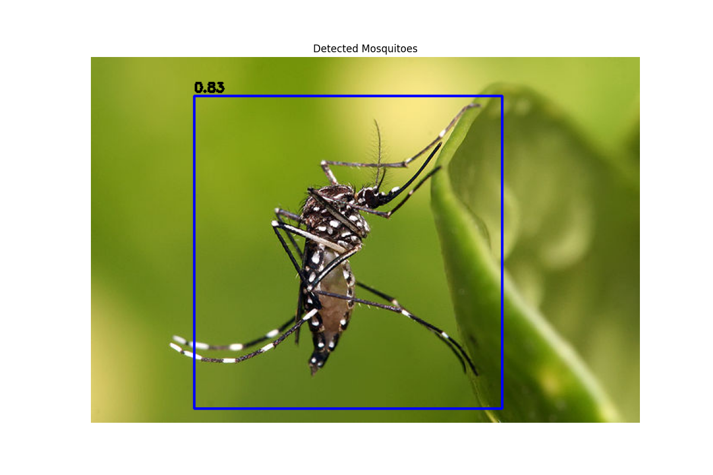

<!--
 DO NOT EDIT.
 THIS FILE WAS AUTOMATICALLY GENERATED BY mkdocs-gallery.
 TO MAKE CHANGES, EDIT THE SOURCE PYTHON FILE:
 "docs/en/examples/tutorial_part_1_mosquito_detection.py"
 LINE NUMBERS ARE GIVEN BELOW.
-->

!!! note

    Click [here](#download_links)
    to download the full example code or to run this example in your browser via Binder


Сегментация комаров с помощью MosquitoSegmenter
===============================================

Этот туториал показывает, как использовать `MosquitoSegmenter` из библиотеки CulicidaeLab
для выполнения сегментации комаров на изображениях. Мы рассмотрим:

- Загрузку модели сегментатора (SAM)
- Подготовку изображения
- Запуск предсказания для получения маски
- Визуализацию результата

<!-- GENERATED FROM PYTHON SOURCE LINES 15-19 -->

# Mosquito Detection Tutorial

This notebook demonstrates how to use the CulicidaeLab library for detecting mosquitoes in images.


<!-- GENERATED FROM PYTHON SOURCE LINES 21-30 -->

```{.python }
import re
import cv2
import matplotlib.pyplot as plt
from pathlib import Path

from culicidaelab.core.settings import get_settings
from culicidaelab.predictors.detector import MosquitoDetector


```


<!-- GENERATED FROM PYTHON SOURCE LINES 31-34 -->

## 1. Initialize Settings and Load Model

First, we'll get the settings instance which will handle model weights and configurations.

<!-- GENERATED FROM PYTHON SOURCE LINES 36-37 -->

Get settings instance

<!-- GENERATED FROM PYTHON SOURCE LINES 37-40 -->

```{.python }
settings = get_settings()
settings.list_model_types()

```


Out:
{: .mkd-glr-script-out }

```{.shell .mkd-glr-script-out-disp }

['classifier', 'detector', 'segmenter']
```


<!-- GENERATED FROM PYTHON SOURCE LINES 41-44 -->

```{.python }
model_config = settings.get_config("predictors.detector")
model_path = settings.get_model_weights_path("detector")

```


<!-- GENERATED FROM PYTHON SOURCE LINES 45-47 -->

```{.python }
detector = MosquitoDetector(settings=settings, load_model=True)

```


Out:
{: .mkd-glr-script-out }

```{.shell .mkd-glr-script-out-disp }
Weights file found at: C:\Users\lenova\AppData\Local\culicidaelab\culicidaelab\models\weights\detection\culico-net-det-v1-nano.pt

```


<!-- GENERATED FROM PYTHON SOURCE LINES 48-51 -->

## 2. Load and Process an Image

Now let's load a test image and run detection on it.

<!-- GENERATED FROM PYTHON SOURCE LINES 53-54 -->

Load test image

<!-- GENERATED FROM PYTHON SOURCE LINES 54-76 -->

```{.python }
image_path = str(Path("test_imgs") / "640px-Aedes_aegypti.jpg")
image = cv2.imread(image_path)
image = cv2.cvtColor(image, cv2.COLOR_BGR2RGB)

# Run detection
detections = detector.predict(image)

# Draw detections
annotated_image = detector.visualize(image, detections)

# Display results
plt.figure(figsize=(12, 8))
plt.imshow(annotated_image)
plt.axis("off")
plt.title("Detected Mosquitoes")
plt.show()

# Print detection results
print("\nDetection Results:")
for i, (x, y, w, h, conf) in enumerate(detections):
    print(f"Mosquito {i+1}: Confidence = {conf:.2f}, Box = (x={x:.1f}, y={y:.1f}, w={w:.1f}, h={h:.1f})")

```


{: .mkd-glr-single-img srcset="../images/mkd_glr_tutorial_part_1_mosquito_detection_001.png, ../images/mkd_glr_tutorial_part_1_mosquito_detection_001_2_0x.png 2.0x"}

Out:
{: .mkd-glr-script-out }

```{.shell .mkd-glr-script-out-disp }
C:/Users/lenova/CascadeProjects/culicidaelab/docs/en/examples/tutorial_part_1_mosquito_detection.py:69: UserWarning: FigureCanvasAgg is non-interactive, and thus cannot be shown
  plt.show()

Detection Results:
Mosquito 1: Confidence = 0.83, Box = (x=299.6, y=227.9, w=359.2, h=365.3)

```


<!-- GENERATED FROM PYTHON SOURCE LINES 77-83 -->

```{.python }
test_ground_truth = detections[0][:4]
evaluation = detector.evaluate([test_ground_truth], prediction=detections)
print(evaluation)
evaluation_from_raw = detector.evaluate([test_ground_truth], input_data=image)
print(evaluation_from_raw)

```


Out:
{: .mkd-glr-script-out }

```{.shell .mkd-glr-script-out-disp }
{'precision': 0.9999999989999999, 'recall': 1.0, 'f1': 0.9999999989999999, 'ap': 0.9999999989999999, 'mean_iou': 1.0}
{'precision': 0.9999999989999999, 'recall': 1.0, 'f1': 0.9999999989999999, 'ap': 0.9999999989999999, 'mean_iou': 1.0}

```


<!-- GENERATED FROM PYTHON SOURCE LINES 84-104 -->

```{.python }
image_dir = Path("test_imgs")

# This pattern matches any string that ends with .jpg, .jpeg, or .png, case-insensitively.
# \.   -> matches a literal dot
# (jpg|jpeg|png) -> matches 'jpg' OR 'jpeg' OR 'png'
# $    -> matches the end of the string
pattern = re.compile(r"\.(jpg|jpeg|png)$", re.IGNORECASE)

# Get list with all files and filter using the regex
image_paths = [path for path in image_dir.iterdir() if path.is_file() and pattern.search(str(path))]
try:
    batch = [cv2.cvtColor(cv2.imread(str(path)), cv2.COLOR_BGR2RGB) for path in image_paths]
    print(f"\nSuccessfully created a batch with {len(batch)} images.")
except Exception as e:
    print(f"An error occurred while reading images: {e}")
    batch = []

detections_batch = detector.predict_batch(batch)
print(detections_batch)

```


Out:
{: .mkd-glr-script-out }

```{.shell .mkd-glr-script-out-disp }

Successfully created a batch with 3 images.


Predicting detection batch:   0%|                                               | 0/3 [00:00<?, ?it/s]

Predicting detection batch:  33%|#############                          | 1/3 [00:00<00:01,  1.58it/s]
Predicting detection batch: 100%|#######################################| 3/3 [00:00<00:00,  4.75it/s]
[[(np.float32(293.00903), np.float32(229.80469), np.float32(357.76526), np.float32(365.13818), 0.8381393551826477)], [(np.float32(217.3683), np.float32(104.564575), np.float32(166.60593), np.float32(118.52366), 0.8341205716133118)], [(np.float32(729.15344), np.float32(315.28235), np.float32(554.7985), np.float32(489.8028), 0.8352258205413818)]]

```


<!-- GENERATED FROM PYTHON SOURCE LINES 105-107 -->

Assuming detections_batch is in the format: [[(x,y,w,h,conf), ...], [(x,y,w,h,conf), ...], ...]
Create ground truth batch in the correct format

<!-- GENERATED FROM PYTHON SOURCE LINES 107-118 -->

```{.python }
batch_test_gt = [[(x, y, w, h) for (x, y, w, h, conf) in detections] for detections in detections_batch]

# Now call evaluate_batch with the correct format
batch_evaluation = detector.evaluate_batch(
    ground_truth_batch=batch_test_gt,  # List of lists of ground truth boxes
    input_data_batch=None,  # We're providing predictions directly
    predictions_batch=detections_batch,  # List of lists of predictions with confidence
    num_workers=1,  # Use single worker for deterministic results
)

print(batch_evaluation)
```


Out:
{: .mkd-glr-script-out }

```{.shell .mkd-glr-script-out-disp }


Calculating metrics:   0%|                                                      | 0/3 [00:00<?, ?it/s]
Calculating metrics: 100%|############################################| 3/3 [00:00<00:00, 1496.01it/s]
{'recall_mean': 1.0, 'recall_std': 0.0, 'f1_mean': 0.9999999989999999, 'f1_std': 0.0, 'ap_mean': 0.9999999989999999, 'ap_std': 0.0, 'mean_iou_mean': 0.9999999403953552, 'mean_iou_std': 8.429369702178807e-08, 'precision_mean': 0.9999999989999999, 'precision_std': 0.0, 'count': 3}

```


**Total running time of the script:** ( 0 minutes  2.413 seconds)

<div id="download_links"></div>

[](https://mybinder.org/v2/gh/iloncka-ds/culicidaelab/gh-pages?urlpath=lab/tree/docs/en/examples/generated/gallery/tutorial_part_1_mosquito_detection.ipynb){ .center}

[:fontawesome-solid-download: Download Python source code: tutorial_part_1_mosquito_detection.py](./tutorial_part_1_mosquito_detection.py){ .md-button .center}

[:fontawesome-solid-download: Download Jupyter notebook: tutorial_part_1_mosquito_detection.ipynb](./tutorial_part_1_mosquito_detection.ipynb){ .md-button .center}


[Gallery generated by mkdocs-gallery](https://smarie.github.io/mkdocs-gallery){: .mkd-glr-signature }
