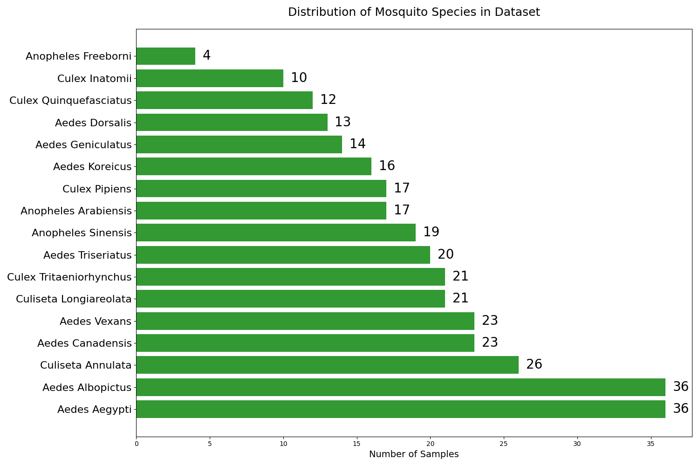
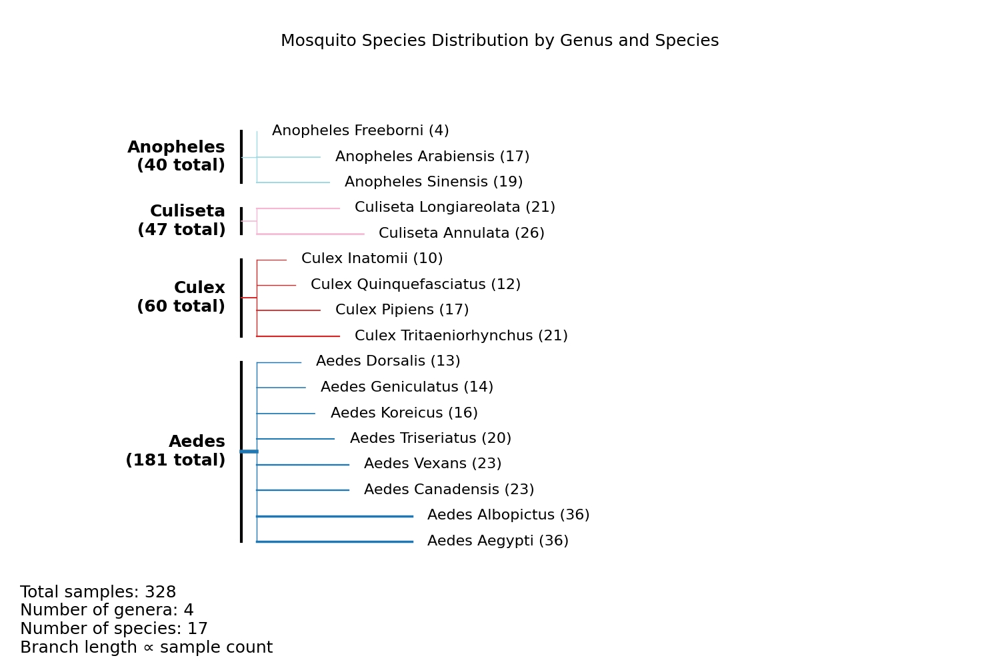

<!--
 DO NOT EDIT.
 THIS FILE WAS AUTOMATICALLY GENERATED BY mkdocs-gallery.
 TO MAKE CHANGES, EDIT THE SOURCE PYTHON FILE:
 "docs/en/examples/tutorial_part_4_datasets_example.py"
 LINE NUMBERS ARE GIVEN BELOW.
-->

!!! note

    Click [here](#download_links)
    to download the full example code or to run this example in your browser via Binder


# CulicidaeLab Datasets Module Example

This notebook demonstrates how to use the datasets module in CulicidaeLab.

<!-- GENERATED FROM PYTHON SOURCE LINES 8-9 -->

Third-party imports

<!-- GENERATED FROM PYTHON SOURCE LINES 9-20 -->

```{.python }
import matplotlib.pyplot as plt
import numpy as np
import requests

from datasets import load_dataset
from collections import defaultdict

from culicidaelab.core.settings import get_settings
from culicidaelab.core.provider_service import ProviderService
from culicidaelab.datasets.datasets_manager import DatasetsManager

```


<!-- GENERATED FROM PYTHON SOURCE LINES 21-27 -->

```{.python }
print("\n--- 1. Initializing DatasetsManager ---")
settings = get_settings()
provider_service = ProviderService(settings)
manager = DatasetsManager(settings, provider_service)
print("DatasetsManager initialized successfully.")

```


Out:
{: .mkd-glr-script-out }

```{.shell .mkd-glr-script-out-disp }

--- 1. Initializing DatasetsManager ---
DatasetsManager initialized successfully.

```


<!-- GENERATED FROM PYTHON SOURCE LINES 28-32 -->

```{.python }
print("\n--- 2. Listing all available datasets ---")
available_datasets = manager.list_datasets()
print(f"Available datasets found in configuration: {available_datasets}")

```


Out:
{: .mkd-glr-script-out }

```{.shell .mkd-glr-script-out-disp }

--- 2. Listing all available datasets ---
Available datasets found in configuration: ['classification', 'detection', 'segmentation', 'species_diversity']

```


<!-- GENERATED FROM PYTHON SOURCE LINES 33-43 -->

```{.python }
print("\n--- 3. Getting info for 'classification' dataset ---")
try:
    info = manager.get_dataset_info("classification")
    print(f"  - Name: {info.name}")
    print(f"  - Path/ID: {info.path}")
    print(f"  - Provider: {info.provider_name}")
    print(f"  - Classes: {info.classes}")
except KeyError as e:
    print(e)

```


Out:
{: .mkd-glr-script-out }

```{.shell .mkd-glr-script-out-disp }

--- 3. Getting info for 'classification' dataset ---
  - Name: mosquito-species-classification
  - Path/ID: mosquito_species_classification
  - Provider: huggingface
  - Classes: ['aedes_aegypti', 'aedes_albopictus', 'aedes_canadensis', 'aedes_dorsalis', 'aedes_geniculatus', 'aedes_koreicus', 'aedes_triseriatus', 'aedes_vexans', 'anopheles_arabiensis', 'anopheles_freeborni', 'anopheles_sinensis', 'class_background', 'culex_inatomii', 'culex_pipiens', 'culex_quinquefasciatus', 'culex_tritaeniorhynchus', 'culiseta_annulata', 'culiseta_longiareolata']

```


<!-- GENERATED FROM PYTHON SOURCE LINES 44-50 -->

```{.python }
print("\n--- 4. Loading 'classification' dataset for the first time ---")
print("This will trigger the provider to 'download' and then 'load' the data.")
classification_data = manager.load_dataset("classification", split="test")
print("\nDataset loaded successfully!")
print(f"Returned data: {classification_data}")

```


Out:
{: .mkd-glr-script-out }

```{.shell .mkd-glr-script-out-disp }

--- 4. Loading 'classification' dataset for the first time ---
This will trigger the provider to 'download' and then 'load' the data.
Dataset 'classification' not in cache. Downloading...
Existing dataset found at 'C:\Users\lenova\AppData\Local\culicidaelab\culicidaelab\datasets\mosquito_species_classification\test'. Removing it for a clean download.


Saving the dataset (0/1 shards):   0%|                                 | 0/328 [00:00<?, ? examples/s]

Saving the dataset (1/1 shards): 100%|#####################| 328/328 [00:00<00:00, 3838.58 examples/s]
Saving the dataset (1/1 shards): 100%|#####################| 328/328 [00:00<00:00, 3838.58 examples/s]
Dataset 'classification' downloaded and path cached.
Loading 'classification' from path: C:\Users\lenova\AppData\Local\culicidaelab\culicidaelab\datasets\mosquito_species_classification\test
Dataset 'classification' loaded successfully.

Dataset loaded successfully!
Returned data: Dataset({
    features: ['image', 'filename', 'label'],
    num_rows: 328
})

```


<!-- GENERATED FROM PYTHON SOURCE LINES 51-56 -->

```{.python }
print("\n--- 5. Listing currently loaded (cached) datasets ---")
loaded_list = manager.list_loaded_datasets()
print(f"Manager reports these datasets are loaded: {loaded_list}")
print(f"Internal cache state: {manager.loaded_datasets}")

```


Out:
{: .mkd-glr-script-out }

```{.shell .mkd-glr-script-out-disp }

--- 5. Listing currently loaded (cached) datasets ---
Manager reports these datasets are loaded: ['classification']
Internal cache state: {'classification': Path('C:/Users/lenova/AppData/Local/culicidaelab/culicidaelab/datasets/mosquito_species_classification/test')}

```


<!-- GENERATED FROM PYTHON SOURCE LINES 57-58 -->

Define the dataset name

<!-- GENERATED FROM PYTHON SOURCE LINES 58-73 -->

```{.python }
dataset_name = "iloncka/mosquito-species-classification-dataset"
API_URL = f"https://datasets-server.huggingface.co/croissant-crumbs?dataset={dataset_name}"


def get_metadata(dataset_name):
    """Fetch metadata for a given dataset from Hugging Face."""
    api_url = f"https://datasets-server.huggingface.co/croissant-crumbs?dataset={dataset_name}"
    response = requests.get(api_url, timeout=10)
    response.raise_for_status()
    return response.json()


metadata = get_metadata(dataset_name)
print(metadata)

```


Out:
{: .mkd-glr-script-out }

```{.shell .mkd-glr-script-out-disp }
{'@context': {'@language': 'en', '@vocab': 'https://schema.org/', 'citeAs': 'cr:citeAs', 'column': 'cr:column', 'conformsTo': 'dct:conformsTo', 'cr': 'http://mlcommons.org/croissant/', 'data': {'@id': 'cr:data', '@type': '@json'}, 'dataBiases': 'cr:dataBiases', 'dataCollection': 'cr:dataCollection', 'dataType': {'@id': 'cr:dataType', '@type': '@vocab'}, 'dct': 'http://purl.org/dc/terms/', 'extract': 'cr:extract', 'field': 'cr:field', 'fileProperty': 'cr:fileProperty', 'fileObject': 'cr:fileObject', 'fileSet': 'cr:fileSet', 'format': 'cr:format', 'includes': 'cr:includes', 'isLiveDataset': 'cr:isLiveDataset', 'jsonPath': 'cr:jsonPath', 'key': 'cr:key', 'md5': 'cr:md5', 'parentField': 'cr:parentField', 'path': 'cr:path', 'personalSensitiveInformation': 'cr:personalSensitiveInformation', 'recordSet': 'cr:recordSet', 'references': 'cr:references', 'regex': 'cr:regex', 'repeated': 'cr:repeated', 'replace': 'cr:replace', 'sc': 'https://schema.org/', 'separator': 'cr:separator', 'source': 'cr:source', 'subField': 'cr:subField', 'transform': 'cr:transform'}, '@type': 'sc:Dataset', 'conformsTo': 'http://mlcommons.org/croissant/1.0', 'distribution': [{'@type': 'cr:FileObject', '@id': 'repo', 'name': 'repo', 'description': 'The Hugging Face git repository.', 'contentUrl': 'https://huggingface.co/datasets/iloncka/mosquito-species-classification-dataset/tree/refs%2Fconvert%2Fparquet', 'encodingFormat': 'git+https', 'sha256': 'https://github.com/mlcommons/croissant/issues/80'}, {'@type': 'cr:FileSet', '@id': 'parquet-files-for-config-default', 'name': 'parquet-files-for-config-default', 'description': 'The underlying Parquet files as converted by Hugging Face (see: https://huggingface.co/docs/dataset-viewer/parquet).', 'containedIn': {'@id': 'repo'}, 'encodingFormat': 'application/x-parquet', 'includes': 'default/*/*.parquet'}], 'recordSet': [{'@type': 'cr:RecordSet', 'dataType': 'cr:Split', 'key': {'@id': 'default_splits/split_name'}, '@id': 'default_splits', 'name': 'default_splits', 'description': 'Splits for the default config.', 'field': [{'@type': 'cr:Field', '@id': 'default_splits/split_name', 'name': 'split_name', 'description': 'The name of the split.', 'dataType': 'sc:Text'}], 'data': [{'default_splits/split_name': 'train'}, {'default_splits/split_name': 'valid'}, {'default_splits/split_name': 'test'}]}, {'@type': 'cr:RecordSet', '@id': 'default', 'name': 'default', 'description': "iloncka/mosquito-species-classification-dataset - 'default' subset\n\nAdditional information:\n- 3 splits: train, valid, test", 'field': [{'@type': 'cr:Field', '@id': 'default/split', 'name': 'default/split', 'description': 'Split to which the example belongs to.', 'dataType': 'sc:Text', 'source': {'fileSet': {'@id': 'parquet-files-for-config-default'}, 'extract': {'fileProperty': 'fullpath'}, 'transform': {'regex': 'default/(?:partial-)?(train|valid|test)/.+parquet$'}}, 'references': {'field': {'@id': 'default_splits/split_name'}}}, {'@type': 'cr:Field', '@id': 'default/image', 'name': 'default/image', 'description': "Image column 'image' from the Hugging Face parquet file.", 'dataType': 'sc:ImageObject', 'source': {'fileSet': {'@id': 'parquet-files-for-config-default'}, 'extract': {'column': 'image'}, 'transform': {'jsonPath': 'bytes'}}}, {'@type': 'cr:Field', '@id': 'default/filename', 'name': 'default/filename', 'description': "Column 'filename' from the Hugging Face parquet file.", 'dataType': 'sc:Text', 'source': {'fileSet': {'@id': 'parquet-files-for-config-default'}, 'extract': {'column': 'filename'}}}, {'@type': 'cr:Field', '@id': 'default/label', 'name': 'default/label', 'description': "Column 'label' from the Hugging Face parquet file.", 'dataType': 'sc:Text', 'source': {'fileSet': {'@id': 'parquet-files-for-config-default'}, 'extract': {'column': 'label'}}}]}]}

```


<!-- GENERATED FROM PYTHON SOURCE LINES 74-80 -->

```{.python }
dataset = load_dataset(
    "iloncka/mosquito-species-classification-dataset",
    split="test",
)  # , streaming=True, trust_remote_code=True
dataset_head = dataset.take(2)

```


<!-- GENERATED FROM PYTHON SOURCE LINES 81-83 -->

```{.python }
set(dataset["label"])

```


Out:
{: .mkd-glr-script-out }

```{.shell .mkd-glr-script-out-disp }

{'anopheles_freeborni', 'anopheles_sinensis', 'aedes_canadensis', 'aedes_vexans', 'aedes_geniculatus', 'culex_tritaeniorhynchus', 'culiseta_longiareolata', 'culex_inatomii', 'culex_pipiens', 'aedes_triseriatus', 'aedes_koreicus', 'anopheles_arabiensis', 'culiseta_annulata', 'culex_quinquefasciatus', 'aedes_dorsalis', 'aedes_aegypti', 'aedes_albopictus'}
```


<!-- GENERATED FROM PYTHON SOURCE LINES 84-85 -->

Specify the dataset, config, and split you want to query

<!-- GENERATED FROM PYTHON SOURCE LINES 85-105 -->

```{.python }
dataset_name = "iloncka/mosquito-species-classification-dataset"  # e.g., "nyu-mll/glue"
config_name = "default"  # e.g., "cola"
split_name = "test"  # e.g., "train", "validation"

# Construct the API URL
API_URL = (
    f"https://datasets-server.huggingface.co/statistics?dataset={dataset_name}&config={config_name}&split={split_name}"
)


# Function to query the API
def query():
    response = requests.get(API_URL, timeout=10)
    return response.json()


# Fetch and print unique labels
dataset_info = query()


```


<!-- GENERATED FROM PYTHON SOURCE LINES 106-211 -->

```{.python }
def get_dataset_summary(dataset_name, dataset_info):
    """
    Generate a summary of dataset information from the dataset statistics.

    Parameters:
    -----------
    dataset_info : dict
        Dictionary containing dataset statistics and information

    Returns:
    --------
    dict
        Organized summary of the dataset
    """
    summary = {
        "dataset_name": dataset_name,
        "total_samples": dataset_info["num_examples"],
        "columns": {},
        "label_distribution": None,
        "image_info": None,
    }

    # Process each column's statistics
    for column in dataset_info["statistics"]:
        col_name = column["column_name"]
        col_type = column["column_type"]
        stats = column["column_statistics"]

        # Special handling for label column
        if col_type == "string_label":
            summary["label_distribution"] = {
                "num_classes": stats["n_unique"],
                "class_distribution": stats["frequencies"],
            }

        # Special handling for image column
        elif col_type == "image":
            summary["image_info"] = {
                "dimensions": f"{int(stats['min'])}x{int(stats['max'])}",
                "num_images": dataset_info["num_examples"],
            }

        # Store basic column information
        summary["columns"][col_name] = {
            "type": col_type,
            "missing_values": {
                "count": stats.get("nan_count", 0),
                "percentage": stats.get("nan_proportion", 0) * 100,
            },
        }

        # Add additional statistics if available
        if "mean" in stats:
            summary["columns"][col_name]["statistics"] = {
                "mean": stats["mean"],
                "std": stats["std"],
                "min": stats["min"],
                "max": stats["max"],
            }

    return summary


# Print summary in a readable format
def print_dataset_summary(summary):
    print(f"Dataset Summary {summary['dataset_name']}:")
    print(f"Total samples: {summary['total_samples']}")
    print("\nImage Information:")
    if summary["image_info"]:
        print(f"Dimensions: {summary['image_info']['dimensions']}")
        print(f"Number of images: {summary['image_info']['num_images']}")

    print("\nLabel Distribution:")
    if summary["label_distribution"]:
        print(f"Number of classes: {summary['label_distribution']['num_classes']}")
        print("\nSamples per class:")
        for class_name, count in summary["label_distribution"]["class_distribution"].items():
            print(f"  {class_name}: {count}")

    print("\nColumns:")
    for col_name, col_info in summary["columns"].items():
        print(f"\n{col_name}:")
        print(f"  Type: {col_info['type']}")
        # Print missing values info, keeping line length <= 120
        missing_count = col_info["missing_values"]["count"]
        missing_pct = col_info["missing_values"]["percentage"]
        print(f"  Missing values: {missing_count} ({missing_pct:.2f}%)")
        if "statistics" in col_info:
            print("  Statistics:")
            print(f"    Mean: {col_info['statistics']['mean']:.2f}")
            print(f"    Std: {col_info['statistics']['std']:.2f}")
            print(f"    Min: {col_info['statistics']['min']}")
            print(f"    Max: {col_info['statistics']['max']}")


# Example usage:
summary = get_dataset_summary(
    dataset_name,
    dataset_info,
)  # Replace dataset_info with your response

# Print the summary
print_dataset_summary(summary)


```


Out:
{: .mkd-glr-script-out }

```{.shell .mkd-glr-script-out-disp }
Dataset Summary iloncka/mosquito-species-classification-dataset:
Total samples: 328

Image Information:
Dimensions: 224x224
Number of images: 328

Label Distribution:
Number of classes: 17

Samples per class:
  aedes_koreicus: 16
  aedes_geniculatus: 14
  culiseta_longiareolata: 21
  aedes_aegypti: 36
  culex_quinquefasciatus: 12
  culiseta_annulata: 26
  aedes_triseriatus: 20
  culex_inatomii: 10
  aedes_dorsalis: 13
  anopheles_freeborni: 4
  aedes_canadensis: 23
  aedes_vexans: 23
  culex_tritaeniorhynchus: 21
  anopheles_sinensis: 19
  anopheles_arabiensis: 17
  aedes_albopictus: 36
  culex_pipiens: 17

Columns:

filename:
  Type: string_text
  Missing values: 0 (0.00%)
  Statistics:
    Mean: 137.03
    Std: 18.11
    Min: 115
    Max: 170

image:
  Type: image
  Missing values: 0 (0.00%)
  Statistics:
    Mean: 224.00
    Std: 0.00
    Min: 224
    Max: 224

label:
  Type: string_label
  Missing values: 0 (0.00%)

```


<!-- GENERATED FROM PYTHON SOURCE LINES 212-268 -->

```{.python }
def find_min_max_classes(dataset_info):
    """
    Find classes with minimum and maximum number of samples in the dataset.

    Parameters:
    -----------
    dataset_info : dict
        Dictionary containing dataset statistics and information

    Returns:
    --------
    dict
        Information about minimum and maximum classes
    """
    # Get the label frequencies from the statistics
    label_stats = None
    for column in dataset_info["statistics"]:
        if column["column_type"] == "string_label":
            label_stats = column["column_statistics"]["frequencies"]
            break

    if not label_stats:
        return None

    # Find min and max classes
    min_class = min(label_stats.items(), key=lambda x: x[1])
    max_class = max(label_stats.items(), key=lambda x: x[1])

    result = {
        "minimum": {"class_name": min_class[0], "sample_count": min_class[1]},
        "maximum": {"class_name": max_class[0], "sample_count": max_class[1]},
        "difference": max_class[1] - min_class[1],
    }

    return result


# Example usage:
min_max_info = find_min_max_classes(
    dataset_info,
)  # Replace dataset_info with your response

# Print the results in a readable format
if min_max_info:
    print("Class Distribution Analysis:")
    print("\nMinimum samples per class:")
    print(f"  Class: {min_max_info['minimum']['class_name']}")
    print(f"  Count: {min_max_info['minimum']['sample_count']} samples")

    print("\nMaximum samples per class:")
    print(f"  Class: {min_max_info['maximum']['class_name']}")
    print(f"  Count: {min_max_info['maximum']['sample_count']} samples")

    print(f"\nDifference between max and min: {min_max_info['difference']} samples")


```


Out:
{: .mkd-glr-script-out }

```{.shell .mkd-glr-script-out-disp }
Class Distribution Analysis:

Minimum samples per class:
  Class: anopheles_freeborni
  Count: 4 samples

Maximum samples per class:
  Class: aedes_aegypti
  Count: 36 samples

Difference between max and min: 32 samples

```


<!-- GENERATED FROM PYTHON SOURCE LINES 269-341 -->

```{.python }
def create_distribution_plot(
    dataset,
    dataset_info,
    color="green",
    figsize=(15, 10),
    output_file="class_distribution.png",
):
    """
    Create a horizontal bar plot of class distribution.

    Parameters:
    -----------
    dataset : HuggingFace IterableDataset
        The dataset containing images and labels
    dataset_info : dict
        Dictionary containing dataset statistics and information
    figsize : tuple, default=(15, 10)
        Figure size (width, height)
    output_file : str, default='class_distribution.png'
        Output file name
    """
    # Get label frequencies from dataset_info
    label_stats = None
    for column in dataset_info["statistics"]:
        if column["column_type"] == "string_label":
            label_stats = column["column_statistics"]["frequencies"]
            break

    if not label_stats:
        print("No label statistics found in dataset_info")
        return

    # Sort classes by sample count
    sorted_items = sorted(label_stats.items(), key=lambda x: x[1], reverse=True)
    classes, counts = zip(*sorted_items)

    # Create figure with custom size
    _, ax = plt.subplots(figsize=figsize)

    # Create horizontal bars
    y_pos = np.arange(len(classes))
    ax.barh(y_pos, counts, align="center", color=color, alpha=0.8)

    # Customize the plot
    ax.set_yticks(y_pos)
    # Format class names by replacing underscores with spaces and capitalize
    formatted_classes = [c.replace("_", " ").title() for c in classes]
    ax.set_yticklabels(formatted_classes, fontsize=16)

    # Add value labels on the bars
    for i, v in enumerate(counts):
        ax.text(v + 0.5, i, str(v), va="center", fontsize=20)

    # Add title and labels
    plt.title("Distribution of Mosquito Species in Dataset", pad=20, fontsize=18)
    plt.xlabel("Number of Samples", fontsize=14)

    # Adjust layout to prevent label cutoff
    plt.tight_layout()

    # Save the plot
    plt.savefig(output_file, dpi=300, bbox_inches="tight")
    print(f"Distribution plot saved as {output_file}")

    # Display the plot
    plt.show()


# Example usage - create both plots
create_distribution_plot(dataset, dataset_info)


```


{: .mkd-glr-single-img srcset="../images/mkd_glr_tutorial_part_4_datasets_example_001.png, ../images/mkd_glr_tutorial_part_4_datasets_example_001_2_0x.png 2.0x"}

Out:
{: .mkd-glr-script-out }

```{.shell .mkd-glr-script-out-disp }
Distribution plot saved as class_distribution.png
C:/Users/lenova/CascadeProjects/culicidaelab/docs/en/examples/tutorial_part_4_datasets_example.py:334: UserWarning: FigureCanvasAgg is non-interactive, and thus cannot be shown
  plt.show()

```


<!-- GENERATED FROM PYTHON SOURCE LINES 342-530 -->

```{.python }
def create_tree_visualization(
    dataset_info,
    figsize=(15, 10),
    output_file="tree_distribution.png",
):
    """
    Create a tree-like visualization with branch lengths proportional to species count.
    """
    # Get label frequencies from dataset_info
    label_stats = None
    for column in dataset_info["statistics"]:
        if column["column_type"] == "string_label":
            label_stats = column["column_statistics"]["frequencies"]
            break

    if not label_stats:
        print("No label statistics found in dataset_info")
        return

    # Group species by genus
    genus_groups = defaultdict(list)
    genus_totals = defaultdict(int)

    for species, count in label_stats.items():
        genus = species.split("_")[0]
        genus_groups[genus].append((species, count))
        genus_totals[genus] += count

    # Sort genera by total count
    sorted_genera = sorted(genus_totals.items(), key=lambda x: x[1], reverse=True)

    # Create figure
    fig, ax = plt.subplots(figsize=figsize)

    # Calculate scaling factors
    max_count = max(label_stats.values())
    min_count = min(label_stats.values())
    max_genus_count = max(genus_totals.values())
    min_genus_count = min(genus_totals.values())

    # Calculate positions
    total_species = sum(len(group) for group in genus_groups.values())
    y_positions = np.linspace(0.1, 0.9, total_species)
    trunk_x = 0.15  # Position of main vertical line
    max_branch_length = 0.4  # Maximum branch length

    current_y_index = 0
    text_offset = 0.02

    # Color map for genera
    colors = plt.cm.tab20(np.linspace(0, 1, len(genus_groups)))

    # Draw main trunk segments between genera
    # Draw main trunk segments between genera
    # prev_end removed (was unused)
    for (genus, _), color in zip(sorted_genera, colors):
        species_count = len(genus_groups[genus])
        start_y = y_positions[current_y_index]
        end_y = y_positions[current_y_index + species_count - 1]

        # Draw main trunk segment for this genus
        ax.plot([trunk_x, trunk_x], [start_y, end_y], color="k", linewidth=3)

        # prev_end = end_y  # Removed unused variable
        current_y_index += species_count

    # Reset current_y_index for species drawing
    current_y_index = 0

    # Draw branches for each genus
    for (genus, total_count), color in zip(sorted_genera, colors):
        species_list = genus_groups[genus]
        species_count = len(species_list)

        # Calculate genus branch position and length
        genus_y = np.mean(
            y_positions[current_y_index : current_y_index + species_count],
        )
        genus_branch_length = 0.02  # Fixed length for genus branches

        # Calculate line thickness based on count
        thickness = 1 + 3 * (total_count - min_genus_count) / (max_genus_count - min_genus_count)

        # Draw genus branch
        ax.plot(
            [trunk_x, trunk_x + genus_branch_length],
            [genus_y, genus_y],
            "-",
            color=color,
            linewidth=thickness,
        )

        # Add genus name
        ax.text(
            trunk_x - 0.02,
            genus_y,
            f"{genus.title()}\n({total_count} total)",
            horizontalalignment="right",
            verticalalignment="center",
            fontsize=18,
            fontweight="bold",
        )

        # Draw vertical connector for species
        if species_count > 1:
            ax.plot(
                [trunk_x + genus_branch_length, trunk_x + genus_branch_length],
                [
                    y_positions[current_y_index],
                    y_positions[current_y_index + species_count - 1],
                ],
                "-",
                color=color,
                linewidth=1,
                alpha=1,
            )

        # Draw species branches
        for i, (species, count) in enumerate(
            sorted(species_list, key=lambda x: x[1], reverse=True),
        ):
            y_pos = y_positions[current_y_index + i]

            # Calculate species branch length based on count
            species_branch_length = max_branch_length * 0.5 * (count - min_count) / (max_count - min_count)

            # Draw species branch
            species_thickness = 0.5 + 2 * (count - min_count) / (max_count - min_count)
            ax.plot(
                [
                    trunk_x + genus_branch_length,
                    trunk_x + genus_branch_length + species_branch_length,
                ],
                [y_pos, y_pos],
                "-",
                color=color,
                linewidth=species_thickness,
            )

            # Add species name with genus
            species_name = species.replace(
                "_",
                " ",
            ).title()  # Include full name with genus
            ax.text(
                trunk_x + genus_branch_length + species_branch_length + text_offset,
                y_pos,
                f"{species_name} ({count})",
                verticalalignment="center",
                fontsize=16,
            )

        current_y_index += species_count

    # Customize the plot
    ax.set_xlim(0, 1)
    ax.set_ylim(0, 1)
    ax.axis("off")

    # Add title
    plt.suptitle(
        "Mosquito Species Distribution by Genus and Species",
        y=0.95,
        fontsize=18,
    )

    # Add total samples count and legend
    total_samples = sum(label_stats.values())
    plt.figtext(
        0.02,
        0.02,
        f"Total samples: {total_samples}\n"
        f"Number of genera: {len(genus_groups)}\n"
        f"Number of species: {len(label_stats)}\n"
        f"Branch length ∝ sample count",
        fontsize=18,
    )

    # Save the plot
    plt.savefig(output_file, dpi=300, bbox_inches="tight")
    print(f"Tree visualization saved as {output_file}")

    # Display the plot
    plt.show()


# Example usage
create_tree_visualization(dataset_info)
```


{: .mkd-glr-single-img srcset="../images/mkd_glr_tutorial_part_4_datasets_example_002.png, ../images/mkd_glr_tutorial_part_4_datasets_example_002_2_0x.png 2.0x"}

Out:
{: .mkd-glr-script-out }

```{.shell .mkd-glr-script-out-disp }
Tree visualization saved as tree_distribution.png
C:/Users/lenova/CascadeProjects/culicidaelab/docs/en/examples/tutorial_part_4_datasets_example.py:525: UserWarning: FigureCanvasAgg is non-interactive, and thus cannot be shown
  plt.show()

```


**Total running time of the script:** ( 0 minutes  23.646 seconds)

<div id="download_links"></div>

[](https://mybinder.org/v2/gh/iloncka-ds/culicidaelab/gh-pages?urlpath=lab/tree/docs/en/examples/generated/gallery/tutorial_part_4_datasets_example.ipynb){ .center}

[:fontawesome-solid-download: Download Python source code: tutorial_part_4_datasets_example.py](./tutorial_part_4_datasets_example.py){ .md-button .center}

[:fontawesome-solid-download: Download Jupyter notebook: tutorial_part_4_datasets_example.ipynb](./tutorial_part_4_datasets_example.ipynb){ .md-button .center}


[Gallery generated by mkdocs-gallery](https://smarie.github.io/mkdocs-gallery){: .mkd-glr-signature }
