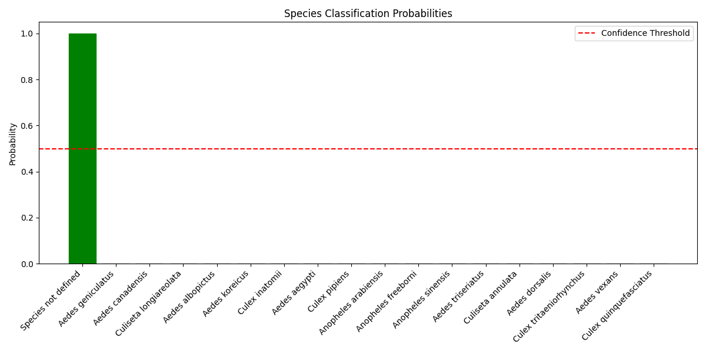
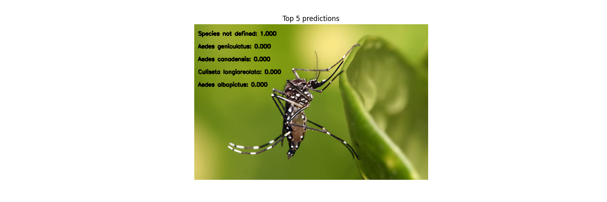

<!--
 DO NOT EDIT.
 THIS FILE WAS AUTOMATICALLY GENERATED BY mkdocs-gallery.
 TO MAKE CHANGES, EDIT THE SOURCE PYTHON FILE:
 "examples/tutorial_part_3_mosquito_classification.py"
 LINE NUMBERS ARE GIVEN BELOW.
-->

!!! note

    Click [here](#download_links)
    to download the full example code or to run this example in your browser via Binder


Сегментация комаров с помощью MosquitoSegmenter
===============================================

Этот туториал показывает, как использовать `MosquitoSegmenter` из библиотеки CulicidaeLab
для выполнения сегментации комаров на изображениях. Мы рассмотрим:

- Загрузку модели сегментатора (SAM)
- Подготовку изображения
- Запуск предсказания для получения маски
- Визуализацию результата

<!-- GENERATED FROM PYTHON SOURCE LINES 15-22 -->

# Mosquito Classification Tutorial
This tutorial demonstrates how to use CulicidaeLab for mosquito species classification.
First, let's import the necessary libraries:
1. Setting up the classification model
2. Loading and preprocessing images
3. Running classification
4. Interpreting results

<!-- GENERATED FROM PYTHON SOURCE LINES 24-32 -->

```{.python }
import cv2
import re
import numpy as np
import matplotlib.pyplot as plt
from culicidaelab import MosquitoClassifier
from culicidaelab.core.settings import get_settings
from pathlib import Path

```


<!-- GENERATED FROM PYTHON SOURCE LINES 33-35 -->

## 1. Initialize Settings and Classifier


<!-- GENERATED FROM PYTHON SOURCE LINES 37-39 -->

First, we'll initialize our settings and create a MosquitoClassifier instance.
The settings module will handle downloading model weights if they're not already present:

<!-- GENERATED FROM PYTHON SOURCE LINES 41-42 -->

Get settings instance

<!-- GENERATED FROM PYTHON SOURCE LINES 42-45 -->

```{.python }
settings = get_settings()
settings.list_model_types()

```


Out:
{: .mkd-glr-script-out }

```{.shell .mkd-glr-script-out-disp }

['classifier', 'detector', 'segmenter']
```


<!-- GENERATED FROM PYTHON SOURCE LINES 46-49 -->

```{.python }
classifier_conf = settings.get_config("predictors.classifier")
print(classifier_conf.model_arch)

```


Out:
{: .mkd-glr-script-out }

```{.shell .mkd-glr-script-out-disp }
tiny_vit_21m_224.in1k

```


<!-- GENERATED FROM PYTHON SOURCE LINES 50-52 -->

```{.python }
classifier_conf.model_dump()

```


Out:
{: .mkd-glr-script-out }

```{.shell .mkd-glr-script-out-disp }

{'target_': 'culicidaelab.predictors.Classifier', 'model_path': 'weights/classification/culico-net-cls-v1-17.pkl', 'confidence': 0.5, 'device': 'cpu', 'params': {'input_size': 224, 'mean': [0.485, 0.456, 0.406], 'std': [0.229, 0.224, 0.225]}, 'repository_id': 'iloncka/culico-net-cls-v1', 'filename': 'culico-net-cls-v1-17.pkl', 'provider_name': 'huggingface', 'model_arch': 'tiny_vit_21m_224.in1k', 'model_config_path': '', 'model_config_filename': '', 'visualization': {'overlay_color': '#000000', 'alpha': 0.5, 'box_color': '#000000', 'text_color': '#000000', 'font_scale': 0.5, 'box_thickness': 2, 'text_thickness': 2, 'format': 'png', 'dpi': 300}, 'predict_batch_size': 4, 'dataset_repository': 'iloncka/mosquito-species-classification-dataset'}
```


<!-- GENERATED FROM PYTHON SOURCE LINES 53-56 -->

```{.python }
print(classifier_conf.repository_id)
print(classifier_conf.filename)

```


Out:
{: .mkd-glr-script-out }

```{.shell .mkd-glr-script-out-disp }
iloncka/culico-net-cls-v1
culico-net-cls-v1-17.pkl

```


<!-- GENERATED FROM PYTHON SOURCE LINES 57-58 -->

Get model path and config

<!-- GENERATED FROM PYTHON SOURCE LINES 58-63 -->

```{.python }
model_path = settings.get_model_weights_path("classifier")
model_config = settings.get_config("predictors.classifier").model_dump()
print(f"Using model path: {model_path}")
print(f"Using model config: {model_config}")

```


Out:
{: .mkd-glr-script-out }

```{.shell .mkd-glr-script-out-disp }
Using model path: C:\Users\lenova\AppData\Local\culicidaelab\culicidaelab\models\weights\classification\culico-net-cls-v1-17.pkl
Using model config: {'target_': 'culicidaelab.predictors.Classifier', 'model_path': 'weights/classification/culico-net-cls-v1-17.pkl', 'confidence': 0.5, 'device': 'cpu', 'params': {'input_size': 224, 'mean': [0.485, 0.456, 0.406], 'std': [0.229, 0.224, 0.225]}, 'repository_id': 'iloncka/culico-net-cls-v1', 'filename': 'culico-net-cls-v1-17.pkl', 'provider_name': 'huggingface', 'model_arch': 'tiny_vit_21m_224.in1k', 'model_config_path': '', 'model_config_filename': '', 'visualization': {'overlay_color': '#000000', 'alpha': 0.5, 'box_color': '#000000', 'text_color': '#000000', 'font_scale': 0.5, 'box_thickness': 2, 'text_thickness': 2, 'format': 'png', 'dpi': 300}, 'predict_batch_size': 4, 'dataset_repository': 'iloncka/mosquito-species-classification-dataset'}

```


<!-- GENERATED FROM PYTHON SOURCE LINES 64-66 -->

```{.python }
classifier = MosquitoClassifier(settings, load_model=True)

```


Out:
{: .mkd-glr-script-out }

```{.shell .mkd-glr-script-out-disp }
Weights file found at: C:\Users\lenova\AppData\Local\culicidaelab\culicidaelab\models\blobs\1719be673435fa3b1c753f648c6e40b8014d48574b621719d56333066c9e2891
C:\Users\lenova\CascadeProjects\culicidaelab\.venv\Lib\site-packages\fastai\learner.py:455: UserWarning: load_learner` uses Python's insecure pickle module, which can execute malicious arbitrary code when loading. Only load files you trust.
If you only need to load model weights and optimizer state, use the safe `Learner.load` instead.
  warn("load_learner` uses Python's insecure pickle module, which can execute malicious arbitrary code when loading. Only load files you trust.\nIf you only need to load model weights and optimizer state, use the safe `Learner.load` instead.")

```


<!-- GENERATED FROM PYTHON SOURCE LINES 67-69 -->

```{.python }
classes_sp = classifier.learner.dls.vocab

```


<!-- GENERATED FROM PYTHON SOURCE LINES 70-73 -->

```{.python }
species_map = {i: s for i, s in enumerate(classes_sp)}
print(species_map)

```


Out:
{: .mkd-glr-script-out }

```{.shell .mkd-glr-script-out-disp }
{0: 'aedes_aegypti', 1: 'aedes_albopictus', 2: 'aedes_canadensis', 3: 'aedes_dorsalis', 4: 'aedes_geniculatus', 5: 'aedes_koreicus', 6: 'aedes_triseriatus', 7: 'aedes_vexans', 8: 'anopheles_arabiensis', 9: 'anopheles_freeborni', 10: 'anopheles_sinensis', 11: 'class_background', 12: 'culex_inatomii', 13: 'culex_pipiens', 14: 'culex_quinquefasciatus', 15: 'culex_tritaeniorhynchus', 16: 'culiseta_annulata', 17: 'culiseta_longiareolata'}

```


<!-- GENERATED FROM PYTHON SOURCE LINES 74-77 -->

## 2. Load and Preprocess Image

Now let's load a test image. We'll use one of the sample images provided in the test_data directory:

<!-- GENERATED FROM PYTHON SOURCE LINES 79-80 -->

Find test image path

<!-- GENERATED FROM PYTHON SOURCE LINES 80-96 -->

```{.python }
image_path = Path("test_imgs") / "640px-Aedes_aegypti.jpg"

# Load and preprocess image
image = cv2.imread(str(image_path))
if image is None:
    raise ValueError(f"Could not load image from {image_path}")

image = cv2.cvtColor(image, cv2.COLOR_BGR2RGB)

# Display the image
plt.figure(figsize=(10, 10))
plt.imshow(image)
plt.axis("off")
plt.title("Input Image")
plt.show()

```


{: .mkd-glr-single-img srcset="../images/mkd_glr_tutorial_part_3_mosquito_classification_001.png, ../images/mkd_glr_tutorial_part_3_mosquito_classification_001_2_0x.png 2.0x"}

Out:
{: .mkd-glr-script-out }

```{.shell .mkd-glr-script-out-disp }
C:/Users/lenova/CascadeProjects/culicidaelab/examples/tutorial_part_3_mosquito_classification.py:94: UserWarning: FigureCanvasAgg is non-interactive, and thus cannot be shown
  plt.show()

```


<!-- GENERATED FROM PYTHON SOURCE LINES 97-100 -->

## 3. Run Classification

Let's classify the mosquito species. The classifier will return probabilities for each species class:

<!-- GENERATED FROM PYTHON SOURCE LINES 102-103 -->

Run classification

<!-- GENERATED FROM PYTHON SOURCE LINES 103-125 -->

```{.python }
predictions = classifier.predict(image)

# Get species names and probabilities from predictions
species_names = [p[0] for p in predictions]  # First element of each tuple is species name
probabilities = [p[1] for p in predictions]  # Second element is the confidence score

# Sort predictions by probability
sorted_indices = np.argsort(probabilities)[::-1]
sorted_species = [species_names[i] for i in sorted_indices]
sorted_probs = [probabilities[i] for i in sorted_indices]

# Print top predictions based on config
top_k = model_config["params"].get("top_k", 3)
conf_threshold = model_config["params"].get("conf_threshold", 0.5)

print(f"\nTop {top_k} predictions (confidence threshold: {conf_threshold:.0%}):")
for species, prob in zip(sorted_species[:top_k], sorted_probs[:top_k]):
    if prob >= conf_threshold:
        print(f"{species}: {prob:.1%}")
    else:
        print(f"{species}: {prob:.1%} (below threshold)")

```


Out:
{: .mkd-glr-script-out }

```{.shell .mkd-glr-script-out-disp }
█

 |-------------------------------------------| 0.00% [0/1 00:00<?]

 |███████████████████████████████████████████| 100.00% [1/1 00:01<00:00]
Top 3 predictions (confidence threshold: 50%):
Species not defined: 100.0%
Aedes geniculatus: 0.0% (below threshold)
Aedes canadensis: 0.0% (below threshold)

```


<!-- GENERATED FROM PYTHON SOURCE LINES 126-129 -->

## 4. Visualize Results

Let's create a bar plot of the classification probabilities:

<!-- GENERATED FROM PYTHON SOURCE LINES 131-132 -->

Plot probabilities

<!-- GENERATED FROM PYTHON SOURCE LINES 132-147 -->

```{.python }
plt.figure(figsize=(12, 6))
bars = plt.bar(sorted_species, sorted_probs)

# Color bars based on confidence threshold
for i, prob in enumerate(sorted_probs):
    bars[i].set_color("green" if prob >= conf_threshold else "gray")

plt.axhline(y=conf_threshold, color="r", linestyle="--", label="Confidence Threshold")
plt.xticks(rotation=45, ha="right")
plt.ylabel("Probability")
plt.title("Species Classification Probabilities")
plt.legend()
plt.tight_layout()
plt.show()

```


{: .mkd-glr-single-img srcset="../images/mkd_glr_tutorial_part_3_mosquito_classification_002.png, ../images/mkd_glr_tutorial_part_3_mosquito_classification_002_2_0x.png 2.0x"}

Out:
{: .mkd-glr-script-out }

```{.shell .mkd-glr-script-out-disp }
C:/Users/lenova/CascadeProjects/culicidaelab/examples/tutorial_part_3_mosquito_classification.py:145: UserWarning: FigureCanvasAgg is non-interactive, and thus cannot be shown
  plt.show()

```


<!-- GENERATED FROM PYTHON SOURCE LINES 148-159 -->

```{.python }
annotated_image = classifier.visualize(
    image,
    predictions,
    save_path="annotated_image.jpg",
)

plt.figure(figsize=(15, 5))
plt.imshow(annotated_image)
plt.axis("off")
plt.title("Top 5 predictions")

```


{: .mkd-glr-single-img srcset="../images/mkd_glr_tutorial_part_3_mosquito_classification_003.png, ../images/mkd_glr_tutorial_part_3_mosquito_classification_003_2_0x.png 2.0x"}

Out:
{: .mkd-glr-script-out }

```{.shell .mkd-glr-script-out-disp }

Text(0.5, 1.0, 'Top 5 predictions')
```


<!-- GENERATED FROM PYTHON SOURCE LINES 160-163 -->

```{.python }
metrics = classifier.evaluate("Aedes albopictus", input_data=image)
print(metrics)

```


Out:
{: .mkd-glr-script-out }

```{.shell .mkd-glr-script-out-disp }
█

 |-------------------------------------------| 0.00% [0/1 00:00<?]

 |███████████████████████████████████████████| 100.00% [1/1 00:01<00:00]

                                                                        

                                                                        
{'accuracy': 0.0, 'confidence': 0.9999974966049194, 'top_1_correct': 0.0, 'top_5_correct': 1.0}

```


<!-- GENERATED FROM PYTHON SOURCE LINES 164-167 -->

```{.python }
metrics = classifier.evaluate("Aedes albopictus", predictions)
print(metrics)

```


Out:
{: .mkd-glr-script-out }

```{.shell .mkd-glr-script-out-disp }
{'accuracy': 0.0, 'confidence': 0.9999974966049194, 'top_1_correct': 0.0, 'top_5_correct': 1.0}

```


<!-- GENERATED FROM PYTHON SOURCE LINES 168-187 -->

```{.python }
image_dir = Path("test_imgs")

# This pattern matches any string that ends with .jpg, .jpeg, or .png, case-insensitively.
# \.   -> matches a literal dot
# (jpg|jpeg|png) -> matches 'jpg' OR 'jpeg' OR 'png'
# $    -> matches the end of the string
pattern = re.compile(r"\.(jpg|jpeg|png)$", re.IGNORECASE)

# Get list with all files and filter using the regex
image_paths = [path for path in image_dir.iterdir() if path.is_file() and pattern.search(str(path))]
try:
    batch = [cv2.cvtColor(cv2.imread(str(path)), cv2.COLOR_BGR2RGB) for path in image_paths]
    print(f"\nSuccessfully created a batch with {len(batch)} images.")
except Exception as e:
    print(f"An error occurred while reading images: {e}")
    batch = []

classifier_batch_result = classifier.predict_batch(batch)
print(classifier_batch_result)
```


Out:
{: .mkd-glr-script-out }

```{.shell .mkd-glr-script-out-disp }

Successfully created a batch with 3 images.
█

 |-------------------------------------------| 0.00% [0/1 00:00<?]

 |███████████████████████████████████████████| 100.00% [1/1 00:01<00:00]

                                                                        

                                                                        
█

 |-------------------------------------------| 0.00% [0/1 00:00<?]

 |███████████████████████████████████████████| 100.00% [1/1 00:00<00:00]

                                                                        

                                                                        
█

 |-------------------------------------------| 0.00% [0/1 00:00<?]

 |███████████████████████████████████████████| 100.00% [1/1 00:06<00:00]

                                                                        

                                                                        
[[('Species not defined', 0.9999974966049194), ('Aedes geniculatus', 1.3878860727345455e-06), ('Aedes canadensis', 6.275938062572095e-07), ('Culiseta longiareolata', 1.9189951672160532e-07), ('Aedes albopictus', 1.5878956105552788e-07), ('Aedes koreicus', 6.77346392308209e-08), ('Culex inatomii', 6.519470474586342e-08), ('Aedes aegypti', 1.0762919444573527e-08), ('Culex pipiens', 6.705281663244023e-09), ('Anopheles arabiensis', 4.4237538077140925e-09), ('Anopheles freeborni', 1.9299242204340317e-09), ('Anopheles sinensis', 1.881420796934208e-09), ('Aedes triseriatus', 1.7156526199713085e-09), ('Culiseta annulata', 6.858243417617871e-10), ('Aedes dorsalis', 6.465855073578552e-10), ('Culex tritaeniorhynchus', 3.611400900549455e-10), ('Aedes vexans', 1.790639858612053e-10), ('Culex quinquefasciatus', 1.7036581867468925e-10)], [('Species not defined', 0.9952943921089172), ('Aedes geniculatus', 0.0029407646507024765), ('Aedes albopictus', 0.0010846194345504045), ('Culiseta annulata', 0.0005492913187481463), ('Aedes triseriatus', 4.47279708168935e-05), ('Culiseta longiareolata', 4.280772554920986e-05), ('Aedes koreicus', 1.7301179468631744e-05), ('Anopheles arabiensis', 1.3072188266960438e-05), ('Aedes canadensis', 5.217938905843766e-06), ('Aedes aegypti', 4.294739028409822e-06), ('Culex inatomii', 2.2784445263823727e-06), ('Anopheles freeborni', 9.295964105149324e-07), ('Aedes dorsalis', 1.7838277699411265e-07), ('Culex quinquefasciatus', 3.582100305266067e-08), ('Anopheles sinensis', 3.4501855594726294e-08), ('Aedes vexans', 1.5966213240403704e-08), ('Culex tritaeniorhynchus', 4.598698755131636e-09), ('Culex pipiens', 8.670200113414239e-10)], [('Species not defined', 0.9999964237213135), ('Aedes aegypti', 3.1853699056227924e-06), ('Culiseta annulata', 1.506910223270097e-07), ('Anopheles arabiensis', 1.1444131331472818e-07), ('Culiseta longiareolata', 8.58791793234559e-08), ('Aedes koreicus', 3.625141431484735e-08), ('Aedes geniculatus', 1.5171821132753394e-08), ('Aedes canadensis', 1.271294980398352e-08), ('Anopheles sinensis', 1.065290611279579e-08), ('Aedes triseriatus', 1.0129481253784434e-08), ('Aedes albopictus', 9.440959125583959e-09), ('Anopheles freeborni', 2.1999664312488676e-09), ('Culex tritaeniorhynchus', 1.8199928231155127e-09), ('Culex inatomii', 1.1870645577616301e-09), ('Culex quinquefasciatus', 6.511018946220304e-10), ('Aedes dorsalis', 4.2939196642777233e-10), ('Aedes vexans', 1.2844748875640022e-10), ('Culex pipiens', 2.1681217585167722e-11)]]

```


**Total running time of the script:** ( 0 minutes  12.386 seconds)

<div id="download_links"></div>

[](https://mybinder.org/v2/gh/iloncka-ds/culicidaelab/gh-pages?urlpath=lab/tree/examples/generated/gallery/tutorial_part_3_mosquito_classification.ipynb){ .center}

[:fontawesome-solid-download: Download Python source code: tutorial_part_3_mosquito_classification.py](./tutorial_part_3_mosquito_classification.py){ .md-button .center}

[:fontawesome-solid-download: Download Jupyter notebook: tutorial_part_3_mosquito_classification.ipynb](./tutorial_part_3_mosquito_classification.ipynb){ .md-button .center}


[Gallery generated by mkdocs-gallery](https://smarie.github.io/mkdocs-gallery){: .mkd-glr-signature }
