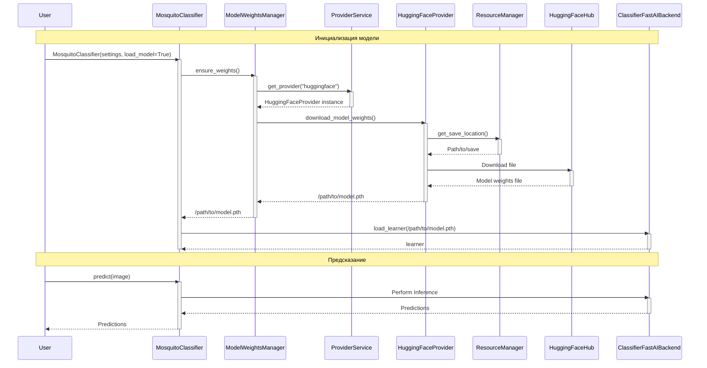

# Руководство разработчика
## 1. Введение

### 1.1 Назначение
Этот документ предоставляет детальное описание проекта для библиотеки CulicidaeLab. Библиотека представляет собой систему на Python, предназначенную для облегчения управления наборами данных, конфигурацией и моделями машинного обучения (predictors) для задач, связанных с анализом изображений комаров, включая детекцию, сегментацию и классификацию.

### 1.2 Область применения
Библиотека предоставляет:
-   Типобезопасную, валидированную систему конфигурации для параметров моделей, настроек приложения и метаданных видов.
-   Кросс-платформенное управление ресурсами для наборов данных, весов моделей, кэша и временных файлов.
-   Набор моделей (predictors) для классификации, детекции и сегментации, построенных на общем базовом классе.
-   Архитектуру на основе провайдеров для интеграции с внешними источниками данных, такими как Hugging Face.
-   Утилиты для обработки наборов данных, файловых операций и визуализации результатов.

### 1.3 Определения, акронимы и сокращения (DAA)
-   **YOLO**: You Only Look Once (архитектура модели детекции объектов)
-   **SAM**: Segment Anything Model (архитектура модели сегментации)
-   **IoU**: Intersection over Union (метрика для сегментации и детекции)
-   **AP**: Average Precision (метрика для детекции)
-   **mAP**: Mean Average Precision (метрика детекции)
-   **Pydantic**: Библиотека валидации данных и управления настройками для Python.

### 1.4 Ссылки
*   IEEE Std 1016-1998, Рекомендуемая практика IEEE для описаний проектирования ПО.
*   Справочник по языку Python 3.x.
*   Документация Pydantic.
*   Документация OmegaConf.
*   Документация библиотеки FastAI.
*   Документация HuggingFace Hub и Datasets.
*   Документация модели YOLO (Ultralytics).
*   Документация Segment Anything Model (SAM).
*   Документация timm (PyTorch Image Models).

### 1.5 Обзор документа
Этот документ организован в четыре основных раздела:
*   **Раздел 1 (Введение)**: Предоставляет назначение, область применения, определения, ссылки и обзор этого документа.
*   **Раздел 2 (Обзор системы)**: Описывает контекст системы, цели и общие функции.
*   **Раздел 3 (Архитектурное проектирование системы)**: Описывает высокоуровневую архитектуру, включая декомпозицию компонентов, их интерфейсы и проектирование данных.
*  **Раздел 4 (Детальное проектирование системы)**: Предоставляет детальное описание каждого модуля и его составных классов, включая их назначение, функции, интерфейсы и данные.
*  **Раздел 5 (Прослеживаемость)**: Кратко обсуждает, как проектирование отвечает неявным требованиям библиотеки.

---

## 2. Обзор системы

### 2.1 Контекст системы
Библиотека CulicidaeLab предназначена для использования исследователями, разработчиками и специалистами по данным, работающими над проектами, связанными с анализом изображений комаров. Она может служить бэкендом для более крупных приложений или использоваться напрямую в скриптах для пакетной обработки, оценки моделей и управления наборами данных. Она работает в среде Python и зависит от нескольких внешних библиотек для своей основной функциональности (например, Pydantic, FastAI, библиотеки Hugging Face, PyTorch, Ultralytics).

### 2.2 Цели системы
Основные цели этой библиотеки:
1.  Предоставить централизованный, типобезопасный и валидированный способ управления конфигурациями для наборов данных, моделей и настроек приложений с использованием Pydantic.
2.  Предложить гибкую систему на основе провайдеров для управления и доступа к различным наборам данных и весам моделей из различных источников (например, Hugging Face).
3.  Определить общий, предсказуемый интерфейс (`BasePredictor`) для различных типов моделей (детектор, сегментатор, классификатор) и предоставить конкретные реализации.
4.  Обеспечить эффективный вывод моделей, четкую визуализацию результатов и стандартизированную оценку.
5.  Гарантировать надежное, кросс-платформенное управление ресурсами для моделей, наборов данных, кэша и временных файлов.

### 2.3 Функции системы
Библиотека предоставляет следующие ключевые функции:
*   **Управление конфигурацией**: Загружает, объединяет и валидирует иерархические конфигурации из YAML-файлов в модели Pydantic.
*   **Управление ресурсами**: Управляет путями файловой системы для моделей, наборов данных, кэша и временных файлов кросс-платформенным способом.
*   **Абстракция провайдеров**: Загружает наборы данных и веса моделей от внешних провайдеров (например, Hugging Face) через стандартизированный интерфейс.
*   **Управление наборами данных**: Перечисляет и загружает наборы данных, как определено в конфигурации, используя абстракцию провайдеров.
*   **Предсказание модели**: Выполняет вывод с использованием моделей детектора, сегментатора и классификатора на отдельных изображениях или батчах.
*   **Визуализация результатов**: Генерирует визуальные выходы предсказаний моделей, наложенные на входные изображения.
*   **Оценка модели**: Оценивает производительность модели против эталонных данных с использованием стандартных метрик для каждой задачи.
*   **Управление весами моделей**: Гарантирует, что веса моделей доступны локально, загружая их через провайдеров при необходимости.

---

## 3. Архитектурное проектирование системы
### 3.1 Архитектурный обзор и принципы проектирования
Архитектура библиотеки `culicidaelab` построена на принципах Clean Code и SOLID, чтобы предоставить пользователям мощный и гибкий инструмент, остающийся простым в использовании. Архитектура четко разделена на логические слои, каждый со своей областью ответственности. Это разделение упрощает понимание, тестирование и расширение кода.

Библиотека включает **подключаемую архитектуру бэкендов**, которая обеспечивает поддержку нескольких ML-фреймворков (PyTorch, ONNX) и оптимизированных режимов развертывания. Это позволяет использовать гибкие профили установки от легковесных развертываний только для инференса до полных сред разработки.

#### 3.1.1 Диаграмма архитектурных слоев

```mermaid
graph TD
    %% -- Layers Definition --
    classDef userLayer fill:#eaf4ff,stroke:#004085,stroke-width:2px,color:#004085
    classDef productLayer fill:#e8f5e9,stroke:#155724,stroke-width:2px,color:#155724
    classDef facadeLayer fill:#fff8e1,stroke:#856404,stroke-width:2px,color:#856404
    classDef coreLayer fill:#fbe9e7,stroke:#721c24,stroke-width:2px,color:#721c24
    classDef infraLayer fill:#eceff1,stroke:#383d41,stroke-width:2px,color:#383d41
    classDef backendLayer fill:#e3f2fd,stroke:#0277bd,stroke-width:2px,color:#0277bd
    classDef externalLayer fill:#f5f5f5,stroke:#6c757d,stroke-width:4px,stroke-dasharray: 5 5

    %% -- User Layer --
    subgraph "Пользователь"
         LibraryUser[/"👤 Пользователь библиотеки"/]
         ServeAPI[/"⚡ Serve API<br/>(Продакшн)"/]
    end

    %% -- Products Layer --
    subgraph "Основной функционал библиотеки"
        direction TB
        Predictors["🔬 Предикторы"]
        style Predictors fill:#fff,stroke:none
        MosquitoClassifier("🦟 MosquitoClassifier")
        MosquitoDetector("🎯 MosquitoDetector")
        MosquitoSegmenter("✂️ MosquitoSegmenter")
        UtilityFunctions("🔧 Утилитарные функции<br/>list_models()<br/>list_datasets()")
    end

    %% -- Facade Layer --
    subgraph "Фасад (Центр Конфигурации)"
        facade_spacer["<br>"]; style facade_spacer fill:none,stroke:none
        facade_spacer ~~~ Settings
        Settings["🎛️ Settings<br/><b>(Фасад)</b><br/>Предоставляет унифицированный доступ<br/>к сервисам и параметрам"]
    end

    %% -- Core Abstraction & Logic Layer --
    subgraph "Ядро (Абстракции и Контракты)"
        core_spacer["<br>"]; style core_spacer fill:none,stroke:none
        core_spacer ~~~ BasePredictor
        BasePredictor["🧩 BasePredictor<br/>Абстрактный класс для<br/>всех предикторов"]
        BaseProvider["🔌 BaseProvider<br/>Абстрактный класс для<br/>внешних провайдеров"]
        BaseInferenceBackend["🎯 BaseInferenceBackend<br/>Абстрактный интерфейс бэкенда<br/>для ML-фреймворков"]
        PredictionModels["📊 Модели предсказаний<br/>Структурированные выходы<br/>на основе Pydantic"]
        ProviderService["🔧 ProviderService<br/>Фабрика для создания<br/>объектов-провайдеров"]
        ConfigManager["⚙️ ConfigManager<br/>Управляет конфигурациями<br/>из YAML файлов"]
    end

    %% -- Backend Layer --
    subgraph "Подключаемая система бэкендов"
        BackendFactory["🏭 Фабрика бэкендов<br/>Интеллектуальный выбор бэкенда<br/>на основе окружения"]
        PyTorchBackends["🔥 PyTorch бэкенды<br/>FastAI, YOLO, SAM<br/>(Разработка)"]
        ONNXBackends["⚡ ONNX бэкенды<br/>Оптимизированный вывод<br/>(Продакшн)"]
    end

    %% -- Infrastructure & Adapters Layer --
    subgraph "Инфраструктура и Адаптеры"
        infra_spacer["<br>"]; style infra_spacer fill:none,stroke:none
        infra_spacer ~~~ DatasetsManager
        ResourceManager["📁 ResourceManager<br/>Управляет файлами<br/>и директориями"]
        HuggingFaceProvider["🤗 HuggingFaceProvider<br/><b>(Адаптер)</b><br/>Реализация для<br/>Hugging Face Hub"]
        DatasetsManager["📊 DatasetsManager<br/>Управляет жизненным циклом<br/>наборов данных"]
    end

    %% -- External Systems --
    subgraph "Внешние Системы"
        direction LR
        HuggingFaceHub[("🌐<br/>Hugging Face Hub")]
        FileSystem[("💾<br/>Локальная<br/>Файловая Система")]
    end

    %% -- Relationships --
    LibraryUser -- "Использует" --> MosquitoClassifier
    LibraryUser -- "Использует" --> MosquitoDetector
    LibraryUser -- "Использует" --> MosquitoSegmenter
    LibraryUser -- "Использует" --> UtilityFunctions
    LibraryUser -- "Высокопроизводительный API" --> ServeAPI
    LibraryUser -- "Или управляет данными через" --> DatasetsManager

    ServeAPI -- "Оптимизированный вывод" --> ONNXBackends
    ServeAPI -- "Кэширует предикторы" --> MosquitoClassifier
    ServeAPI -- "Кэширует предикторы" --> MosquitoDetector
    ServeAPI -- "Кэширует предикторы" --> MosquitoSegmenter

    MosquitoClassifier -- "Получает при создании" --> Settings
    MosquitoDetector -- "Получает при создании" --> Settings
    MosquitoSegmenter -- "Получает при создании" --> Settings
    UtilityFunctions -- "Использует" --> Settings

    Settings -- "Управляет" --> ProviderService
    Settings -- "Управляет" --> ConfigManager
    Settings -- "Управляет" --> ResourceManager

    MosquitoClassifier -. "Реализует" .-> BasePredictor
    MosquitoDetector -. "Реализует" .-> BasePredictor
    MosquitoSegmenter -. "Реализует" .-> BasePredictor
    Predictors --- MosquitoClassifier
    Predictors --- MosquitoDetector
    Predictors --- MosquitoSegmenter

    BasePredictor -- "Делегирует к" --> BaseInferenceBackend
    BasePredictor -- "Выводит" --> PredictionModels
    BackendFactory -- "Создает" --> BaseInferenceBackend
    BackendFactory -. "Выбирает" .-> PyTorchBackends
    BackendFactory -. "Выбирает" .-> ONNXBackends
    PyTorchBackends -. "Реализует" .-> BaseInferenceBackend
    ONNXBackends -. "Реализует" .-> BaseInferenceBackend

    DatasetsManager -- "Использует" --> ProviderService
    ProviderService -- "Создает" --> HuggingFaceProvider
    HuggingFaceProvider -. "Реализует" .-> BaseProvider

    HuggingFaceProvider -- "Загружает из" --> HuggingFaceHub
    ResourceManager -- "Работает с" --> FileSystem
    HuggingFaceProvider -- "Сохраняет в" --> ResourceManager
    ConfigManager -- "Читает из" --> ResourceManager

    %% -- Styling --
    class LibraryUser,ServeAPI userLayer
    class MosquitoClassifier,MosquitoDetector,MosquitoSegmenter,Predictors,UtilityFunctions productLayer
    class Settings facadeLayer
    class BasePredictor,BaseProvider,BaseInferenceBackend,PredictionModels,ProviderService,ConfigManager coreLayer
    class BackendFactory,PyTorchBackends,ONNXBackends backendLayer
    class ResourceManager,HuggingFaceProvider,DatasetsManager infraLayer
    class HuggingFaceHub,FileSystem externalLayer
```



#### 3.1.2 Описание слоев

1. **Основная функциональность библиотеки**: Это высший уровень, представляющий конкретные, используемые продукты библиотеки: `MosquitoClassifier`, `MosquitoDetector`, `MosquitoSegmenter` и утилитарные функции. Также включает высокопроизводительный API `serve()` для продакшн-развертываний.

2. **Фасад (Центр конфигурации)**: Класс `Settings` реализует паттерн проектирования **Фасад**. Он служит единой, упрощенной точкой входа для настройки всей библиотеки, скрывая внутреннюю сложность управления конфигурациями, ресурсами и сервисами.

3. **Ядро (Абстракции и контракты)**: Это архитектурное ядро, определяющее основные абстрактные классы и интерфейсы (`BasePredictor`, `BaseProvider`, `BaseInferenceBackend`). Этот слой полностью отделен от конкретных реализаций и включает структурированные модели предсказаний, построенные с помощью Pydantic.

4. **Подключаемая система бэкендов**: Дополнительный слой, который обеспечивает поддержку нескольких ML-фреймворков. `BackendFactory` интеллектуально выбирает между PyTorch бэкендами (для разработки) и ONNX бэкендами (для продакшна) на основе окружения, конфигурации и предпочтений пользователя.

5. **Инфраструктура и адаптеры**: Этот слой содержит конкретные реализации базовых абстракций. Он действует как мост между логикой библиотеки и внешним миром.
   * `DatasetsManager` управляет высокоуровневыми ресурсами наборов данных.
   * `HuggingFaceProvider` реализует паттерн **Адаптер**, адаптируя API Hugging Face к внутреннему интерфейсу `BaseProvider`.
   * `ResourceManager` работает напрямую с файловой системой.

6. **Внешние системы**: Ресурсы вне прямого контроля библиотеки, такие как `Hugging Face Hub` и локальная `Файловая система`.

#### 3.1.3 Руководящие принципы проектирования

* **Расширяемость**: Чтобы добавить новый источник данных (например, AWS S3), разработчику нужно только создать новый `S3Provider`, реализующий интерфейс `BaseProvider`, и зарегистрировать его в конфигурации. Чтобы добавить новый бэкенд (ML-фреймворк), нужно реализовать `BaseInferenceBackend` и зарегистрировать его в `BackendFactory`. Изменения в высокоуровневых модулях предикторов не требуются.

* **Подключаемая архитектура**: Система бэкендов обеспечивает бесшовное переключение между ML-фреймворками (PyTorch, ONNX) и режимами развертывания (разработка, продакшн) без изменения пользовательских API.

* **Гибкость установки**: Архитектура поддерживает несколько профилей установки:
  * **Легковесная** (`[serve]`): только ONNX для продакшн-развертываний (~200МБ)
  * **Полная разработка** (`[full]`): PyTorch + ONNX для полной функциональности (~2ГБ+)

* **Поддерживаемость и тестируемость**: Единственная ответственность каждого компонента упрощает отладку. Использование инверсии зависимостей позволяет заменять инфраструктурные компоненты на заглушки (моки) во время тестирования.

* **Принципы SOLID**:
  * **Принцип инверсии зависимостей (DIP)**: Высокоуровневые модули (`MosquitoClassifier`) не зависят от низкоуровневых модулей (`HuggingFaceProvider`, реализаций конкретных бэкендов). Оба зависят от абстракций (`BaseProvider`, `BaseInferenceBackend`).
  * **Паттерн Фабрика (`ProviderService`, `BackendFactory`)**: Позволяет системе динамически решать, какой объект провайдера или бэкенда создавать на основе конфигурации и окружения.
  * **Паттерн Фасад (`Settings`)**: Упрощает взаимодействие пользователя с библиотекой, скрывая сложность создания и связывания внутренних компонентов.
  * **Паттерн Стратегия (Бэкенды)**: Различные стратегии инференса (PyTorch vs ONNX) могут быть заменены без изменения интерфейса предиктора.

### 3.2 Декомпозиция компонентов

Библиотека декомпозирована на пять основных высокоуровневых модулей:

1. **Модуль `core`**:
   * **Описание**: Формирует основу библиотеки, предоставляя основные сервисы, базовые классы, протоколы и модели данных.
   * **Подкомпоненты**: `Settings`, `ConfigManager`, `ResourceManager`, `BasePredictor`, `BaseProvider`, `BaseInferenceBackend`, `ProviderService`, `prediction_models`, `config_models`, `species_config`, `utils`.

2. **Модуль `datasets`**:
   * **Описание**: Обрабатывает высокоуровневую логику для управления и доступа к наборам данных.
   * **Подкомпоненты**: `DatasetsManager`.

3. **Модуль `providers`**:
   * **Описание**: Содержит конкретные реализации `core.BaseProvider` для получения данных из различных внешних источников.
   * **Подкомпоненты**: `HuggingFaceProvider`.

4. **Модуль `predictors`**:
   * **Описание**: Содержит конкретные реализации `BasePredictor` для конкретных задач машинного обучения, систему фабрики бэкендов и конкретные реализации бэкендов.
   * **Подкомпоненты**: `MosquitoClassifier`, `MosquitoDetector`, `MosquitoSegmenter`, `BackendFactory`, `backends/` (реализации PyTorch и ONNX).

5. **Модуль `serve`**:
   * **Описание**: Высокопроизводительный продакшн API для оптимизированного вывода с автоматическим выбором бэкенда и кэшированием в памяти.
   * **Подкомпоненты**: функция `serve()`, функция `clear_serve_cache()`.

### 3.3 Интерфейсы компонентов

* **`core.Settings`**: Основной класс, с которым взаимодействует пользователь, доступный через `get_settings()`. Действует как синглтон-фасад, предоставляя простой доступ к значениям конфигурации, путям к ресурсам (`.model_dir`), вспомогательным объектам и утилитарным функциям типа `list_models()` и `list_datasets()`. Инициализирует и хранит экземпляры `ConfigManager` и `ResourceManager`.

* **`core.ConfigManager`**: Внутренний компонент, управляемый `Settings`. Загружает YAML-файлы по умолчанию и пользовательские, объединяет их и валидирует результат по отношению к моделям Pydantic, определенным в `core.config_models`.

* **`core.ResourceManager`**: Предоставляет стандартизированные пути для хранения данных (модели, наборы данных, кэш), используемые `Settings`, `DatasetsManager` и реализациями бэкендов.

* **`core.BaseProvider`**: Абстрактный базовый класс, определяющий контракт для любого компонента, предоставляющего данные (наборы данных или файлы моделей), с методами типа `download_dataset` и `download_model_weights`.

* **`core.ProviderService`**: Фабрика и кэш для экземпляров провайдеров. Использует `Settings` для поиска конфигурации провайдера и создает правильную реализацию `BaseProvider` (например, `providers.HuggingFaceProvider`).

* **`core.BaseInferenceBackend`**: Абстрактный базовый класс, определяющий контракт для бэкендов ML-фреймворков. Предоставляет методы для загрузки модели (`load_model`), вывода (`predict`, `predict_batch`) и управления ресурсами (`unload_model`, `is_loaded`).

* **`core.BasePredictor`**: Абстрактный базовый класс для всех предикторов. Определяет стандартный интерфейс (`predict`, `evaluate`, `visualize`) и делегирует операции с моделями экземпляру `BaseInferenceBackend`. Выводит структурированные модели предсказаний Pydantic.

* **`core.prediction_models`**: Модели Pydantic для структурированных, типобезопасных выходов предсказаний: `ClassificationPrediction`, `DetectionPrediction`, `SegmentationPrediction`. Заменяют предыдущие выходы на основе кортежей.

* **`core.WeightsManagerProtocol`**: Протокол, определяющий метод `ensure_weights`. Это отделяет модели от конкретной реализации управления весами.

* **`datasets.DatasetsManager`**: Управляет доступом к наборам данных. Использует `Settings` для получения конфигураций наборов данных и `ProviderService` для получения правильного экземпляра провайдера для загрузки данных.

* **`predictors.*` (например, `MosquitoClassifier`, `MosquitoDetector`)**: Конкретные реализации `BasePredictor`. Инициализируются с `Settings` и автоматически создают соответствующие бэкенды через `BackendFactory`.

* **`predictors.BackendFactory`**: Интеллектуальная фабрика для создания экземпляров бэкендов. Автоматически выбирает между PyTorch и ONNX бэкендами на основе предпочтений пользователя, конфигурации и возможностей окружения.

* **`predictors.ModelWeightsManager`**: Конкретная реализация `WeightsManagerProtocol`. Использует `Settings` для поиска конфигураций моделей и `ProviderService` для загрузки файлов весов, если они недоступны локально.

* **`serve`**: Высокопроизводительный продакшн API, который автоматически использует ONNX бэкенд и реализует кэширование в памяти для минимальной задержки при последующих вызовах.

### 3.4 Концептуальный поток взаимодействия


Чтобы проиллюстрировать взаимодействие компонентов, рассмотрим типичный сценарий классификации изображения комара с новой архитектурой бэкендов.

1. **Инициализация**: Приложение пользователя вызывает `get_settings()` для получения экземпляра фасада `Settings`. Объект `Settings` загружает все необходимые конфигурации из YAML-файлов. Затем пользователь создает экземпляр `MosquitoClassifier`, передавая ему объект `settings`.

   ```python
   from culicidaelab import MosquitoClassifier, get_settings

   settings = get_settings()
   classifier = MosquitoClassifier(settings=settings, load_model=True)
   ```

2. **Выбор бэкенда**: При инициализации `MosquitoClassifier` использует `BackendFactory` для интеллектуального выбора подходящего бэкенда. Фабрика анализирует окружение, конфигурацию и предпочтения пользователя для выбора между PyTorch (разработка) или ONNX (продакшн) бэкендами.

3. **Инициализация бэкенда**: Выбранный бэкенд (например, `ClassifierFastAIBackend`) создается и становится ответственным за все операции с моделью.

4. **Управление весами модели**: Если указан параметр `load_model=True`, бэкенд обеспечивает загрузку весов модели через систему провайдеров. Он использует `ProviderService` для получения экземпляра `HuggingFaceProvider`, который загружает веса модели из Hugging Face Hub и сохраняет их локально в папки созданные `ResourceManager`.

5. **Загрузка модели**: Бэкенд загружает модель в память, используя соответствующий ML-фреймворк (PyTorch, ONNX и т.д.).

6. **Предсказание со структурированным выходом**: Когда пользователь вызывает `predict()`, предиктор делегирует задачу бэкенду для получения необработанного результата, затем преобразует его в модель Pydantic (`ClassificationPrediction`), которая обеспечивает валидацию данных и JSON-сериализацию.

Эта архитектура предоставляет несколько преимуществ:
- **Подключаемые бэкенды** обеспечивают возможность использования различных ML-фреймворков и уровней оптимизации
- **Автоматический выбор бэкенда** на основе окружения и настроек
- **Типизация результатов** с моделями Pydantic для унификации и безопасности типов
- **Гибкость установки** с легковесными профилями инференса и полновесными профилями разработки

Весь сложный процесс остается скрытым от конечного пользователя, которому нужно выполнить только две строчки для создания предиктора с обеспечением улучшенной производительности и гибкости.

### 3.5 Проектирование данных

* **Данные конфигурации**: Управляются `ConfigManager` и валидируются в дерево **моделей Pydantic**, с `core.config_models.CulicidaeLabConfig` в качестве корня. Исходный источник - YAML-файлы.

* **Данные изображений**: Представлены как `np.ndarray` (массивы NumPy) или другие форматы, поддерживаемые системой бэкендов.

* **Метаданные набора данных**: Формально определены **моделью Pydantic `core.config_models.DatasetConfig`**.

* **Предсказания моделей**: Используются структурированные модели Pydantic вместо кортежей для типобезопасности, валидации и JSON-сериализации:
  * **Классификатор**: `ClassificationPrediction`, содержащий список объектов `Classification` с именами видов и оценками уверенности. Предоставляет метод `top_prediction()` для легкого доступа.
  * **Детектор**: `DetectionPrediction`, содержащий список объектов `Detection` с координатами `BoundingBox` и оценками уверенности.
  * **Сегментатор**: `SegmentationPrediction`, содержащий бинарные маски и метаданные.

* **Эталонные данные**: Аналогично представлены `typing.TypeAlias` (например, `DetectionGroundTruthType`) с форматами, соответствующими типам предсказаний.

* **Метрики оценки**: Словари, сопоставляющие имена метрик со значениями float (`dict[str, float]`).

* **Пути файловой системы**: Управляются как объекты `pathlib.Path` через `ResourceManager` и `Settings`.

* **Данные бэкенда**: Необработанные предсказания от ML-фреймворков преобразуются в структурированные модели через метод `_convert_raw_to_prediction()` в каждом предикторе.

## 4. Детальное проектирование системы

В этом разделе подробно описывается каждый модуль и его компоненты.

### 4.1 Детальное проектирование модуля `core`
Модуль `core` предоставляет фундаментальные классы, протоколы и утилиты, необходимые для функционирования всей библиотеки. Он обрабатывает конфигурацию, управление ресурсами и определяет базовые контракты для моделей и поставщиков данных.

**Структура проекта:**
```
core
├── __init__.py
├── base_inference_backend.py
├── base_predictor.py
├── base_provider.py
├── config_manager.py
├── config_models.py
├── provider_service.py
├── resource_manager.py
├── settings.py
├── species_config.py
├── utils.py
└── weights_manager_protocol.py
```

#### 4.1.1 `core.base_predictor.BasePredictor`

* **Идентификация**: `core.base_predictor.BasePredictor`
* **Назначение**: Абстрактный базовый класс, определяющий общий интерфейс для всех предикторов (например, детектора, сегментатора, классификатора). **Крупная архитектурная переработка** - теперь делегирует операции с моделями подключаемым реализациям `BaseInferenceBackend`.
* **Наследует**: `Generic[InputDataType, PredictionType, GroundTruthType]`, `ABC`
* **Функция**: Обеспечивает стандартную структуру для загрузки модели, предсказания, оценки и визуализации. Делегирует все операции с моделями экземпляру `BaseInferenceBackend`, обеспечивая поддержку нескольких ML-фреймворков (PyTorch, ONNX). Выводит структурированные модели предсказаний Pydantic для типобезопасности и JSON-сериализации.
* **Интерфейсы (Предоставляемые)**:
  * `__init__(self, settings: Settings, predictor_type: str, backend: BaseInferenceBackend, load_model: bool = False)`: **Критическое изменение** - Инициализирует предиктор с экземпляром бэкенда вместо менеджера весов.
  * `load_model(self) -> None`: Делегирует к `backend.load_model()` с улучшенной обработкой ошибок.
  * `unload_model(self) -> None`: Делегирует к `backend.unload_model()`.
  * `predict(self, input_data: InputDataType, **kwargs: Any) -> PredictionType`: Улучшен автоматической загрузкой модели и преобразованием структурированного выхода через `_convert_raw_to_prediction()`.
  * `predict_batch(self, input_data_batch: Sequence[InputDataType], show_progress: bool = False, **kwargs: Any) -> list[PredictionType]`: Улучшенная пакетная обработка с отслеживанием прогресса.
  * `evaluate(self, ground_truth: GroundTruthType, prediction: PredictionType | None = None, input_data: InputDataType | None = None, **predict_kwargs: Any) -> dict[str, float]`: Оценивает одно предсказание против эталонных данных.
  * `evaluate_batch(self, ground_truth_batch: list[GroundTruthType], predictions_batch: list[PredictionType] | None = None, input_data_batch: list[InputDataType] | None = None, num_workers: int = 4, show_progress: bool = True, **predict_kwargs) -> dict[str, float]`: Оценивает пакет элементов с использованием параллельной обработки.
  * `visualize(self, input_data: InputDataType, predictions: PredictionType, save_path: str | Path | None = None) -> np.ndarray` (абстрактный): Визуализирует предсказания на входных данных.
  * `get_model_info(self) -> dict[str, Any]`: Получает информацию о загруженной модели от бэкенда.
  * `model_context(self)` (контекстный менеджер): Временно загружает модель для блока кода.
  * `config` (свойство) `-> PredictorConfig`: Получает модель конфигурации предиктора Pydantic.
  * `model_loaded` (свойство) `-> bool`: **Изменено** - Возвращает `self.backend.is_loaded` вместо внутреннего состояния.
  * `__call__(self, input_data: InputDataType, **kwargs: Any) -> PredictionType`: Удобный метод для `predict()`.
  * `_convert_raw_to_prediction(self, raw_prediction: Any) -> PredictionType` (абстрактный): **Новый обязательный метод** - Преобразует сырой выход бэкенда в структурированные модели предсказаний Pydantic.
  * `_evaluate_from_prediction(self, prediction: PredictionType, ground_truth: GroundTruthType) -> dict[str, float]` (абстрактный): Основная логика вычисления метрик.
* **Интерфейсы (Используемые)**:
  * `core.settings.Settings`
  * `core.base_inference_backend.BaseInferenceBackend`
  * `core.config_models.PredictorConfig`
  * `core.prediction_models.*` (модели предсказаний Pydantic)
* **Данные**: `settings`, `predictor_type`, `backend`.
* **Примечания по миграции**:
  * **Критическое изменение**: Сигнатура конструктора изменена - требует параметр `backend` вместо `weights_manager`
  * **Новый абстрактный метод**: Подклассы должны реализовать метод `_convert_raw_to_prediction()`
  * **Удаленные методы**: `_load_model()` и свойство `model_path` удалены - теперь обрабатываются бэкендами
    *   `load_model(self) -> None`: Обертка, которая загружает модель, если она еще не загружена.
    *   `unload_model(self) -> None`: Выгружает модель для освобождения памяти.
    *   `predict(self, input_data: np.ndarray, **kwargs: Any) -> PredictionType` (abstract): Делает предсказание для одного входа.
    *   `predict_batch(self, input_data_batch: list[np.ndarray], show_progress: bool = True, **kwargs: Any) -> list[PredictionType]`: Делает предсказания для батча входных данных.
    *   `evaluate(self, ground_truth: GroundTruthType, prediction: PredictionType | None = None, input_data: np.ndarray | None = None, **predict_kwargs: Any) -> dict[str, float]`: Оценивает единичное предсказание против эталонных данных.
    *   `evaluate_batch(self, ground_truth_batch: list[GroundTruthType], predictions_batch: list[PredictionType] | None = None, input_data_batch: list[np.ndarray] | None = None, num_workers: int = 4, show_progress: bool = True, **predict_kwargs) -> dict[str, float]`: Оценивает батч элементов с использованием параллельной обработки.
    *   `visualize(self, input_data: np.ndarray, predictions: PredictionType, save_path: str | Path | None = None) -> np.ndarray` (abstract): Визуализирует предсказания на входных данных.
    *   `get_model_info(self) -> dict[str, Any]`: Получает информацию о загруженной модели.
    *   `model_context(self)` (контекстный менеджер): Временно загружает модель для блока кода.
    *   `config` (свойство) `-> PredictorConfig`: Получает модель конфигурации Pydantic для модели.
    *   `model_loaded` (свойство) `-> bool`: Проверяет, загружена ли модель.
    *   `model_path` (свойство) `-> Path`: Получает путь к файлу весов модели.
    *   `__call__(self, input_data: np.ndarray, **kwargs: Any) -> Any`: Удобный метод для `predict()`.
    *   `_load_model(self) -> None` (abstract): Логика загрузки модели, специфичная для дочернего класса.
    *   `_evaluate_from_prediction(self, prediction: PredictionType, ground_truth: GroundTruthType) -> dict[str, float]` (abstract): Основная логика расчета метрик.
*   **Интерфейсы (Используемые)**:
    *   `core.settings.Settings`
    *   `core.weights_manager_protocol.WeightsManagerProtocol`
    *   `core.config_models.PredictorConfig`
*   **Данные**: `settings`, `predictor_type`, `weights_manager`.

#### 4.1.2 `core.base_inference_backend.BaseInferenceBackend`

* **Идентификация**: `core.base_inference_backend.BaseInferenceBackend`
* **Назначение**: **Новый архитектурный компонент** - Абстрактный базовый класс для всех бэкендов ML-фреймворков, обеспечивающий подключаемую поддержку PyTorch, ONNX и других движков вывода.
* **Наследует**: `Generic[InputDataType, PredictionType]`, `ABC`
* **Функция**: Определяет контракт для загрузки модели, вывода и управления ресурсами в различных ML-фреймворках. Обеспечивает гибкие профили установки библиотеки и режимы развертывания.
* **Интерфейсы (Предоставляемые)**:
  * `__init__(self, predictor_type: str)`: Инициализирует бэкенд с информацией о типе предиктора.
  * `load_model(self, **kwargs: Any) -> None` (абстрактный): Загружает модель в память, используя конкретный ML-фреймворк.
  * `predict(self, input_data: InputDataType, **kwargs: Any) -> PredictionType` (абстрактный): Выполняет вывод на одном входе.
  * `predict_batch(self, input_data_batch: list[InputDataType], show_progress: bool = False, **kwargs: Any) -> list[PredictionType]`: Выполняет пакетный вывод с опциональным отслеживанием прогресса.
  * `unload_model(self) -> None` (абстрактный): Выгружает модель для освобождения памяти.
  * `is_loaded(self) -> bool` (абстрактный): Проверяет, загружена ли модель в данный момент.
* **Интерфейсы (Используемые)**:
  * Специфичные для фреймворка библиотеки (PyTorch, ONNX Runtime и т.д.)
  * `core.settings.Settings` (через конкретные реализации)
* **Данные**: `predictor_type`, объекты моделей, специфичные для фреймворка.
* **Конкретные реализации**:
  * `predictors.backends.classifier._fastai.ClassifierFastAIBackend`: Классификация на основе PyTorch/FastAI
  * `predictors.backends.classifier._onnx.ClassifierONNXBackend`: Классификация на основе ONNX
  * `predictors.backends.detector._yolo.DetectorYOLOBackend`: Детекция на основе YOLO
  * `predictors.backends.segmenter._sam.SegmenterSAMBackend`: Сегментация на основе SAM

#### 4.1.3 `core.prediction_models`

* **Идентификация**: `core.prediction_models`
* **Назначение**: **Новый архитектурный компонент** - Модели Pydantic для структурированных, типобезопасных выходов предсказаний, заменяющие предыдущие форматы на основе кортежей.
* **Функция**: Предоставляет JSON-сериализуемые, валидированные выходы предсказаний с удобными методами доступа. Обеспечивает согласованные ответы API для всех типов предикторов.
* **Ключевые модели**:
  * `BoundingBox`: Представляет ограничивающие рамки детекции с методом преобразования `to_numpy()`.
  * `Detection`: Результат одной детекции с ограничивающей рамкой, уверенностью и опциональной информацией о классе.
  * `DetectionPrediction`: Контейнер для множественных детекций с метаданными.
  * `Classification`: Результат одной классификации с именем вида и оценкой уверенности.
  * `ClassificationPrediction`: Контейнер для множественных классификаций с удобным методом `top_prediction()`.
  * `SegmentationPrediction`: Контейнер для масок сегментации и метаданных.
* **Преимущества**:
  * **Типобезопасность**: Полные подсказки типов и валидация
  * **JSON-сериализация**: Прямое преобразование в/из JSON для ответов API
  * **Удобные методы**: Легкий доступ к общим операциям типа `top_prediction()`
  * **Обратная совместимость**: Может быть преобразован в устаревшие форматы кортежей при необходимости

#### 4.1.4 `core.base_provider.BaseProvider`
*   **Идентификация**: `core.base_provider.BaseProvider`
*   **Назначение**: Абстрактный базовый класс для всех поставщиков данных и моделей.
*   **Наследует**: `ABC`
*   **Функция**: Определяет стандартный контракт для загрузки наборов данных и весов моделей из внешних или внутренних источников.
*   **Интерфейсы (Предоставляемые)**:
    *   `download_dataset(self, dataset_name: str, save_dir: str | None = None, *args: Any, **kwargs: Any) -> Path` (abstract): Загружает набор данных.
    *   `download_model_weights(self, model_type: str, *args: Any, **kwargs: Any) -> Path` (abstract): Загружает веса модели.
    *   `get_provider_name(self) -> str` (abstract): Получает уникальное имя провайдера.
    *   `load_dataset(self, dataset_path: str | Path, **kwargs: Any) -> Any` (abstract): Загружает набор данных из локального пути.
*   **Данные**: N/A (абстрактный класс).

#### 4.1.3 `core.config_manager.ConfigManager`
*   **Идентификация**: `core.config_manager.ConfigManager`
*   **Назначение**: Обрабатывает загрузку, объединение и валидацию конфигураций для библиотеки.
*   **Функция**: Реализует надежную стратегию загрузки: 1. Загружает конфигурации YAML по умолчанию, входящие в состав библиотеки. 2. Загружает пользовательские конфигурации YAML. 3. Объединяет пользовательскую конфигурацию поверх значений по умолчанию. 4. Валидирует окончательную объединенную конфигурацию по отношению к модели Pydantic `CulicidaeLabConfig`. Также предоставляет утилиту для создания объектов из их определений конфигурации.
*   **Интерфейсы (Предоставляемые)**:
    *   `__init__(self, user_config_dir: str | Path | None = None)`: Инициализирует менеджер.
    *   `get_config(self) -> CulicidaeLabConfig`: Возвращает полностью валидированный объект конфигурации Pydantic.
    *   `instantiate_from_config(self, config_obj: Any, **kwargs: Any) -> Any`: Создает объект Python из его модели конфигурации Pydantic, которая должна содержать поле `target`.
    *   `save_config(self, file_path: str | Path) -> None`: Сохраняет текущее состояние конфигурации в YAML-файл.
*   **Интерфейсы (Используемые)**:
    *   `core.config_models.CulicidaeLabConfig` и другие модели Pydantic.
    *   Библиотека `PyYAML` (неявно).
*   **Данные**: `user_config_dir`, `default_config_path`, `config` (экземпляр `CulicidaeLabConfig`).

#### 4.1.4 `core.config_models.py`
*   **Идентификация**: `core.config_models.py`
*   **Назначение**: Определяет модели Pydantic, которые представляют всю структуру конфигурации приложения.
*   **Функция**: Обеспечивает валидацию данных, типобезопасность и четкую структуру для всех разделов конфигурации, гарантируя надежность и предсказуемость.
*   **Ключевые модели (Предоставляемые)**:
    *   `CulicidaeLabConfig`: Корневая модель для всей конфигурации.
    *   `PredictorConfig`: Определяет конфигурацию для одной модели, включая ее класс (`target`), путь к модели и другие параметры.
    *   `ProviderConfig`: Определяет конфигурацию для поставщика данных (например, Hugging Face, Roboflow).
    *   `DatasetConfig`: Определяет конфигурацию для конкретного набора данных.
    *   `SpeciesModel`: Определяет конфигурацию для данных о видах, включая сопоставления классов и метаданные.
    *   `AppSettings`: Основные настройки приложения (например, среда, уровень логирования).
    *   `ProcessingConfig`: Общие параметры обработки (например, размер батча, устройство).
    *   `VisualizationConfig`: Настройки для визуализации выходных данных моделей.

#### 4.1.5 `core.provider_service.ProviderService`
*   **Идентификация**: `core.provider_service.ProviderService`
*   **Назначение**: Управляет созданием экземпляров и жизненным циклом поставщиков данных.
*   **Функция**: Действует как фабрика и кэш для экземпляров провайдеров. Использует `Settings` приложения для поиска конфигурации запрошенного провайдера, создает его с помощью `ConfigManager` и хранит для повторного использования.
*   **Интерфейсы (Предоставляемые)**:
    *   `__init__(self, settings: Settings)`: Инициализирует сервис.
    *   `get_provider(self, provider_name: str) -> BaseProvider`: Извлекает созданный экземпляр провайдера по его имени.
*   **Интерфейсы (Используемые)**:
    *   `core.settings.Settings`
    *   `core.base_provider.BaseProvider`
*   **Данные**: `_settings`, `_providers` (как кэш).

#### 4.1.6 `core.resource_manager.ResourceManager`
*   **Идентификация**: `core.resource_manager.ResourceManager`
*   **Назначение**: Централизованное управление ресурсами для моделей, наборов данных и временных файлов с кросс-платформенной совместимостью.
*   **Функция**: Управляет каталогами ресурсов приложения (модели, наборы данных, кэш, временные файлы), предоставляет стандартизированную генерацию путей, управление временными рабочими областями (включая контекстный менеджер с автоматической очисткой), утилиты очистки файлов, создание/проверку контрольных сумм и отчеты об использовании диска.
*   **Интерфейсы (Предоставляемые)**:
    *   `__init__(self, app_name: str | None = None, custom_base_dir: str | Path | None = None)`: Инициализирует пути к ресурсам.
    *   `get_model_path(self, model_name: str, create_if_missing: bool = True) -> Path`: Получает стандартизированный путь для конкретной модели.
    *   `get_dataset_path(self, dataset_name: str, create_if_missing: bool = True) -> Path`: Получает стандартизированный путь для конкретного набора данных.
    *   `get_cache_path(self, cache_name: str, create_if_missing: bool = True) -> Path`: Получает путь для файлов кэша.
    *   `create_temp_workspace(self, prefix: str = "workspace", suffix: str = "") -> Path`: Создает временный рабочий каталог.
    *   `temp_workspace(self, prefix: str = "workspace", suffix: str = "")` (контекстный менеджер): Создает временную рабочую область, которая автоматически удаляется при выходе.
    *   `clean_temp_workspace(self, workspace_path: Path, force: bool = False) -> None`: Вручную очищает временную рабочую область.
    *   `clean_old_files(self, days: int = 5, include_cache: bool = True) -> dict[str, int]`: Очищает старые загруженные и временные файлы.
    *   `get_disk_usage(self) -> dict[str, dict[str, int | str]]`: Получает статистику использования диска для всех управляемых каталогов.
    *   `create_checksum(self, file_path: str | Path, algorithm: str = "md5") -> str`: Создает контрольную сумму для файла.
    *   `verify_checksum(self, file_path: str | Path, expected_checksum: str, algorithm: str = "md5") -> bool`: Проверяет контрольную сумму файла.
    *   `get_all_directories(self) -> dict[str, Path]`: Получает все управляемые каталоги.
*   **Данные**: `app_name`, `user_data_dir`, `user_cache_dir`, `temp_dir`, `model_dir`, `dataset_dir`, `downloads_dir`.

#### 4.1.7 `core.settings.Settings`
*   **Идентификация**: `core.settings.Settings`
*   **Назначение**: Пользовательский интерфейс для всего управления конфигурацией, предоставляющий простой и стабильный способ доступа к значениям конфигурации, каталогам ресурсов и настройкам приложения.
*   **Функция**: Этот класс действует как высокоуровневый интерфейс, который делегирует сложные операции `ConfigManager` и `ResourceManager`. Он спроектирован как синглтон, доступный через функцию `get_settings`, обеспечивая единый, согласованный источник конфигурации во всем приложении.
*   **Интерфейсы (Предоставляемые)**:
    *   `__init__(self, config_dir: str | Path | None = None)`: Инициализирует фасад Settings, настраивая базовые менеджеры.
    *   `get_config(self, path: str | None = None, default: Any = None) -> Any`: Получает значение конфигурации с использованием пути, разделенного точками.
    *   `set_config(self, path: str, value: Any) -> None`: Устанавливает значение конфигурации в памяти.
    *   `save_config(self, file_path: str | Path | None = None) -> None`: Сохраняет текущую конфигурацию в памяти в YAML-файл.
    *   `instantiate_from_config(self, config_path: str, **kwargs: Any) -> Any`: Удобный метод для создания объекта из пути его конфигурации.
    *   `get_dataset_path(self, dataset_type: str) -> Path`: Получает путь для каталога конкретного набора данных.
    *   `get_model_weights_path(self, model_type: str) -> Path`: Получает настроенный путь к файлу весов модели.
    *   `get_api_key(self, provider: str) -> str | None`: Получает API-ключ для указанного провайдера.
    *   `temp_workspace(self, prefix: str = "workspace")` (контекстный менеджер): Предоставляет временную рабочую область через `ResourceManager`.
    *   `model_dir` / `weights_dir` (свойство) `-> Path`: Каталог для весов моделей.
    *   `dataset_dir` (свойство) `-> Path`: Каталог для наборов данных.
    *   `cache_dir` (свойство) `-> Path`: Каталог кэша.
    *   `config_dir` (свойство) `-> Path`: Активный пользовательский каталог конфигурации.
    *   `species_config` (свойство) `-> SpeciesConfig`: Предоставляет отложенный доступ к помощнику `SpeciesConfig`.
*   **Интерфейсы (Используемые)**:
    *   `core.config_manager.ConfigManager`
    *   `core.resource_manager.ResourceManager`
    *   `core.species_config.SpeciesConfig`
*   **Данные**: `_instance`, `_lock`, `_initialized`.

#### 4.1.8 `core.settings.get_settings`
*   **Идентификация**: `core.settings.get_settings`
*   **Назначение**: Фабричная функция для получения экземпляра синглтона `Settings`.
*   **Функция**: Это основная точка входа для доступа ко всем настройкам приложения. Гарантирует, что класс `Settings` инициализируется только один раз.
*   **Интерфейсы (Предоставляемые)**:
    *   `get_settings(config_dir: str | Path | None = None) -> Settings`: Возвращает экземпляр синглтона `Settings`.

#### 4.1.9 `core.species_config.SpeciesConfig`
*   **Идентификация**: `core.species_config.SpeciesConfig`
*   **Назначение**: Пользовательский интерфейс для доступа к конфигурации видов.
*   **Функция**: Этот класс действует как адаптер, принимая валидированный объект Pydantic `SpeciesModel` из основной конфигурации и предоставляя простые, прямые методы для запроса данных о видах, такие как сопоставление между индексами классов и именами или получение подробных метаданных.
*   **Интерфейсы (Предоставляемые)**:
    *   `__init__(self, config: SpeciesModel)`: Инициализируется с валидированным объектом Pydantic `SpeciesModel`.
    *   `species_map` (свойство) `-> dict[int, str]`: Получает сопоставление индексов классов с полными названиями видов.
    *   `get_species_metadata(self, species_name: str) -> dict[str, Any] | None`: Получает подробные метаданные для конкретного вида.
    *   `get_species_by_index(self, index: int) -> str | None`: Получает полное название вида по его индексу класса.
    *   `get_index_by_species(self, species_name: str) -> int | None`: Получает индекс класса для заданного названия вида.
    *   `list_species_names(self) -> list[str]`: Возвращает список всех настроенных названий видов.
*   **Интерфейсы (Используемые)**:
    *   `core.config_models.SpeciesModel`
*   **Данные**: `_config`, `_species_map`, `_reverse_species_map`, `_metadata_store`.

#### 4.1.10 `core.utils`
*   **Идентификация**: `core.utils`
*   **Назначение**: Коллекция автономных служебных функций, используемых во всей библиотеке.
*   **Функции (Предоставляемые)**:
    *   `download_file(url: str, destination: str | Path | None = None, downloads_dir: str | Path | None = None, progress_callback: Callable | None = None, chunk_size: int = 8192, timeout: int = 30, desc: str | None = None) -> Path`: Загружает файл по URL с возможностью отслеживания прогресса, чанкирования и таймаута, возвращая путь к загруженному файлу.
    *   `str_to_bgr(str_color: str) -> tuple[int, int, int]`: Преобразует строку шестнадцатеричного цвета (например, '#RRGGBB') в кортеж целых чисел BGR, подходящий для использования с такими библиотеками, как OpenCV.

#### 4.1.11 `core.weights_manager_protocol.WeightsManagerProtocol`
*   **Идентификация**: `core.weights_manager_protocol.WeightsManagerProtocol`
*   **Назначение**: Определяет протокол (интерфейс) для любого класса, который управляет весами моделей.
*   **Тип**: `typing.Protocol`
*   **Функция**: Гарантирует, что основные компоненты, такие как `BasePredictor`, могут работать с любым менеджером весов, не завися от его конкретной реализации. Это способствует слабой связанности и позволяет использовать различные стратегии управления весами (например, локальная файловая система, облачное хранилище).
*   **Интерфейсы (Предоставляемые)**:
    *   `ensure_weights(self, predictor_type: str) -> Path`: Гарантирует, что веса для данного типа модели доступны локально, потенциально загружая их, если они отсутствуют, и возвращает локальный путь к файлу весов.

### 4.2 Детальное проектирование модуля `datasets`
Модуль `datasets` отвечает за управление доступом к наборам данных и их загрузку на основе центральной конфигурации приложения. Он действует как посредник между пользовательским кодом и базовыми поставщиками данных.

**Структура проекта:**
```
datasets
├── __init__.py
└── datasets_manager.py
```

#### 4.2.1 `datasets.datasets_manager.DatasetsManager`
*   **Идентификация**: `datasets.datasets_manager.DatasetsManager`
*   **Назначение**: Управляет доступом, загрузкой и кэшированием настроенных наборов данных.
*   **Функция**: Предоставляет высокоуровневый интерфейс, который использует глобальный `Settings` для конфигурации и `ProviderService` для фактической загрузки данных. Это отделяет логику *того, какие* наборы данных доступны (определено в конфигурации) от *того, как* они загружаются и извлекаются (обрабатывается провайдерами). Он поддерживает сессионно-локальный кэш загруженных путей наборов данных, чтобы избежать повторных загрузок.
*   **Интерфейсы (Предоставляемые)**:
    *   `__init__(self, settings: Settings, provider_service: ProviderService)`: Инициализирует менеджер с его зависимостями.
    *   `get_dataset_info(self, dataset_name: str) -> DatasetConfig`: Извлекает модель конфигурации Pydantic для конкретного набора данных.
    *   `list_datasets(self) -> list[str]`: Перечисляет все доступные имена наборов данных из глобальной конфигурации.
    *   `list_loaded_datasets(self) -> list[str]`: Перечисляет все наборы данных, которые были загружены (загружены и кэшированы) в течение текущей сессии.
    *   `load_dataset(self, dataset_name: str, split: str | None = None, **kwargs: Any) -> Any`: Загружает конкретное разделение набора данных. Использует настроенного провайдера для загрузки набора данных, если он еще не кэширован, а затем загружает его в память. Тип возвращаемого значения зависит от реализации провайдера.
*   **Интерфейсы (Используемые)**:
    *   `core.settings.Settings`: Для доступа к конфигурациям наборов данных.
    *   `core.provider_service.ProviderService`: Для получения правильного экземпляра провайдера для загрузки и загрузки данных.
    *   `core.config_models.DatasetConfig`: Как тип возвращаемого значения для `get_dataset_info`.
*   **Данные**: `settings`, `provider_service`, `loaded_datasets` (внутренний кэш).

### 4.3 Детальное проектирование модуля `providers`
Модуль `providers` содержит конкретные реализации интерфейса `BaseProvider`. Каждый класс в этом модуле отвечает за взаимодействие с конкретным внешним источником данных (например, Hugging Face) для загрузки наборов данных или весов моделей.

**Структура проекта:**
```
providers
├── __init__.py
└── huggingface_provider.py
```

#### 4.3.1 `providers.huggingface_provider.HuggingFaceProvider`
*   **Идентификация**: `providers.huggingface_provider.HuggingFaceProvider`
*   **Наследует**: `core.base_provider.BaseProvider`
*   **Назначение**: Провайдер для загрузки и управления наборами данных и моделями HuggingFace.
*   **Функция**: Этот класс реализует интерфейс `BaseProvider` для взаимодействия с Hugging Face Hub. Он извлекает метаданные наборов данных, загружает полные наборы данных или конкретные разделения и загружает веса моделей. Он предназначен для создания `ProviderService`, который внедряет основной объект `Settings` и специфическую для провайдера конфигурацию (например, `dataset_url` и `api_key`).
*   **Интерфейсы (Предоставляемые)**:
    *   `__init__(self, settings: Settings, dataset_url: str, **kwargs: Any) -> None`: Инициализирует провайдер с глобальными настройками и его специфической конфигурацией.
    *   `download_dataset(self, dataset_name: str, save_dir: str | None = None, split: str | None = None, *args: Any, **kwargs: Any) -> Path`: Загружает набор данных из Hugging Face Hub в локальный каталог.
    *   `download_model_weights(self, model_type: str, *args: Any, **kwargs: Any) -> Path`: Загружает и кэширует веса моделей из Hugging Face Hub на основе конфигурации.
    *   `get_dataset_metadata(self, dataset_name: str) -> dict[str, Any]`: Извлекает метаданные для конкретного набора данных из Hub.
    *   `get_provider_name(self) -> str`: Возвращает имя провайдера: `"huggingface"`.
    *   `load_dataset(self, dataset_path: str | Path, split: str | None = None, **kwargs) -> Any`: Загружает набор данных Hugging Face с локального дискового пути, который обычно является выходом `download_dataset`.
*   **Интерфейсы (Используемые)**:
    *   `core.base_provider.BaseProvider` (наследование).
    *   `core.settings.Settings` (для конфигурации, путей ресурсов и API-ключей).
    *   Библиотека `huggingface_hub` (для загрузки моделей и наборов данных).
    *   Библиотека `datasets` (для загрузки наборов данных с диска).
    *   Библиотека `requests` (для извлечения метаданных).
*   **Данные**: `provider_name`, `settings`, `dataset_url`, `api_key`.

### 4.4 Детальное проектирование модуля `predictors`

Модуль `predictors` содержит конкретные реализации моделей машинного обучения для различных задач анализа комаров, наследуемые от `core.base_predictor.BasePredictor`. **Крупная архитектурная переработка** - теперь включает подключаемую систему бэкендов с интеллектуальным выбором бэкенда и поддержкой нескольких ML-фреймворков.

**Структура проекта:**

```
predictors
├── __init__.py
├── classifier.py
├── detector.py
├── segmenter.py
├── backend_factory.py          # Интеллектуальный выбор бэкенда
└── backends/                   # Подключаемые реализации бэкендов
    ├── __init__.py
    ├── classifier/
    │   ├── _fastai.py         # PyTorch/FastAI бэкенд
    │   └── _onnx.py           # ONNX бэкенд
    ├── detector/
    │   └── _yolo.py           # YOLO бэкенд
    └── segmenter/
        └── _sam.py            # SAM бэкенд
```

#### 4.4.1 `predictors.backend_factory.BackendFactory`

* **Идентификация**: `predictors.backend_factory.create_backend`
* **Назначение**: **Новый архитектурный компонент** - Интеллектуальная фабричная функция для создания подходящих экземпляров бэкендов на основе окружения, конфигурации и предпочтений пользователя.
* **Функция**: Реализует четкий порядок приоритетов для выбора бэкенда: 1) Переопределение кода (параметр mode), 2) Переопределение конфигурации (YAML), 3) Автоопределение окружения. Обеспечивает гибкие профили установки библиотеки и корректную обработку различных сценариев развертывания.
* **Интерфейсы (Предоставляемые)**:
  * `create_backend(settings: Settings, predictor_type: str, mode: str | None = None) -> BaseInferenceBackend`: Создает и возвращает подходящий экземпляр бэкенда.
* **Логика выбора**:
  * **Переопределение кода**: `mode='serve'` принудительно использует ONNX бэкенд, `mode='experiments'` принудительно использует PyTorch бэкенд
  * **Переопределение конфигурации**: Проверяет конфигурацию предиктора на наличие настройки бэкенда
  * **Автоопределение окружения**: Использует PyTorch, если доступен, иначе переключается на ONNX
* **Интерфейсы (Используемые)**:
  * `core.settings.Settings`
  * `core.base_inference_backend.BaseInferenceBackend`
  * Реализации бэкендов в `predictors.backends.*`
* **Данные**: N/A (функция без состояния).
* **Обработка ошибок**: Вызывает `RuntimeError`, если запрошен PyTorch бэкенд, но он не установлен, `ValueError`, если бэкенд не может быть определен.

#### 4.4.2 `predictors.classifier.set_posix_windows` (Контекстный менеджер)

* **Идентификация**: `predictors.classifier.set_posix_windows`
* **Назначение**: Контекстный менеджер для обработки проблем совместимости путей при загрузке моделей FastAI, обученных на системах POSIX (Linux/macOS), в систему Windows.
* **Функция**: Временно исправляет `pathlib.PosixPath`, чтобы он вел себя как `pathlib.WindowsPath` в системах Windows, позволяя правильно десериализовать запакованные объекты путей модели.
* **Интерфейсы (Предоставляемые)**:
  * `@contextmanager def set_posix_windows()`
* **Данные**: N/A (функциональный).

#### 4.4.3 `predictors.classifier.MosquitoClassifier`

* **Идентификация**: `predictors.classifier.MosquitoClassifier`
* **Наследует**: `core.base_predictor.BasePredictor[np.ndarray, ClassificationPrediction, ClassificationGroundTruthType]`
* **Назначение**: Классифицирует виды комаров по изображению с использованием подключаемых реализаций бэкендов (PyTorch/FastAI или ONNX).
* **Функция**: **Крупное архитектурное обновление** - Теперь делегирует операции с моделями реализациям бэкендов, предоставляя структурированные выходы предсказаний Pydantic. Автоматически выбирает подходящий бэкенд на основе окружения и конфигурации.
* **Интерфейсы (Предоставляемые)**:
  * `__init__(self, settings: Settings, backend: BaseInferenceBackend | None = None, mode: str | None = None, load_model: bool = False) -> None`: **Улучшено** - Может принимать явный бэкенд или автоматически создавать его через BackendFactory.
  * `predict(self, input_data: np.ndarray, **kwargs: Any) -> ClassificationPrediction`: **Улучшено** - Возвращает структурированную модель Pydantic `ClassificationPrediction` вместо кортежей.
  * `predict_batch(self, input_data_batch: list[np.ndarray], show_progress: bool = False, **kwargs: Any) -> list[ClassificationPrediction]`: Улучшенная пакетная обработка.
  * `visualize(self, input_data: np.ndarray, predictions: ClassificationPrediction, save_path: str | Path | None = None) -> np.ndarray`: Накладывает лучшие результаты классификации на изображение.
  * `get_species_names(self) -> list[str]`: Получает отсортированный список всех известных классификатору названий видов.
  * `get_class_index(self, species_name: str) -> int | None`: Извлекает индекс класса для заданного названия вида.
  * `_convert_raw_to_prediction(self, raw_prediction: Any) -> ClassificationPrediction`: **Новый обязательный метод** - Преобразует сырой выход бэкенда в структурированную модель Pydantic.
* **Интерфейсы (Используемые)**:
  * `core.base_predictor.BasePredictor` (наследование).
  * `core.settings.Settings` (для конфигурации).
  * `predictors.backend_factory.create_backend` (для автоматического выбора бэкенда).
  * `core.prediction_models.ClassificationPrediction` (структурированный выход).
  * Реализации бэкендов через интерфейс `BaseInferenceBackend`.
* **Данные**: `settings`, `backend` (экземпляр BaseInferenceBackend).
* **Поддержка бэкендов**:
  * **PyTorch/FastAI бэкенд**: Полные возможности разработки с поддержкой обучения
  * **ONNX бэкенд**: Оптимизированный вывод для продакшн-развертываний
    *   `core.settings.Settings` (для конфигурации).
    *   Библиотеки FastAI и PyTorch.
    *   `numpy`, `PIL` (Pillow).
    *   `sklearn.metrics` для расширенных метрик оценки, таких как матрица путаницы и ROC-AUC.
*   **Данные**: `arch`, `data_dir`, `species_map`, `num_classes`, `learner` (объект ученика FastAI).

#### 4.4.3 `predictors.detector.MosquitoDetector`
*   **Идентификация**: `predictors.detector.MosquitoDetector`
*   **Наследует**: `core.base_predictor.BasePredictor[DetectionPredictionType, DetectionGroundTruthType]`
*   **Назначение**: Обнаруживает комаров на изображениях с использованием модели YOLO.
*   **Функция**: Загружает модель YOLO и реализует полный жизненный цикл предсказания для детекции объектов. Предсказывает ограничивающие рамки на отдельных изображениях или батчах (используя собственное батчирование YOLO), визуализирует результаты и оценивает производительность детекции (точность, полнота, AP, средний IoU).
*   **Интерфейсы (Предоставляемые)**:
    *   `__init__(self, settings: Settings, load_model: bool = False) -> None`: Инициализирует детектор.
    *   `predict(self, input_data: np.ndarray, **kwargs: Any) -> DetectionPredictionType`: Обнаруживает комаров на одном изображении, возвращая список ограничивающих рамок `(cx, cy, w, h, conf)`.
    *   `predict_batch(self, input_data_batch: list[np.ndarray], show_progress: bool = True, **kwargs: Any) -> list[DetectionPredictionType]`: Обнаруживает комаров в батче изображений.
    *   `visualize(self, input_data: np.ndarray, predictions: DetectionPredictionType, save_path: str | Path | None = None) -> np.ndarray`: Рисует предсказанные ограничивающие рамки на изображении.
*   **Интерфейсы (Используемые)**:
    *   `core.base_predictor.BasePredictor` (наследование).
    *   `core.settings.Settings` (для конфигурации).
    *   Библиотека Ultralytics YOLO.
    *   `numpy`, `cv2` (OpenCV для визуализации).
*   **Данные**: `confidence_threshold`, `iou_threshold`, `max_detections`, `model` (экземпляр модели YOLO).

#### 4.4.4 `predictors.model_weights_manager.ModelWeightsManager`
*   **Идентификация**: `predictors.model_weights_manager.ModelWeightsManager`
*   **Реализует**: `core.weights_manager_protocol.WeightsManagerProtocol`
*   **Назначение**: Управляет загрузкой и локальной доступностью весов моделей.
*   **Функция**: Действует как мост между моделью, которой нужны ее веса, и `ProviderService`, который может их загрузить. Когда модель запрашивает свои веса, этот менеджер проверяет, существует ли файл уже локально. Если нет, он использует настроенного провайдера для загрузки весов и возвращает окончательный, проверенный локальный путь.
*   **Интерфейсы (Предоставляемые)**:
    *   `__init__(self, settings: Settings, provider_service: ProviderService)`: Инициализирует с зависимостями.
    *   `ensure_weights(self, model_type: str) -> Path`: Гарантирует, что веса модели существуют локально, загружая их при необходимости, и возвращает путь.
*   **Интерфейсы (Используемые)**:
    *   `core.settings.Settings` (чтобы получить конфигурации моделей).
    *   `core.provider_service.ProviderService` (чтобы получить экземпляр провайдера для загрузки).
    *   `core.base_provider.BaseProvider` (через сервис провайдера).
*   **Данные**: `settings`, `provider_service`.

#### 4.4.5 `predictors.segmenter.MosquitoSegmenter`
*   **Идентификация**: `predictors.segmenter.MosquitoSegmenter`
*   **Наследует**: `core.base_predictor.BasePredictor[SegmentationPredictionType, SegmentationGroundTruthType]`
*   **Назначение**: Сегментирует комаров на изображениях с использованием модели SAM2.
*   **Функция**: Загружает модель SAM2 и предоставляет методы для генерации масок сегментации. Может выполнять сегментацию всего изображения или управляться ограничивающими рамками от детектора. Также реализует визуализацию масок и оценку на основе метрик, таких как IoU.
*   **Интерфейсы (Предоставляемые)**:
    *   `__init__(self, settings: Settings, load_model: bool = False) -> None`: Инициализирует сегментатор.
    *   `predict(self, input_data: np.ndarray, **kwargs: Any) -> np.ndarray`: Генерирует бинарную маску сегментации. Может управляться `detection_boxes`, предоставленными в kwargs.
    *   `visualize(self, input_data: np.ndarray, predictions: SegmentationPredictionType, save_path: str | Path | None = None) -> np.ndarray`: Накладывает маску сегментации в виде цветного слоя на исходное изображение.
*   **Интерфейсы (Используемые)**:
    *   `core.base_predictor.BasePredictor` (наследование).
    *   `core.settings.Settings` (для конфигурации).
    *   `segment_anything` (SAM2) библиотека и PyTorch.
    *   `numpy`.
*   **Данные**: `model` (экземпляр/предсказатель модели SAM2).

### 4.5 Детальное проектирование модуля `serve`

Модуль `serve` предоставляет высокопроизводительный, оптимизированный для продакшна API вывода, предназначенный для веб-сервисов и приложений, требующих минимальной задержки. **Новый архитектурный компонент**, который автоматически использует ONNX бэкенды и реализует кэширование в памяти.

**Структура проекта:**

```
serve.py                    # Высокопроизводительный продакшн API
```

#### 4.5.1 `serve.serve`

* **Идентификация**: `serve.serve`
* **Назначение**: **Новый продакшн API** - Высокопроизводительная функция вывода, оптимизированная для продакшн-сред с автоматическим выбором бэкенда и кэшированием в памяти.
* **Функция**: Предоставляет единый, унифицированный интерфейс для всех типов предсказаний, автоматически выбирая ONNX бэкенды для оптимальной производительности. Реализует интеллектуальное кэширование для устранения накладных расходов на загрузку модели при последующих вызовах.
* **Интерфейсы (Предоставляемые)**:
  * `serve(image: ImageInput, predictor_type: str = "classifier", **kwargs) -> PredictionResult`: Выполняет предсказание, используя указанный тип предиктора в высокопроизводительном режиме.
  * `clear_serve_cache() -> None`: Очищает кэш предикторов в памяти и выгружает модели.
* **Псевдонимы типов**:
  * `ImageInput`: Union допустимых форматов входных изображений (np.ndarray, str, Path, PIL.Image, bytes)
  * `PredictionResult`: Union структурированных выходов предсказаний (ClassificationPrediction, DetectionPrediction, SegmentationPrediction)
* **Интерфейсы (Используемые)**:
  * Все классы предикторов (`MosquitoClassifier`, `MosquitoDetector`, `MosquitoSegmenter`)
  * `core.settings.Settings`
  * `core.prediction_models.*` (структурированные выходы)
* **Данные**: Внутренний словарь кэша для экземпляров предикторов.
* **Особенности производительности**:
  * **Автоматический ONNX бэкенд**: Выбирает оптимизированные ONNX бэкенды для самого быстрого вывода
  * **Кэширование в памяти**: Первый вызов загружает модель, последующие вызовы практически мгновенны
  * **Унифицированный интерфейс**: Одна функция для всех типов предсказаний
  * **Типобезопасность**: Структурированные выходы Pydantic с полными подсказками типов
* **Случаи использования**:
  * **Веб API**: Конечные точки FastAPI/Flask с минимальной задержкой
  * **Пакетная обработка**: Эффективная обработка больших наборов изображений
  * **Продакшн-развертывания**: Оптимизировано для обслуживающих сред

#### 4.5.2 Примеры интеграции

**Интеграция с веб API:**
```python
from fastapi import FastAPI, UploadFile
from culicidaelab.serve import serve
import json

app = FastAPI()

@app.post("/predict/{predictor_type}")
async def predict(predictor_type: str, file: UploadFile):
    image_bytes = await file.read()
    result = serve(image_bytes, predictor_type=predictor_type)
    return json.loads(result.model_dump_json())
```

**Сравнение производительности:**
- **Традиционный PyTorch**: ~500мс на предсказание (включая загрузку модели)
- **Serve API (первый вызов)**: ~300мс (оптимизация ONNX + загрузка модели)
- **Serve API (кэшированный)**: ~50мс (в 10 раз быстрее с кэшированной моделью)

## 5. Прослеживаемость

Этот раздел устанавливает всеобъемлющую прослеживаемость между функциональными требованиями системы, архитектурными целями и их соответствующими реализующими компонентами. Матрица прослеживаемости демонстрирует, как каждое проектное решение непосредственно отвечает конкретным требованиям и обеспечивает полное покрытие предполагаемой функциональности системы.

### 5.1 Сопоставление требований с компонентами

Следующая таблица сопоставляет каждое функциональное требование с его реализующими компонентами, обеспечивая четкую видимость того, как архитектура удовлетворяет целям системы:

| Функциональное требование | Основной компонент(ы) | Вспомогательные компоненты | Детали реализации |
|------------------------|---------------------|----------------------|----------------------|
| **Централизованное управление конфигурацией** | `core.ConfigManager` | `core.settings.Settings`, модели Pydantic в `core.config_models` | ConfigManager предоставляет синглтон-доступ к конфигурации, в то время как Settings обрабатывает параметры, специфичные для среды, а модели Pydantic обеспечивают типобезопасность и валидацию |
| **Гибкий доступ и управление наборами данных** | `datasets.DatasetsManager` | модуль `providers`, `core.BaseProvider`, `core.ProviderService` | DatasetsManager управляет операциями с наборами данных, BaseProvider определяет интерфейс провайдера, конкретные провайдеры обрабатывают определенные источники данных |
| **Подключаемая архитектура бэкендов** | `core.BaseInferenceBackend` | `predictors.BackendFactory`, конкретные реализации бэкендов | **НОВОЕ** - Обеспечивает поддержку нескольких ML-фреймворков (PyTorch, ONNX) с интеллектуальным выбором бэкенда на основе окружения и потребностей развертывания |
| **Стандартизированный интерфейс предикторов** | `core.BasePredictor` | Все реализации предикторов, `BaseInferenceBackend` | **Улучшено** - Абстрактный базовый класс делегирует операции с моделями подключаемым бэкендам, сохраняя согласованный API со структурированными выходами Pydantic |
| **Структурированные выходы предсказаний** | `core.prediction_models` | Все реализации предикторов | **НОВОЕ** - Модели Pydantic обеспечивают типобезопасные, JSON-сериализуемые выходы предсказаний, заменяя предыдущие форматы на основе кортежей |
| **Классификация видов** | `predictors.MosquitoClassifier` | `core.BasePredictor`, реализации бэкендов | **Улучшено** - Реализует классификацию, специфичную для видов, с поддержкой подключаемых бэкендов (PyTorch/FastAI, ONNX) |
| **Высокопроизводительный продакшн API** | `serve.serve` | Все предикторы, ONNX бэкенды, кэширование в памяти | **НОВОЕ** - Продакшн-оптимизированный API с автоматическим выбором ONNX бэкенда и интеллектуальным кэшированием для минимальной задержки |
| **Гибкость установки** | `predictors.BackendFactory` | Реализации бэкендов, управление зависимостями | **НОВОЕ** - Поддерживает легковесные установки для обслуживания (только ONNX) и полные среды разработки (PyTorch+ONNX) |
| **Детекция объектов** | `predictors.MosquitoDetector` | `core.BasePredictor`, утилиты визуализации | Предоставляет детекцию ограничивающих рамок с возможностью пакетной обработки и интегрированной визуализации |
| **Сегментация изображений** | `predictors.MosquitoSegmenter` | `core.BasePredictor`, утилиты постобработки | Реализует сегментацию на уровне пикселей с поддержкой нескольких форматов вывода и обработки масок |
| **Эффективная пакетная обработка** | методы `predict_batch()` | `core.BasePredictor`, управление ресурсами | Оптимизированная пакетная обработка с управлением памятью и отслеживанием прогресса для всех типов моделей |
| **Визуализация результатов** | методы `visualize()` | Библиотеки построения графиков, `core.BasePredictor` | Согласованный интерфейс визуализации с настраиваемыми форматами вывода и наложением аннотаций |
| **Оценка производительности модели** | `evaluate()` и `evaluate_batch()` | Расчет метрик, утилиты валидации | Всеобъемлющая структура оценки со стандартными метриками и пользовательскими протоколами оценки |
| **Управление ресурсами** | `core.ResourceManager` | Утилиты файловой системы, управление путями | Кросс-платформенная обработка ресурсов с автоматическим созданием и очисткой каталогов |
| **Управление весами моделей** | `predictors.ModelWeightsManager` | `core.WeightsManagerProtocol`, утилиты загрузки | Автоматизированная загрузка весов моделей, кэширование и управление версиями с проверкой целостности |
| **Интеграция с внешними источниками данных** | `core.BaseProvider` | `providers.HuggingFaceProvider`, `core.ProviderService` | Расширяемая система провайдеров, поддерживающая несколько источников данных с едиными шаблонами доступа |
| **Обработка метаданных видов** | `core.SpeciesConfig` | Система конфигурации, валидация | Управление структурированной информацией о видах с таксономической валидацией и обогащением метаданных |
| **Кросс-платформенная совместимость** | Все основные модули | Платформо-специфичные утилиты | Согласованное поведение в разных операционных системах с учетом платформы при обработке файлов |

### 5.2 Прослеживаемость архитектурных целей

Архитектура решает несколько неявных, но критически важных целей, которые обеспечивают долгосрочную жизнеспособность и удобство использования системы:

#### 5.2.1 Модульность и расширяемость

**Цель**: Обеспечить легкое добавление новых предикторов, источников данных и бэкендов ML-фреймворков без изменения существующего кода.

**Реализация**:
- **Базовые абстракции**: `BasePredictor`, `BaseProvider`, `BaseInferenceBackend` определяют четкие контракты
- **Разделение модулей**: Отдельные модули `core`, `datasets`, `providers` и `predictors` с минимальными взаимозависимостями
- **Архитектура плагинов**: Система провайдеров позволяет новые источники данных, система бэкендов обеспечивает подключенеие новых ML-фреймворков
- **Иерархия наследования**: Хорошо определенные базовые классы позволяют создавать новые типы предикторов и бэкендов с шаблонным кодом
- **Паттерн Фабрика**: `BackendFactory` обеспечивает динамический выбор бэкенда без изменений кода

**Верификация**: Новые предикторы для видов комаров могут быть добавлены путем наследования от `BasePredictor` без изменения существующих компонентов.

#### 5.2.2 Поведение на основе конфигурации
**Цель**: Максимизировать гибкость системы через внешнюю конфигурацию вместо жестко заданных значений.

**Реализация**:
- **Централизованные настройки**: `core.ConfigManager` предоставляет единый источник истины для конфигурации
- **Осведомленность о среде**: `core.Settings` адаптируется к различным средам развертывания
- **Типобезопасность**: Модели Pydantic в `core.config_models` обеспечивают валидацию конфигурации
- **Иерархическая конфигурация**: Поддержка глобальных, модульно-специфичных и экземплярно-специфичных настроек

**Верификация**: Пользователи могут изменять поведение системы через файлы конфигурации без изменений кода.

#### 5.2.3 Гибкость развертывания и оптимизация производительности

**Цель**: Поддержка нескольких сценариев развертывания от легковесного продакшн-обслуживания до полных сред разработки с оптимальной производительностью для каждого случая использования.

**Реализация**:

- **Подключаемая архитектура бэкендов**: `BaseInferenceBackend` обеспечивает переключение между PyTorch (разработка) и ONNX (продакшн) бэкендами
- **Интеллектуальный выбор бэкенда**: `BackendFactory` автоматически выбирает оптимальный бэкенд на основе окружения и конфигурации
- **Профили установки**: Поддержка легковесного `[serve]` (только ONNX, ~200МБ) и полного `[full]` (PyTorch+ONNX, ~2ГБ+) установок
- **Высокопроизводительный API обслуживания**: `serve.serve` предоставляет продакшн-оптимизированный вывод с автоматическим выбором ONNX бэкенда и кэшированием в памяти
- **Структурированные выходы**: Модели Pydantic обеспечивают эффективную JSON-сериализацию для веб API, сохраняя типобезопасность

**Верификация**: Одна и та же кодовая база может быть развернута в легковесном режиме обслуживания (только ONNX) или полном режиме разработки (PyTorch+ONNX) с улучшениями производительности в 10+ раз в продакшн-сценариях.

#### 5.2.4 Надежная обработка ошибок и управление ресурсами
**Цель**: Обеспечить стабильность системы и правильную очистку ресурсов при любых условиях.

**Реализация**:
- **Управление ресурсами**: `core.ResourceManager` обрабатывает операции файловой системы с надлежащей очисткой
- **Управление весами**: `ModelWeightsManager` управляет файлами моделей с проверкой целостности
- **Устойчивость провайдеров**: Сбои источников данных обрабатываются корректно с механизмами отката
- **Управление памятью**: Пакетная обработка включает оптимизацию памяти и процедуры очистки

**Верификация**: Система продолжает работать и правильно очищает ресурсы даже при сбое отдельных компонентов.

#### 5.2.4 Оптимизация производительности
**Цель**: Обеспечить возможности эффективной обработки как для единичных предсказаний, так и для пакетных операций.

**Реализация**:
- **Пакетная обработка**: Все модели реализуют оптимизированные методы пакетной обработки с управлением памятью
- **Ленивая загрузка**: Модели и наборы данных загружаются только при необходимости для минимизации использования памяти
- **Стратегия кэширования**: Часто запрашиваемые данные кэшируются надлежащим образом для сокращения избыточных операций
- **Пул ресурсов**: Общие ресурсы эффективно управляются между несколькими операциями

**Верификация**: Пакетные операции эффективно масштабируются с размером набора данных при сохранении разумного использования памяти.

#### 5.2.5 Опыт разработчика и удобство использования
**Цель**: Предоставить интуитивно понятные API и всеобъемлющую функциональность для исследователей и разработчиков.

**Реализация**:
- **Согласованный интерфейс**: Все модели разделяют общие сигнатуры методов (predict, visualize, evaluate)
- **Богатая визуализация**: Встроенные возможности визуализации с настраиваемыми форматами вывода
- **Всесторонняя оценка**: Стандартные метрики и пользовательские протоколы оценки
- **Интеграция документации**: Структура кода поддерживает всестороннюю генерацию документации

**Верификация**: Новые пользователи могут выполнять общие задачи с минимальным обучением и четкими шаблонами API.

### 5.3 Прослеживаемость сквозных аспектов

Несколько общесистемных проблем решаются за счет согласованной реализации в нескольких компонентах:

#### 5.3.1 Целостность потока данных
- **Источник**: Модуль `providers` обеспечивает подлинность данных
- **Обработка**: `predictors` сохраняет прохождение данных через конвейер обработки
- **Хранение**: `ResourceManager` обрабатывает сохранение данных с возможностью реализации проверки целостности данных
- **Валидация**: Система конфигурации проверяет форматы данных и параметры

#### 5.3.2 Соображения масштабируемости
- **Горизонтальное масштабирование**: Система провайдеров поддерживает распределенные источники данных
- **Вертикальное масштабирование**: Пакетная обработка оптимизирует использование памяти и вычислений
- **Стратегия кэширования**: Многоуровневое кэширование сокращает избыточные операции
- **Управление ресурсами**: Эффективная очистка предотвращает утечки ресурсов

#### 5.3.3 Поддерживаемость и тестирование
- **Четкое разделение**: Модульный дизайн позволяет целенаправленное тестирование отдельных компонентов
- **Внедрение зависимостей**: Конфигурационно-управляемые зависимости поддерживают изоляцию тестов
- **Соответствие протоколу**: Абстрактные базовые классы определяют тестируемые контракты
- **Поддержка моков**: Абстракция провайдеров позволяет всестороннее модульное тестирование

### 5.4 Верификация соответствия

Каждое требование может быть проверено через конкретные артефакты реализации:

1. **Соответствие интерфейсу**: Абстрактные базовые классы определяют контракты, которые должны выполнять конкретные реализации
2. **Покрытие конфигурации**: Все настраиваемое поведение регулируется через систему настроек
3. **Обработка ошибок**: Каждый компонент включает соответствующую обработку исключений и очистку ресурсов
4. **Метрики производительности**: Методы пакетной обработки включают оптимизацию
5. **Точки расширения**: Новая функциональность может быть добавлена через четко определенные механизмы расширения

Эта матрица прослеживаемости гарантирует, что каждый аспект проектирования системы непосредственно отвечает выявленным требованиям, сохраняя при этом архитектурную целостность и поддерживая будущие улучшения.
