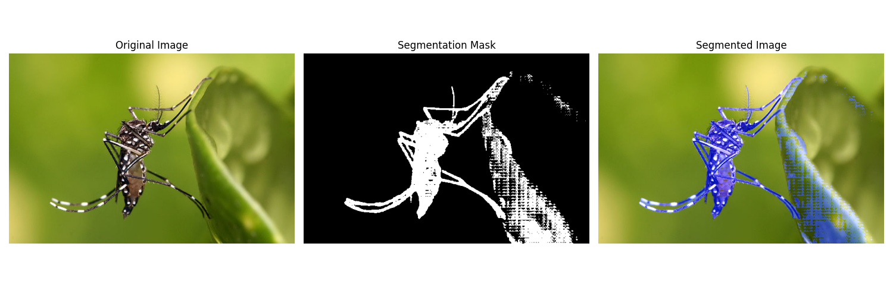
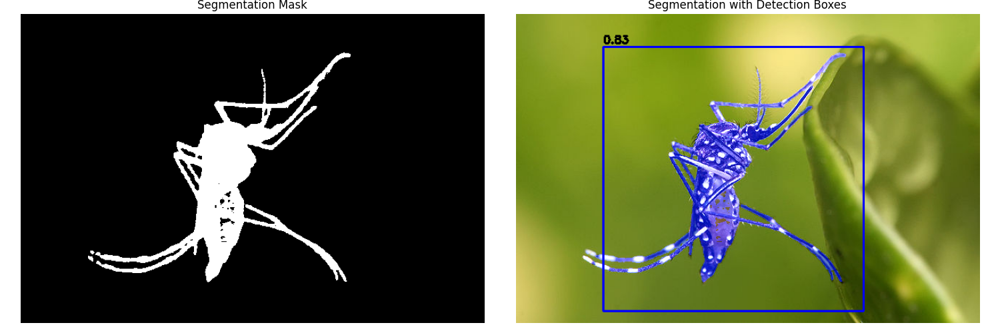

<!--
 DO NOT EDIT.
 THIS FILE WAS AUTOMATICALLY GENERATED BY mkdocs-gallery.
 TO MAKE CHANGES, EDIT THE SOURCE PYTHON FILE:
 "docs/ru/examples/tutorial_part_2_mosquito_segmentation.py"
 LINE NUMBERS ARE GIVEN BELOW.
-->

!!! note

    Click [here](#download_links)
    to download the full example code or to run this example in your browser via Binder


Сегментация комаров с помощью MosquitoSegmenter
===============================================

Этот туториал показывает, как использовать `MosquitoSegmenter` из библиотеки CulicidaeLab
для выполнения сегментации комаров на изображениях. Мы рассмотрим:

- Загрузку модели сегментатора (SAM)
- Подготовку изображения
- Запуск предсказания для получения маски
- Визуализацию результата

<!-- GENERATED FROM PYTHON SOURCE LINES 16-27 -->

# Mosquito Segmentation Tutorial

This tutorial demonstrates how to use the CulicidaeLab library
to perform mosquito segmentation on images. We'll cover:

1. Setting up the segmentation model
2. Loading and preprocessing images
3. Running segmentation
4. Visualizing results

First, let's import the necessary libraries:

<!-- GENERATED FROM PYTHON SOURCE LINES 29-37 -->

```{.python }
import cv2
from pathlib import Path
import matplotlib.pyplot as plt
from culicidaelab import MosquitoSegmenter, MosquitoDetector
from culicidaelab.core.provider_service import ProviderService
from culicidaelab.predictors.model_weights_manager import ModelWeightsManager
from culicidaelab import get_settings

```


<!-- GENERATED FROM PYTHON SOURCE LINES 38-41 -->

## 1. Initialize Settings and Segmenter

First, we'll initialize our settings and create a MosquitoSegmenter instance:

<!-- GENERATED FROM PYTHON SOURCE LINES 43-44 -->

Get settings instance

<!-- GENERATED FROM PYTHON SOURCE LINES 44-47 -->

```{.python }
settings = get_settings()
settings.list_model_types()

```


Out:
{: .mkd-glr-script-out }

```{.shell .mkd-glr-script-out-disp }

['classifier', 'detector', 'segmenter']
```


<!-- GENERATED FROM PYTHON SOURCE LINES 48-58 -->

```{.python }
model_config = settings.get_config("predictors.segmenter")
model_path = settings.get_model_weights_path("segmenter")
provider_service = ProviderService(settings=settings)
weights_manager = ModelWeightsManager(
    settings=settings,
    provider_service=provider_service,
)
# Initialize segmenter
segmenter = MosquitoSegmenter(settings=settings, load_model=True)

```


Out:
{: .mkd-glr-script-out }

```{.shell .mkd-glr-script-out-disp }
Weights file found at: C:\Users\lenova\AppData\Local\culicidaelab\culicidaelab\models\weights\segmentation\sam2.1_hiera_tiny.pt

```


<!-- GENERATED FROM PYTHON SOURCE LINES 59-62 -->

## 2. Load and Preprocess Image

Now let's load a test image:

<!-- GENERATED FROM PYTHON SOURCE LINES 64-65 -->

Load test image

<!-- GENERATED FROM PYTHON SOURCE LINES 65-69 -->

```{.python }
image_path = str(Path("test_imgs") / "640px-Aedes_aegypti.jpg")
image = cv2.imread(image_path)
image = cv2.cvtColor(image, cv2.COLOR_BGR2RGB)

```


<!-- GENERATED FROM PYTHON SOURCE LINES 70-73 -->

## 3. Run Segmentation

Now we can run the segmentation model on our image:

<!-- GENERATED FROM PYTHON SOURCE LINES 75-77 -->

```{.python }
mask = segmenter.predict(image)

```


<!-- GENERATED FROM PYTHON SOURCE LINES 78-81 -->

## 4. Visualize Results

Finally, let's visualize the segmentation results overlaid on the original image:

<!-- GENERATED FROM PYTHON SOURCE LINES 83-84 -->

Visualize segmentation results

<!-- GENERATED FROM PYTHON SOURCE LINES 84-107 -->

```{.python }
segmented_image = segmenter.visualize(image, mask)

# Display results
plt.figure(figsize=(15, 5))

plt.subplot(1, 3, 1)
plt.imshow(image)
plt.axis("off")
plt.title("Original Image")

plt.subplot(1, 3, 2)
plt.imshow(mask, cmap="gray")
plt.axis("off")
plt.title("Segmentation Mask")

plt.subplot(1, 3, 3)
plt.imshow(segmented_image)
plt.axis("off")
plt.title("Segmented Image")

plt.tight_layout()
plt.show()

```


{: .mkd-glr-single-img srcset="../images/mkd_glr_tutorial_part_2_mosquito_segmentation_001.png, ../images/mkd_glr_tutorial_part_2_mosquito_segmentation_001_2_0x.png 2.0x"}

Out:
{: .mkd-glr-script-out }

```{.shell .mkd-glr-script-out-disp }
C:/Users/lenova/CascadeProjects/culicidaelab/docs/ru/examples/tutorial_part_2_mosquito_segmentation.py:105: UserWarning: FigureCanvasAgg is non-interactive, and thus cannot be shown
  plt.show()

```


<!-- GENERATED FROM PYTHON SOURCE LINES 108-110 -->

## Segmentation Using Detection Results


<!-- GENERATED FROM PYTHON SOURCE LINES 112-114 -->

The segmenter can also use detection results to improve segmentation accuracy.
Here's how to combine detection and segmentation:

<!-- GENERATED FROM PYTHON SOURCE LINES 116-117 -->

Initialize detector

<!-- GENERATED FROM PYTHON SOURCE LINES 117-157 -->

```{.python }
detector = MosquitoDetector(settings=settings, load_model=True)
# Load test image
image_path = str(Path("test_imgs") / "640px-Aedes_aegypti.jpg")
image = cv2.imread(image_path)
image = cv2.cvtColor(image, cv2.COLOR_BGR2RGB)

# Run detection
detections = detector.predict(image)

# Run segmentation with detection boxes
mask_with_boxes = segmenter.predict(image, detection_boxes=detections)
# Draw detections
annotated_image = detector.visualize(image, detections)

# Print detection results
print("\nDetection Results:")
for i, (x, y, w, h, conf) in enumerate(detections):
    print(
        f"Mosquito {i+1}: Confidence = {conf:.2f}, Box = (x={x:.1f}, y={y:.1f}, w={w:.1f}, h={h:.1f})",
    )
# Visualize results
segmented_image_with_boxes = segmenter.visualize(annotated_image, mask_with_boxes)

# plt.figure(figsize=(10, 10))
plt.figure(figsize=(15, 5))

plt.subplot(1, 2, 1)
plt.imshow(mask_with_boxes, cmap="gray")
plt.axis("off")
plt.title("Segmentation Mask")


plt.subplot(1, 2, 2)
plt.imshow(segmented_image_with_boxes)
plt.axis("off")
plt.title("Segmentation with Detection Boxes")

plt.tight_layout()
plt.show()

```


{: .mkd-glr-single-img srcset="../images/mkd_glr_tutorial_part_2_mosquito_segmentation_002.png, ../images/mkd_glr_tutorial_part_2_mosquito_segmentation_002_2_0x.png 2.0x"}

Out:
{: .mkd-glr-script-out }

```{.shell .mkd-glr-script-out-disp }
Weights file found at: C:\Users\lenova\AppData\Local\culicidaelab\culicidaelab\models\weights\detection\culico-net-det-v1-nano.pt

Detection Results:
Mosquito 1: Confidence = 0.83, Box = (x=299.6, y=227.9, w=359.2, h=365.3)
C:/Users/lenova/CascadeProjects/culicidaelab/docs/ru/examples/tutorial_part_2_mosquito_segmentation.py:155: UserWarning: FigureCanvasAgg is non-interactive, and thus cannot be shown
  plt.show()

```


<!-- GENERATED FROM PYTHON SOURCE LINES 158-161 -->

```{.python }
metrics = segmenter.evaluate(mask_with_boxes, input_data=image)
print(metrics)

```


Out:
{: .mkd-glr-script-out }

```{.shell .mkd-glr-script-out-disp }
{'iou': 0.5018909670945998, 'precision': 0.5099197532477716, 'recall': 0.969582504970179, 'f1': 0.6683454100073658}

```


<!-- GENERATED FROM PYTHON SOURCE LINES 162-167 -->

```{.python }
metrics_default = segmenter.evaluate(
    mask_with_boxes,
    mask_with_boxes,
)
print(metrics_default)
```


Out:
{: .mkd-glr-script-out }

```{.shell .mkd-glr-script-out-disp }
{'iou': 1.0, 'precision': 1.0, 'recall': 1.0, 'f1': 1.0}

```


**Total running time of the script:** ( 0 minutes  21.071 seconds)

<div id="download_links"></div>

[](https://mybinder.org/v2/gh/iloncka-ds/culicidaelab/gh-pages?urlpath=lab/tree/docs/en/examples/ru/generated/gallery/tutorial_part_2_mosquito_segmentation.ipynb){ .center}

[:fontawesome-solid-download: Download Python source code: tutorial_part_2_mosquito_segmentation.py](./tutorial_part_2_mosquito_segmentation.py){ .md-button .center}

[:fontawesome-solid-download: Download Jupyter notebook: tutorial_part_2_mosquito_segmentation.ipynb](./tutorial_part_2_mosquito_segmentation.ipynb){ .md-button .center}


[Gallery generated by mkdocs-gallery](https://smarie.github.io/mkdocs-gallery){: .mkd-glr-signature }
